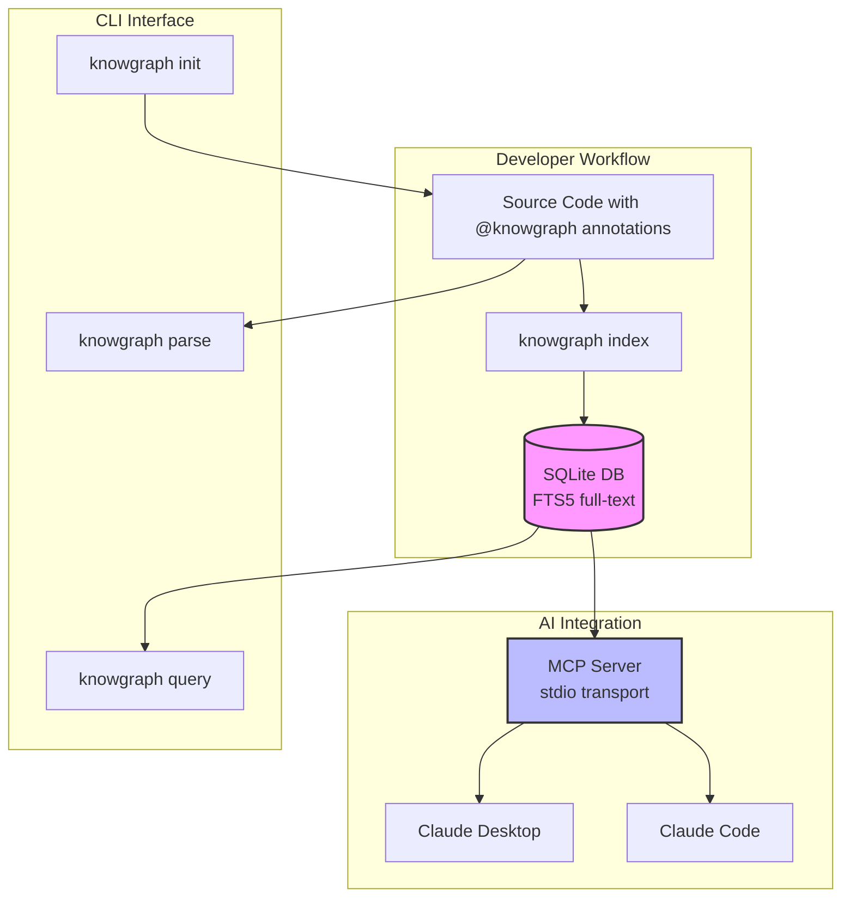
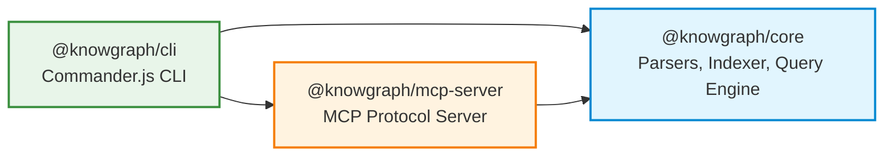
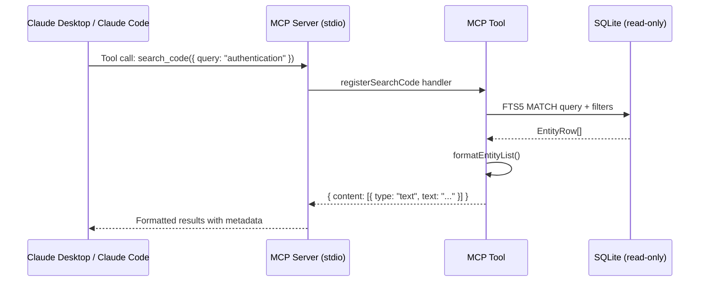
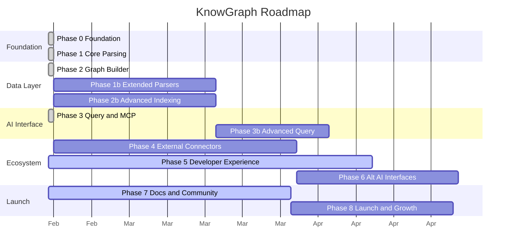

# KnowGraph -- Complete Project Documentation

> Make your codebase AI-navigable by bridging code documentation with business context

---

## Table of Contents

- [1. Vision & Value Proposition](#1-vision--value-proposition)
- [2. Architecture Overview](#2-architecture-overview)
- [3. Monorepo Structure](#3-monorepo-structure)
- [4. Data Flow](#4-data-flow)
- [5. Documentation Map](#5-documentation-map)
- [6. Quick Start](#6-quick-start)
- [7. Key Conventions](#7-key-conventions)
- [8. Roadmap](#8-roadmap)

---

## 1. Vision & Value Proposition

### The Problem

AI coding assistants are great at reading code, but they lack context about:

- **Why** a module exists and what business goal it serves
- **Who** owns it and what team to contact
- **Where** the design docs, Jira tickets, and monitoring dashboards live
- **What** compliance requirements apply (GDPR, PCI-DSS, SOC2)
- **How** it fits into the bigger picture (dependencies, funnel stage, revenue impact)

### The Solution

KnowGraph is an open-source documentation orchestration tool that:

1. **Extracts** structured metadata from code annotations (`@knowgraph` markers)
2. **Builds** a queryable knowledge graph stored in SQLite with FTS5 full-text search
3. **Exposes** the graph to AI assistants via the Model Context Protocol (MCP)

This means AI assistants can understand not just *what* your code does, but *why* it exists and how it connects to business goals.

### Key Differentiators

| Feature | KnowGraph | Traditional Docs | Code Comments |
|---------|-----------|------------------|---------------|
| Machine-readable | Yes (structured YAML) | Partially | No |
| AI-queryable | Yes (MCP + FTS5) | No | No |
| Business context | Yes (funnel, compliance, SLA) | Sometimes | Rarely |
| Lives with code | Yes (in-line annotations) | No (separate docs) | Yes |
| Language-agnostic | Yes (Python, TS, Go, Java+) | N/A | Per-language |
| Zero friction | Yes (standard comments) | High overhead | Low |

---

## 2. Architecture Overview



### Package Dependency Graph



For a detailed architecture deep-dive, see [architecture.md](./architecture.md).

---

## 3. Monorepo Structure

```
knowgraph/
├── packages/
│   ├── core/                          # @knowgraph/core -- the engine
│   │   └── src/
│   │       ├── types/                 # Zod schemas, TypeScript types
│   │       ├── parsers/               # Language-specific parsers
│   │       ├── indexer/               # SQLite database + file scanner
│   │       ├── query/                 # FTS5 search engine
│   │       ├── validation/            # Annotation validation rules
│   │       ├── coverage/              # Coverage calculator
│   │       └── suggest/               # File suggestion engine
│   │
│   ├── cli/                           # @knowgraph/cli -- the user interface
│   │   └── src/
│   │       ├── commands/              # init, parse, index, query, serve, validate, coverage, suggest, hook
│   │       └── utils/                 # Language detection, output formatting
│   │
│   └── mcp-server/                    # @knowgraph/mcp-server -- AI bridge
│       └── src/
│           ├── tools/                 # 7 MCP tools
│           ├── server.ts              # MCP server + stdio transport
│           └── db.ts                  # Read-only SQLite layer
│
├── docs/                              # Project documentation (this directory)
├── roadmap/                           # Machine-readable tracker + ADRs
├── .github/workflows/                 # CI + Release pipelines
├── .knowgraph.yml                     # KnowGraph indexes itself
└── turbo.json                         # Turborepo orchestration
```

---

## 4. Data Flow

### Annotation to Index to Query Pipeline

```mermaid
sequenceDiagram
    participant Dev as Developer
    participant CLI as knowgraph CLI
    participant Reg as Parser Registry
    participant Par as Language Parser
    participant Ext as Metadata Extractor
    participant Zod as Zod Validator
    participant Idx as Indexer
    participant DB as SQLite + FTS5

    Dev->>CLI: knowgraph index ./src
    CLI->>Idx: index({ rootDir, incremental })
    Idx->>Idx: Scan files (.gitignore aware)

    loop For each parsable file
        Idx->>Idx: Compute MD5 hash
        Idx->>Idx: Skip if hash unchanged (incremental)
        Idx->>Reg: parseFile(content, filePath)
        Reg->>Reg: Match extension to parser
        Reg->>Par: parse(content, filePath)
        Par->>Par: Extract comment blocks
        Par->>Ext: extractMetadata(commentBlock)
        Ext->>Ext: Find @knowgraph marker
        Ext->>Ext: Strip comment syntax, extract YAML
        Ext->>Zod: Validate against ExtendedMetadataSchema
        Zod-->>Ext: Validated metadata
        Ext-->>Par: ExtractionResult
        Par->>Par: Match to code entity
        Par-->>Reg: ParseResult[]
        Reg-->>Idx: ParseResult[]
        Idx->>DB: insertEntity + insertTags + insertLinks
        Idx->>DB: insertRelationship (from dependencies)
    end

    Idx-->>CLI: IndexResult (stats, errors, duration)
    CLI-->>Dev: Summary output
```

### MCP Query Flow



---

## 5. Documentation Map

### Architecture & Design

| Document | Description |
|----------|-------------|
| [architecture.md](./architecture.md) | Detailed system architecture with component diagrams |
| [design-decisions.md](./design-decisions.md) | ADR-style decision records |

### Core Package

| Document | Description |
|----------|-------------|
| [core/README.md](./core/README.md) | Core package overview and subsystem index |
| [core/types.md](./core/types.md) | Zod schemas and type system |
| [core/parsers.md](./core/parsers.md) | Parser registry and language parsers |
| [core/indexer.md](./core/indexer.md) | SQLite indexer and incremental indexing |
| [core/query-engine.md](./core/query-engine.md) | FTS5 query engine |
| [core/validation.md](./core/validation.md) | Annotation validation rules |
| [core/coverage.md](./core/coverage.md) | Documentation coverage calculator |
| [core/suggest.md](./core/suggest.md) | File suggestion engine |

### CLI & MCP Server

| Document | Description |
|----------|-------------|
| [cli/getting-started.md](./cli/getting-started.md) | Quick start guide |
| [cli/commands.md](./cli/commands.md) | Complete CLI command reference |
| [mcp-server/overview.md](./mcp-server/overview.md) | MCP server architecture |
| [mcp-server/tools.md](./mcp-server/tools.md) | MCP tools reference |

### Development

| Document | Description |
|----------|-------------|
| [development/contributing.md](./development/contributing.md) | Contributing guide |
| [development/testing.md](./development/testing.md) | Testing guide (Vitest) |
| [development/api-reference.md](./development/api-reference.md) | Core API reference |
| [annotations/README.md](./annotations/README.md) | Full annotation guide & schema reference |

---

## 6. Quick Start

```bash
# Install
npm install -g @knowgraph/cli

# Initialize project
knowgraph init

# Add annotations to code, then index
knowgraph index

# Search
knowgraph query "authentication"

# Start MCP server for AI assistants
knowgraph serve
```

For the full getting started guide, see [cli/getting-started.md](./cli/getting-started.md).

---

## 7. Key Conventions

| Convention | Rule |
|-----------|------|
| **Immutability** | Always `readonly`, never mutate objects |
| **File size** | 200-400 lines typical, 800 max |
| **Functions** | Under 50 lines |
| **TypeScript** | Strict mode, no `any` without justification |
| **Status values** | Only `experimental`, `stable`, `deprecated` |
| **Git workflow** | Feature branches + PRs, never push to main |
| **Commits** | `<type>: <description>` (feat, fix, refactor, docs, test, chore) |
| **Naming** | Files: kebab-case, Functions: camelCase factory pattern, Types: PascalCase |
| **Test coverage** | 80%+ required (enforced by CI) |

---

## 8. Roadmap

### Phase Overview



### Current Status (42% overall)

| Phase | Status | Progress |
|-------|--------|----------|
| 0 -- Foundation | Complete | 100% |
| 1 -- Core Parsing | Complete | 100% |
| 2 -- Graph Builder & Indexer | Complete | 100% |
| 3 -- Query & MCP Server | Complete | 100% |
| 5 -- Developer Experience | **In Progress** | 30% |
| 7 -- Documentation & Community | **In Progress** | 25% |
| 1b, 2b, 3b, 4, 6, 8 | Not Started | 0% |

Full details: [`ROADMAP.md`](../ROADMAP.md) and [`roadmap/tracker.yml`](../roadmap/tracker.yml)
