# KnowGraph — Complete Project Documentation

> Make your codebase AI-navigable by bridging code documentation with business context

---

## Table of Contents

- [1. Vision & Value Proposition](#1-vision--value-proposition)
- [2. Architecture Overview](#2-architecture-overview)
- [3. Monorepo Structure](#3-monorepo-structure)
- [4. Data Flow](#4-data-flow)
- [5. Core Package — @knowgraph/core](#5-core-package--knowgraphcore)
- [6. CLI Package — @knowgraph/cli](#6-cli-package--knowgraphcli)
- [7. MCP Server Package — @knowgraph/mcp-server](#7-mcp-server-package--knowgraphmcp-server)
- [8. Schema & Type System](#8-schema--type-system)
- [9. Annotation Format](#9-annotation-format)
- [10. Database Design](#10-database-design)
- [11. Development Setup](#11-development-setup)
- [12. Build System & CI/CD](#12-build-system--cicd)
- [13. Testing Strategy](#13-testing-strategy)
- [14. Key Conventions](#14-key-conventions)
- [15. Configuration Reference](#15-configuration-reference)
- [16. Architecture Decision Records](#16-architecture-decision-records)
- [17. Roadmap](#17-roadmap)

---

## 1. Vision & Value Proposition

### The Problem

AI coding assistants are great at reading code, but they lack context about:

- **Why** a module exists and what business goal it serves
- **Who** owns it and what team to contact
- **Where** the design docs, Jira tickets, and monitoring dashboards live
- **What** compliance requirements apply (GDPR, PCI-DSS, SOC2)
- **How** it fits into the bigger picture (dependencies, funnel stage, revenue impact)

### The Solution

KnowGraph is an open-source documentation orchestration tool that:

1. **Extracts** structured metadata from code annotations (`@knowgraph` markers)
2. **Builds** a queryable knowledge graph stored in SQLite with FTS5 full-text search
3. **Exposes** the graph to AI assistants via the Model Context Protocol (MCP)

This means AI assistants can understand not just *what* your code does, but *why* it exists and how it connects to business goals.

### Key Differentiators

| Feature | KnowGraph | Traditional Docs | Code Comments |
|---------|-----------|------------------|---------------|
| Machine-readable | Yes (structured YAML) | Partially | No |
| AI-queryable | Yes (MCP + FTS5) | No | No |
| Business context | Yes (funnel, compliance, SLA) | Sometimes | Rarely |
| Lives with code | Yes (in-line annotations) | No (separate docs) | Yes |
| Language-agnostic | Yes (Python, TS, Go, Java+) | N/A | Per-language |
| Zero friction | Yes (standard comments) | High overhead | Low |

---

## 2. Architecture Overview

### High-Level System Diagram

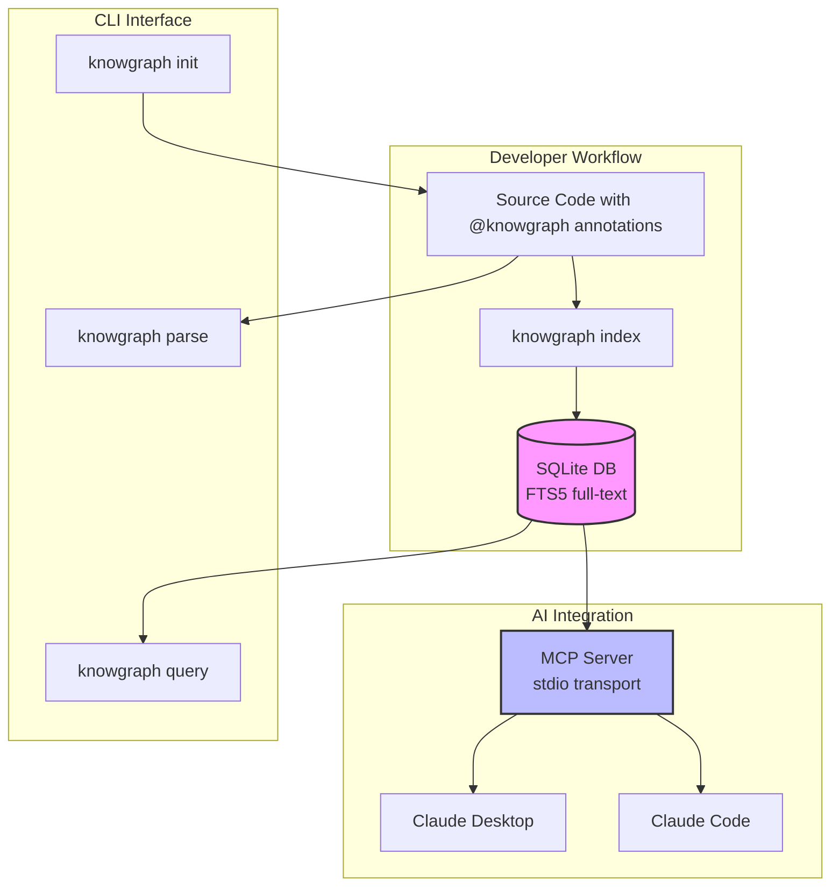

### Package Dependency Graph

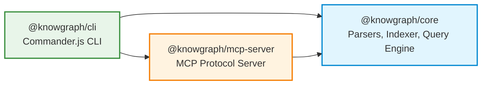

### Component Architecture

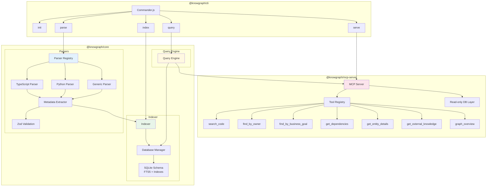

---

## 3. Monorepo Structure

```
knowgraph/
├── packages/
│   ├── core/                          # @knowgraph/core — the engine
│   │   ├── src/
│   │   │   ├── types/
│   │   │   │   ├── entity.ts          # Zod schemas: EntityType, Metadata, Compliance
│   │   │   │   ├── manifest.ts        # Zod schema for .knowgraph.yml config
│   │   │   │   ├── parse-result.ts    # ParseResult interface (parser output)
│   │   │   │   └── index.ts
│   │   │   ├── parsers/
│   │   │   │   ├── types.ts           # Parser and ParserRegistry interfaces
│   │   │   │   ├── registry.ts        # Extension-based parser routing
│   │   │   │   ├── metadata-extractor.ts  # YAML extraction + Zod validation
│   │   │   │   ├── typescript-parser.ts   # JSDoc extraction
│   │   │   │   ├── python-parser.ts       # Docstring extraction
│   │   │   │   ├── generic-parser.ts      # Regex fallback for any language
│   │   │   │   └── index.ts
│   │   │   ├── indexer/
│   │   │   │   ├── schema.ts          # SQLite DDL (tables, FTS5, indexes)
│   │   │   │   ├── database.ts        # CRUD operations + DatabaseManager
│   │   │   │   ├── indexer.ts         # File scanner + incremental indexing
│   │   │   │   ├── types.ts           # StoredEntity, IndexResult, IndexProgress
│   │   │   │   └── index.ts
│   │   │   ├── query/
│   │   │   │   ├── query-engine.ts    # FTS5 search, filters, pagination
│   │   │   │   └── index.ts
│   │   │   └── index.ts              # Core barrel export
│   │   └── package.json
│   │
│   ├── cli/                           # @knowgraph/cli — the user interface
│   │   ├── src/
│   │   │   ├── commands/
│   │   │   │   ├── init.ts            # Project setup wizard
│   │   │   │   ├── parse.ts           # knowgraph parse
│   │   │   │   ├── index-cmd.ts       # knowgraph index
│   │   │   │   ├── query.ts           # knowgraph query
│   │   │   │   ├── serve.ts           # knowgraph serve (MCP)
│   │   │   │   └── index.ts
│   │   │   ├── utils/
│   │   │   │   ├── detect.ts          # Language detection + file suggestions
│   │   │   │   ├── format.ts          # Output formatting
│   │   │   │   └── index.ts
│   │   │   └── index.ts              # CLI entrypoint
│   │   └── package.json
│   │
│   └── mcp-server/                    # @knowgraph/mcp-server — AI bridge
│       ├── src/
│       │   ├── tools/
│       │   │   ├── search-code.ts
│       │   │   ├── find-by-owner.ts
│       │   │   ├── find-by-business-goal.ts
│       │   │   ├── get-dependencies.ts
│       │   │   ├── get-entity-details.ts
│       │   │   ├── get-external-knowledge.ts
│       │   │   ├── graph-overview.ts
│       │   │   ├── format.ts
│       │   │   └── index.ts
│       │   ├── server.ts              # MCP server + stdio transport
│       │   ├── db.ts                  # Read-only SQLite layer
│       │   ├── config.ts
│       │   └── index.ts
│       └── package.json
│
├── schema/                            # JSON Schema specs + examples
├── examples/                          # Annotated example projects
├── roadmap/                           # Machine-readable tracker + ADRs
├── .github/workflows/                 # CI + Release pipelines
├── .knowgraph.yml                     # KnowGraph indexes itself
├── turbo.json                         # Turborepo orchestration
└── CONTRIBUTING.md                    # Contribution guidelines
```

---

## 4. Data Flow

### Annotation to Index to Query Pipeline

```mermaid
sequenceDiagram
    participant Dev as Developer
    participant CLI as knowgraph CLI
    participant Reg as Parser Registry
    participant Par as Language Parser
    participant Ext as Metadata Extractor
    participant Zod as Zod Validator
    participant Idx as Indexer
    participant DB as SQLite + FTS5

    Dev->>CLI: knowgraph index ./src
    CLI->>Idx: index({ rootDir, incremental })
    Idx->>Idx: Scan files (.gitignore aware)

    loop For each parsable file
        Idx->>Idx: Compute MD5 hash
        Idx->>Idx: Skip if hash unchanged (incremental)
        Idx->>Reg: parseFile(content, filePath)
        Reg->>Reg: Match extension to parser
        Reg->>Par: parse(content, filePath)
        Par->>Par: Extract comment blocks
        Par->>Ext: extractMetadata(commentBlock)
        Ext->>Ext: Find @knowgraph marker
        Ext->>Ext: Strip comment syntax, extract YAML
        Ext->>Zod: Validate against ExtendedMetadataSchema
        Zod-->>Ext: Validated metadata
        Ext-->>Par: ExtractionResult
        Par->>Par: Match to code entity
        Par-->>Reg: ParseResult[]
        Reg-->>Idx: ParseResult[]
        Idx->>DB: insertEntity + insertTags + insertLinks
        Idx->>DB: insertRelationship (from dependencies)
    end

    Idx-->>CLI: IndexResult (stats, errors, duration)
    CLI-->>Dev: Summary output
```

### MCP Query Flow

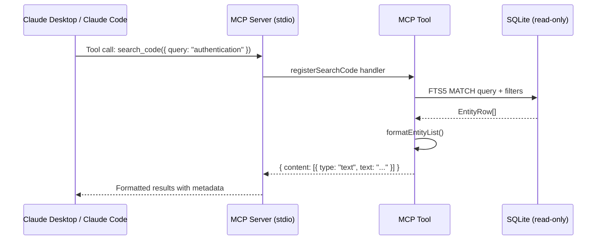

---

## 5. Core Package — @knowgraph/core

The core package (`packages/core/`) contains all the business logic.

### 5.1 Parser System

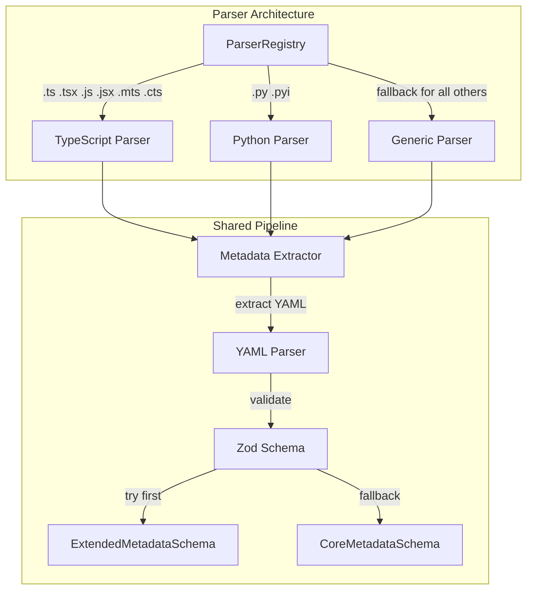

**Parser Interface** (`parsers/types.ts`):

```typescript
interface Parser {
  readonly name: string;
  readonly supportedExtensions: readonly string[];
  parse(content: string, filePath: string): readonly ParseResult[];
}
```

**TypeScript Parser** — Extracts from JSDoc `/** @knowgraph ... */` blocks, then matches to: class declarations, function declarations, arrow functions, interface declarations, type aliases, enum declarations, method declarations (with parent class detection), and module-level docs.

**Python Parser** — Extracts from triple-quoted docstrings containing `@knowgraph`, then matches to: function/method definitions (with parent class detection), class definitions, module-level docstrings, and collects decorators.

**Generic Parser** — Regex-based fallback for JSDoc, hash-style, and line-comment patterns. Works for Go, Java, Ruby, and any language.

### 5.2 Metadata Extractor

The pipeline in `parsers/metadata-extractor.ts`:

1. **Find marker** — Locate `@knowgraph` in comment block
2. **Strip syntax** — Remove `*`, `#`, whitespace from each line
3. **Dedent** — Remove common leading whitespace
4. **Parse YAML** — Using the `yaml` library
5. **Validate** — Try `ExtendedMetadataSchema` first (superset), fall back to `CoreMetadataSchema`
6. **Return** — `ExtractionResult` with validated metadata or errors

### 5.3 Indexer

The indexer (`indexer/indexer.ts`) orchestrates file scanning and database population:

1. **Collect files** — `globSync('**/*')` respecting `.gitignore` and exclude patterns
2. **Filter parsable** — Only files the registry can handle
3. **Incremental check** — Compare MD5 hash to stored hash, skip unchanged
4. **Parse** — Run through parser registry
5. **Store** — Insert entities, tags, links, and relationships into SQLite
6. **Report progress** — Callback with file count, entity count, current file

### 5.4 Query Engine

| Method | Description |
|--------|-------------|
| `search(options)` | FTS5 full-text search with type/owner/status/tag/filePath filters and pagination |
| `getEntity(id)` | Get single entity by SHA-256 ID |
| `getDependencies(entityId)` | Traverse relationship graph (outbound) |
| `getDependents(entityId)` | Traverse relationship graph (inbound) |
| `getByOwner(owner)` | All entities owned by a team/person |
| `getByTag(tag)` | All entities with a specific tag |
| `getStats()` | Index statistics (counts by type, language) |

---

## 6. CLI Package — @knowgraph/cli

Uses [Commander.js](https://github.com/tj/commander.js/) with five commands:

| Command | Description |
|---------|-------------|
| `knowgraph init` | Interactive project setup wizard with language detection |
| `knowgraph parse <path>` | Parse files and output entities as JSON |
| `knowgraph index <path>` | Build/update the SQLite index |
| `knowgraph query <text>` | Search with `--owner`, `--tags`, `--type` filters |
| `knowgraph serve` | Start the MCP server (stdio transport) |

### Init Wizard Flow

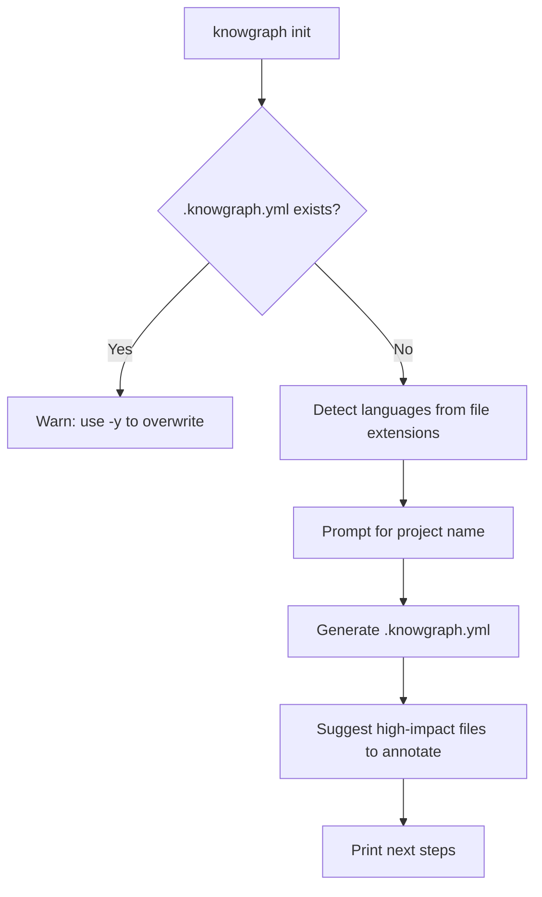

### Dependencies

- `chalk` — Terminal colors
- `commander` — CLI framework
- `inquirer` — Interactive prompts
- `ora` — Spinner animations
- `yaml` — YAML serialization

---

## 7. MCP Server Package — @knowgraph/mcp-server

### 7.1 Tools

| Tool | Parameters | Description |
|------|-----------|-------------|
| `search_code` | `query`, `type?`, `owner?`, `tags?`, `limit?` | Full-text search across entities |
| `find_by_owner` | `owner` | Find all entities owned by a team |
| `find_by_business_goal` | `goal` | Search by business goal or funnel stage |
| `get_dependencies` | `entity_id`, `depth?` | Map dependency graph with BFS traversal |
| `get_entity_details` | `entity_id` | Get complete metadata for one entity |
| `get_external_knowledge` | `entity_id?` | Find linked resources (Notion, Jira, etc.) |
| `graph_overview` | *(none)* | Index statistics: counts, types, languages, owners |

### 7.2 Transport

Uses **stdio transport** — communicates via stdin/stdout. No network configuration needed. Server process is spawned by the AI client.

### 7.3 Database Layer

Read-only SQLite layer (`db.ts`) that:
- Opens DB in read-only mode (`{ readonly: true, fileMustExist: true }`)
- Detects FTS5 availability, falls back to LIKE queries
- Supports depth-limited BFS for dependency traversal

### 7.4 Claude Desktop Configuration

```json
{
  "mcpServers": {
    "knowgraph": {
      "command": "knowgraph",
      "args": ["serve", "--db", ".knowgraph/knowgraph.db"]
    }
  }
}
```

---

## 8. Schema & Type System

Zod is the single source of truth for both runtime validation and TypeScript types.

### Core Schema Hierarchy

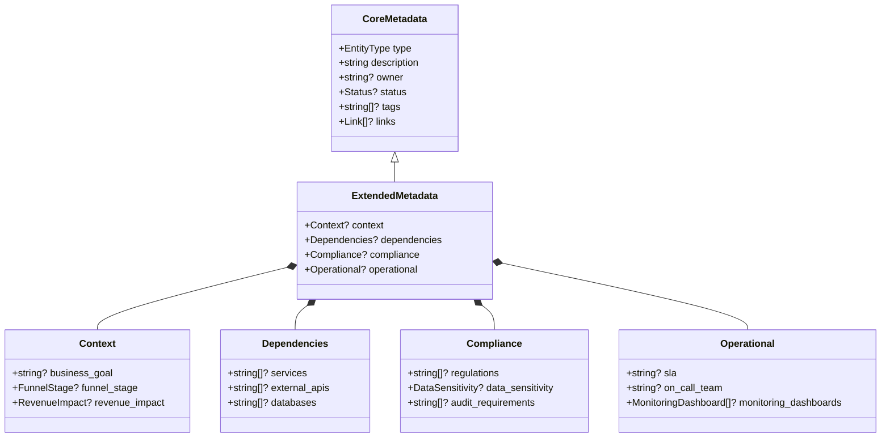

### Enums

| Enum | Values |
|------|--------|
| `EntityType` | `module`, `class`, `function`, `method`, `service`, `api_endpoint`, `variable`, `constant`, `interface`, `enum` |
| `Status` | `experimental`, `stable`, `deprecated` |
| `FunnelStage` | `awareness`, `acquisition`, `activation`, `retention`, `revenue`, `referral` |
| `RevenueImpact` | `critical`, `high`, `medium`, `low`, `none` |
| `DataSensitivity` | `public`, `internal`, `confidential`, `restricted` |
| `LinkType` | `notion`, `jira`, `linear`, `confluence`, `github`, `custom` |

---

## 9. Annotation Format

All annotations use YAML inside standard comments, prefixed with `@knowgraph`.

### TypeScript / JavaScript

```typescript
/**
 * @knowgraph
 * type: class
 * description: REST controller handling user CRUD operations
 * owner: platform-team
 * status: stable
 * tags: [users, api, rest]
 * context:
 *   business_goal: Core user management for the platform
 *   funnel_stage: activation
 *   revenue_impact: high
 * compliance:
 *   regulations: [GDPR]
 *   data_sensitivity: confidential
 */
export class UserController { }
```

### Python

```python
def process_payment(customer_id: str, amount_cents: int) -> PaymentResult:
    """
    @knowgraph
    type: function
    description: Processes a one-time payment charge through Stripe
    owner: payments-team
    status: stable
    tags: [payments, charge, stripe]
    context:
      funnel_stage: revenue
      revenue_impact: critical
    compliance:
      regulations: [PCI-DSS]
      data_sensitivity: restricted
    """
    pass
```

### Go

```go
// knowgraph:
//   type: function
//   description: HTTP handler for user registration
//   owner: auth-team
//   status: stable
//   tags: [auth, registration, http]
func HandleRegister(w http.ResponseWriter, r *http.Request) { }
```

### Required Fields

Only `type` and `description` are required. Everything else is optional.

---

## 10. Database Design

### Entity-Relationship Diagram

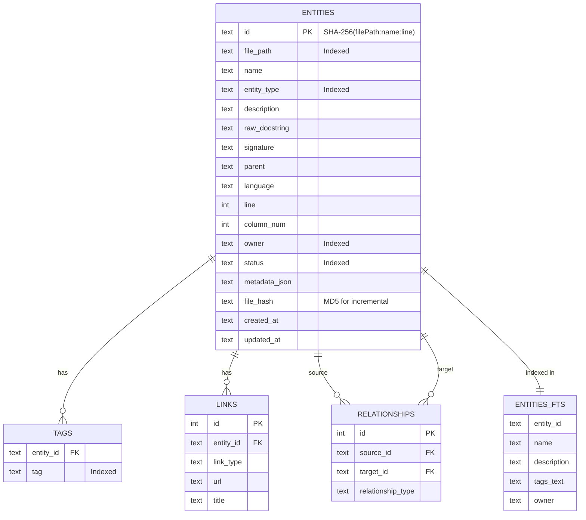

### Design Decisions

- **Entity ID**: SHA-256 hash of `filePath:name:line` — deterministic, collision-free
- **FTS5**: Virtual table for full-text search across name, description, tags, owner
- **WAL mode**: Write-Ahead Logging for concurrent reads
- **Incremental indexing**: MD5 file hash to skip unchanged files
- **Cascade deletes**: Tags, links, relationships auto-delete with entities

---

## 11. Development Setup

### Prerequisites

- **Node.js** >= 20
- **pnpm** 9.x (`corepack enable && corepack prepare pnpm@9.15.4 --activate`)

### Commands

```bash
git clone https://github.com/idosams/know-know.git
cd know-know
pnpm install
pnpm turbo build         # Build all packages
pnpm turbo test          # Run all tests
pnpm turbo typecheck     # Type check
pnpm turbo lint          # Lint
pnpm format              # Prettier
```

---

## 12. Build System & CI/CD

### Turborepo Build Order

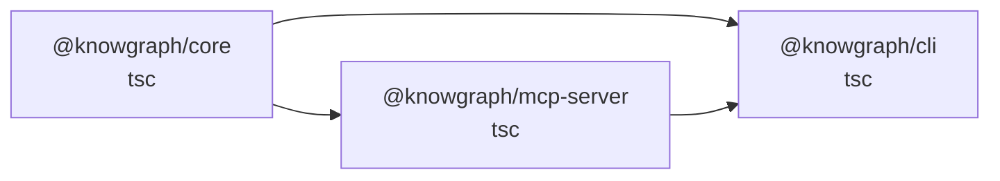

### CI Pipeline (GitHub Actions)

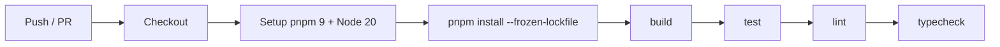

### Release Pipeline

Triggered by GitHub Release. Publishes to npm in dependency order with `--provenance`:

```
@knowgraph/core → @knowgraph/mcp-server → @knowgraph/cli
```

---

## 13. Testing Strategy

- **Framework**: Vitest
- **Coverage target**: 80%+

### Test Organization

| Package | Tests |
|---------|-------|
| `core/types` | Zod schema validation (entity, manifest) |
| `core/parsers` | Metadata extraction, TypeScript parser, Python parser, registry routing |
| `core/indexer` | SQLite CRUD, file scanning, incremental indexing |
| `core/query` | FTS5 search, filtering, pagination, dependency traversal |
| `cli` | All 5 commands (init, parse, index, query, serve) |
| `mcp-server` | Server setup, DB layer, all 7 MCP tools |

---

## 14. Key Conventions

| Convention | Rule |
|-----------|------|
| **Immutability** | Always `readonly`, never mutate objects |
| **File size** | 200-400 lines typical, 800 max |
| **Functions** | Under 50 lines |
| **TypeScript** | Strict mode, no `any` without justification |
| **Status values** | Only `experimental`, `stable`, `deprecated` |
| **Git workflow** | Feature branches + PRs, never push to main |
| **Commits** | `<type>: <description>` (feat, fix, refactor, docs, test, chore) |
| **Naming** | Files: kebab-case, Functions: camelCase factory pattern, Types: PascalCase |

---

## 15. Configuration Reference

### .knowgraph.yml

```yaml
version: "1.0"
name: my-project
languages: [typescript, python]
include: ["packages/*/src/**/*"]
exclude: [node_modules, dist, .git, __tests__]
index:
  output_dir: .knowgraph
  incremental: true
```

---

## 16. Architecture Decision Records

| ADR | Decision | Rationale |
|-----|----------|-----------|
| ADR-001 | pnpm + Turborepo monorepo | Shared types, parallel builds, single CI |
| ADR-002 | SQLite with FTS5 | Zero-config, portable, fast full-text search |
| ADR-003 | MCP protocol | Native Claude integration, standard protocol |
| ADR-004 | Zod schemas | Single source of truth for types + runtime validation |
| ADR-005 | Regex-based parsing (initial) | Fast multi-language support, tree-sitter later |
| ADR-006 | MD5 incremental indexing | Only re-index changed files |
| ADR-007 | YAML in code comments | Familiar syntax, lives with code, IDE-friendly |
| ADR-008 | Commander.js CLI | Well-maintained, built-in help, subcommands |
| ADR-009 | Defer vector embeddings | Simpler initial release, FTS5 covers most cases |
| ADR-010 | Connector plugin architecture | Separate npm packages, install only what you need |

Full details: [`roadmap/decisions.yml`](../roadmap/decisions.yml)

---

## 17. Roadmap

### Phase Overview

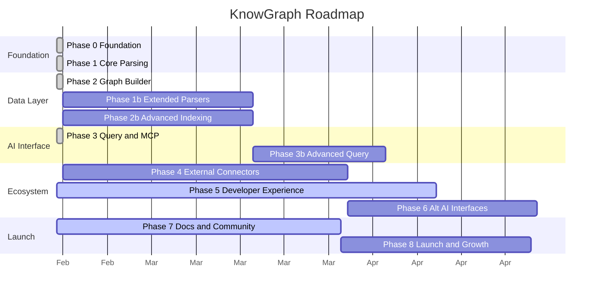

### Current Status (42% overall)

| Phase | Status | Progress |
|-------|--------|----------|
| 0 — Foundation | Complete | 100% |
| 1 — Core Parsing | Complete | 100% |
| 2 — Graph Builder & Indexer | Complete | 100% |
| 3 — Query & MCP Server | Complete | 100% |
| 5 — Developer Experience | **In Progress** | 30% |
| 7 — Documentation & Community | **In Progress** | 25% |
| 1b, 2b, 3b, 4, 6, 8 | Not Started | 0% |

Full details: [`ROADMAP.md`](../ROADMAP.md) and [`roadmap/tracker.yml`](../roadmap/tracker.yml)

---

*Generated from the KnowGraph source code and project files.*
