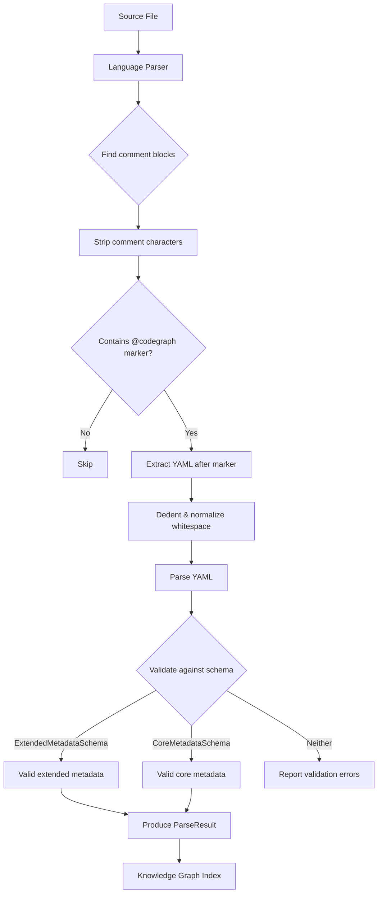

# Annotation Guide & Schema Reference

CodeGraph annotations are structured YAML metadata embedded in source code comments. They describe what code does, who owns it, how it connects to business goals, and what compliance requirements it must meet. The indexer extracts these annotations and builds a queryable knowledge graph.

## Table of Contents

- [How Annotations Work](#how-annotations-work)
- [Language-Specific Examples](#language-specific-examples)
  - [TypeScript / JavaScript](#typescript--javascript)
  - [Python](#python)
  - [Go](#go)
  - [Java](#java)
  - [Generic (Any Language)](#generic-any-language)
- [Complete Field Reference](#complete-field-reference)
  - [Core Fields](#core-fields)
  - [Context Fields](#context-fields)
  - [Dependencies Fields](#dependencies-fields)
  - [Compliance Fields](#compliance-fields)
  - [Operational Fields](#operational-fields)
  - [Links Fields](#links-fields)
- [Enum Value Reference](#enum-value-reference)
- [Best Practices](#best-practices)
- [Common Patterns](#common-patterns)

---

## How Annotations Work

### The `@codegraph` Marker

Every annotation begins with the `@codegraph` marker. This marker tells the parser that the YAML content following it should be extracted and validated. Without this marker, the comment is ignored.

```
@codegraph
type: function
description: Processes a payment charge through Stripe
```

### YAML-in-Comments Format

Annotations are written as valid YAML inside your language's native comment syntax. The parser strips comment characters (`*`, `#`, `//`) and indentation before parsing the YAML. This means you write annotations using the comment style you already use.

### Extraction Pipeline

The following diagram shows how annotations flow from source code to the knowledge graph:



**Step by step:**

1. **Language parser** scans the file for comment blocks (JSDoc, docstrings, line comments, etc.)
2. **Comment stripping** removes language-specific comment characters (`*`, `#`, `//`)
3. **Marker detection** checks whether `@codegraph` appears in the stripped content
4. **YAML extraction** takes everything after the `@codegraph` marker
5. **Dedent** removes common leading whitespace (important for indented docstrings)
6. **YAML parsing** converts the text to a structured object
7. **Schema validation** tries `ExtendedMetadataSchema` first (includes context, dependencies, compliance, operational), then falls back to `CoreMetadataSchema`
8. **ParseResult** is emitted with the validated metadata, entity name, file path, line number, and language

### Parser Selection

CodeGraph selects the parser based on file extension:

| Parser     | Extensions                               |
|------------|------------------------------------------|
| TypeScript | `.ts`, `.tsx`, `.js`, `.jsx`, `.mts`, `.cts` |
| Python     | `.py`, `.pyi`                            |
| Generic    | All other files (fallback)               |

The generic parser handles any language by looking for block comments (`/* */`, `""" """`, `''' '''`) and consecutive line comments (`//` or `#`).

---

## Language-Specific Examples

### TypeScript / JavaScript

TypeScript and JavaScript annotations use JSDoc comment blocks (`/** ... */`). The parser recognizes annotations on modules, classes, functions, methods, interfaces, enums, type aliases, and arrow functions.

#### Module-Level Annotation

Place the annotation at the top of the file, before any non-import code:

```typescript
/**
 * @codegraph
 * type: module
 * description: Express application entry point for the blog platform API
 * owner: platform-team
 * status: stable
 * tags: [api, express, blog-platform]
 * context:
 *   business_goal: Content management and publishing platform
 *   funnel_stage: activation
 *   revenue_impact: high
 * dependencies:
 *   services: [auth-service, media-service]
 *   databases: [postgres-main, redis-cache]
 * operational:
 *   sla: "99.9%"
 *   on_call_team: platform-team
 */

import express from 'express';
```

#### Function Declaration

```typescript
/**
 * @codegraph
 * type: function
 * description: Registers a new user with email/password and returns a JWT
 * owner: platform-team
 * status: stable
 * tags: [users, registration, auth]
 * context:
 *   funnel_stage: acquisition
 *   revenue_impact: high
 * compliance:
 *   regulations: [GDPR]
 *   data_sensitivity: confidential
 */
async function registerUser(req: Request, res: Response): Promise<void> {
  // ...
}
```

#### Arrow Function

```typescript
/**
 * @codegraph
 * type: function
 * description: Validates request body against a Zod schema
 * owner: platform-team
 * status: stable
 * tags: [validation, middleware]
 */
export const validateBody = (schema: ZodSchema) => {
  // ...
};
```

#### Class

```typescript
/**
 * @codegraph
 * type: class
 * description: Service class managing email delivery through SendGrid
 * owner: platform-team
 * status: stable
 * tags: [email, notifications, sendgrid]
 * dependencies:
 *   external_apis: [sendgrid-api]
 */
export class EmailService {
  // ...
}
```

#### Method (Inside a Class)

```typescript
export class EmailService {
  /**
   * @codegraph
   * type: method
   * description: Sends a welcome email to newly registered users
   * owner: platform-team
   * status: stable
   * tags: [email, welcome, onboarding]
   * context:
   *   funnel_stage: acquisition
   *   revenue_impact: high
   */
  async sendWelcomeEmail(to: string, displayName: string): Promise<boolean> {
    // ...
  }
}
```

The parser automatically detects the enclosing class and sets the `parent` field on the resulting `ParseResult`.

#### Interface

```typescript
/**
 * @codegraph
 * type: interface
 * description: Core user entity representing a registered platform user
 * owner: platform-team
 * status: stable
 * tags: [users, models, entity]
 * compliance:
 *   regulations: [GDPR]
 *   data_sensitivity: confidential
 */
export interface User {
  readonly id: string;
  readonly email: string;
  readonly displayName: string;
}
```

#### Enum

```typescript
/**
 * @codegraph
 * type: enum
 * description: Possible states of an order in the fulfillment pipeline
 * owner: orders-team
 * status: stable
 * tags: [orders, state-machine]
 */
export enum OrderStatus {
  Pending = 'pending',
  Confirmed = 'confirmed',
  Shipped = 'shipped',
  Delivered = 'delivered',
  Cancelled = 'cancelled',
}
```

---

### Python

Python annotations use triple-quoted docstrings (`"""..."""` or `'''...'''`). The parser recognizes annotations on modules, classes, functions, and methods.

#### Module-Level Annotation

Place the docstring at the very top of the file (before imports):

```python
"""
@codegraph
type: module
description: Payment processing service integrating with Stripe
owner: payments-team
status: stable
tags: [payments, billing, stripe]
context:
  business_goal: Revenue processing and subscription management
  funnel_stage: revenue
  revenue_impact: critical
dependencies:
  services: [notification-service]
  external_apis: [stripe-api]
  databases: [postgres-main]
compliance:
  regulations: [PCI-DSS, SOC2]
  data_sensitivity: restricted
  audit_requirements: [transaction-logging, pci-audit-trail]
operational:
  sla: "99.99%"
  on_call_team: payments-team
"""

from dataclasses import dataclass
```

#### Function

```python
def process_payment(
    customer_id: str,
    amount_cents: int,
    currency: str,
) -> PaymentResult:
    """
    @codegraph
    type: function
    description: Processes a one-time payment charge through Stripe
    owner: payments-team
    status: stable
    tags: [payments, charge, stripe]
    context:
      funnel_stage: revenue
      revenue_impact: critical
    compliance:
      regulations: [PCI-DSS]
      data_sensitivity: restricted
    """
    pass
```

#### Class

```python
@dataclass(frozen=True)
class UserCreate:
    """
    @codegraph
    type: class
    description: Pydantic schema for user registration request validation
    owner: platform-team
    status: stable
    tags: [users, models, validation, input]
    """
    email: str
    name: str
    password: str
```

The parser collects decorators (like `@dataclass`) from lines above the `class` or `def` statement.

#### Method (Inside a Class)

```python
class OrderService:
    def create_order(
        self,
        order_data: OrderCreate,
    ) -> OrderResponse:
        """
        @codegraph
        type: method
        description: Creates a new order and initiates payment processing
        owner: orders-team
        status: stable
        tags: [orders, create, payment]
        context:
          funnel_stage: revenue
          revenue_impact: critical
        """
        pass
```

The parser uses indentation to detect the enclosing class, setting the `parent` field automatically.

---

### Go

Go does not have block-level doc comments like JSDoc. Use consecutive line comments with the `@codegraph` marker. The generic parser handles Go files.

#### Module-Level Annotation

```go
// @codegraph
// type: module
// description: HTTP handler package for the user management API
// owner: platform-team
// status: stable
// tags: [api, http, users]
// context:
//   business_goal: User lifecycle management
//   funnel_stage: acquisition
//   revenue_impact: high

package handlers
```

#### Function

```go
// @codegraph
// type: function
// description: Handles POST /users to create a new user account
// owner: platform-team
// status: stable
// tags: [users, registration, api]
// compliance:
//   regulations: [GDPR]
//   data_sensitivity: confidential
func CreateUser(w http.ResponseWriter, r *http.Request) {
    // ...
}
```

---

### Java

Java annotations use JavaDoc comment blocks (`/** ... */`). The generic parser handles Java files.

#### Class

```java
/**
 * @codegraph
 * type: class
 * description: REST controller for payment processing endpoints
 * owner: payments-team
 * status: stable
 * tags: [payments, api, rest]
 * dependencies:
 *   services: [payment-service, notification-service]
 *   external_apis: [stripe-api]
 * compliance:
 *   regulations: [PCI-DSS]
 *   data_sensitivity: restricted
 */
@RestController
@RequestMapping("/api/v1/payments")
public class PaymentController {
    // ...
}
```

#### Method

```java
/**
 * @codegraph
 * type: method
 * description: Processes a payment charge and returns a transaction receipt
 * owner: payments-team
 * status: stable
 * tags: [payments, charge]
 * context:
 *   funnel_stage: revenue
 *   revenue_impact: critical
 */
@PostMapping("/charge")
public ResponseEntity<TransactionReceipt> charge(@RequestBody ChargeRequest request) {
    // ...
}
```

---

### Generic (Any Language)

The generic parser works with any language that uses block comments (`/* */`, `""" """`, `''' '''`) or consecutive line comments (`//`, `#`). It serves as a fallback when no dedicated parser exists.

#### Block Comment Style

```c
/*
 * @codegraph
 * type: function
 * description: Initializes the connection pool for the database
 * owner: infra-team
 * status: stable
 * tags: [database, init, connection-pool]
 */
void init_connection_pool(Config *config) {
    // ...
}
```

#### Hash Comment Style (Ruby, Shell, etc.)

```ruby
# @codegraph
# type: module
# description: Background job processor for email delivery queue
# owner: platform-team
# status: stable
# tags: [jobs, email, background]
# dependencies:
#   services: [email-service]
#   databases: [redis-cache]

class EmailWorker
  # ...
end
```

```bash
# @codegraph
# type: module
# description: Deployment script for production environment
# owner: devops-team
# status: stable
# tags: [deploy, production, ci-cd]
# operational:
#   on_call_team: devops-team

#!/bin/bash
set -euo pipefail
```

---

## Complete Field Reference

### Core Fields

These fields form the minimum required annotation. Every annotation must include `type` and `description`.

| Field         | Type       | Required | Description                                                   | Example                                    |
|---------------|------------|----------|---------------------------------------------------------------|--------------------------------------------|
| `type`        | `string`   | Yes      | The kind of code entity being annotated                       | `module`, `function`, `class`              |
| `description` | `string`   | Yes      | Human-readable description of what this code does (min 1 char) | `"Processes payment charges via Stripe"`   |
| `owner`       | `string`   | No       | Team or individual responsible for this code                  | `"payments-team"`                          |
| `status`      | `string`   | No       | Lifecycle status of this code                                 | `"stable"`                                 |
| `tags`        | `string[]` | No       | Searchable labels for categorization                          | `[payments, stripe, billing]`              |
| `links`       | `Link[]`   | No       | External references (docs, tickets, dashboards)               | See [Links Fields](#links-fields)          |

### Context Fields

Nested under the `context` key. Maps code to business metrics.

| Field            | Type     | Required | Description                                          | Example         |
|------------------|----------|----------|------------------------------------------------------|-----------------|
| `business_goal`  | `string` | No       | What business objective this code serves             | `"Revenue processing and subscription management"` |
| `funnel_stage`   | `string` | No       | Where in the customer funnel this code operates      | `"revenue"`     |
| `revenue_impact` | `string` | No       | How much revenue depends on this code working        | `"critical"`    |

### Dependencies Fields

Nested under the `dependencies` key. Maps runtime dependencies.

| Field           | Type       | Required | Description                                       | Example                              |
|-----------------|------------|----------|---------------------------------------------------|--------------------------------------|
| `services`      | `string[]` | No       | Internal services this code depends on            | `[auth-service, payment-service]`    |
| `external_apis` | `string[]` | No       | Third-party APIs this code calls                  | `[stripe-api, sendgrid-api]`         |
| `databases`     | `string[]` | No       | Databases this code reads from or writes to       | `[postgres-main, redis-cache]`       |

### Compliance Fields

Nested under the `compliance` key. Tracks regulatory and data-handling requirements.

| Field                | Type       | Required | Description                                          | Example                                    |
|----------------------|------------|----------|------------------------------------------------------|--------------------------------------------|
| `regulations`        | `string[]` | No       | Regulatory frameworks that apply to this code        | `[PCI-DSS, GDPR, SOC2]`                   |
| `data_sensitivity`   | `string`   | No       | Classification of data handled by this code          | `"restricted"`                             |
| `audit_requirements` | `string[]` | No       | Specific audit trails this code must maintain        | `[transaction-logging, pci-audit-trail]`   |

### Operational Fields

Nested under the `operational` key. Captures runtime and incident-response metadata.

| Field                    | Type                     | Required | Description                                          | Example                                          |
|--------------------------|--------------------------|----------|------------------------------------------------------|--------------------------------------------------|
| `sla`                    | `string`                 | No       | Uptime or performance SLA commitment                 | `"99.99%"`                                       |
| `on_call_team`           | `string`                 | No       | Team responsible for production incidents            | `"payments-team"`                                |
| `monitoring_dashboards`  | `MonitoringDashboard[]`  | No       | Links to monitoring/observability dashboards         | See below                                        |

Each monitoring dashboard entry:

| Field   | Type     | Required | Description                     | Example                                            |
|---------|----------|----------|---------------------------------|----------------------------------------------------|
| `type`  | `string` | No       | Dashboard platform              | `"grafana"`, `"datadog"`                           |
| `url`   | `string` | Yes      | URL to the dashboard            | `"https://grafana.example.com/d/payments"`         |
| `title` | `string` | No       | Human-readable dashboard name   | `"Payment Processing Dashboard"`                   |

### Links Fields

Each entry in the `links` array:

| Field   | Type     | Required | Description                          | Example                                      |
|---------|----------|----------|--------------------------------------|----------------------------------------------|
| `type`  | `string` | No       | The kind of linked resource          | `"notion"`, `"jira"`, `"github"`             |
| `url`   | `string` | Yes      | URL to the linked resource           | `"https://notion.so/api-architecture"`       |
| `title` | `string` | No       | Human-readable title for the link    | `"API Architecture Document"`                |

---

## Enum Value Reference

### `type` (Entity Type)

| Value          | Description                                              |
|----------------|----------------------------------------------------------|
| `module`       | A file-level or package-level entity                     |
| `class`        | A class definition                                       |
| `function`     | A standalone function                                    |
| `method`       | A function that belongs to a class                       |
| `service`      | A logical service or microservice boundary               |
| `api_endpoint` | A specific API route handler                             |
| `variable`     | A module-level variable                                  |
| `constant`     | A module-level constant                                  |
| `interface`    | A TypeScript interface or protocol definition            |
| `enum`         | An enumeration type                                      |

### `status`

| Value          | Description                                              |
|----------------|----------------------------------------------------------|
| `experimental` | Under active development, API may change                 |
| `stable`       | Production-ready, API is settled                         |
| `deprecated`   | Scheduled for removal, do not add new dependencies       |

### `funnel_stage`

| Value        | Description                                                |
|--------------|------------------------------------------------------------|
| `awareness`  | How users discover the product (landing pages, SEO)        |
| `acquisition`| How users sign up or create accounts                       |
| `activation` | How users experience the core value for the first time     |
| `retention`  | How users keep coming back (notifications, dashboards)     |
| `revenue`    | How the product generates money (payments, subscriptions)  |
| `referral`   | How users invite others (sharing, referral programs)       |

### `revenue_impact`

| Value      | Description                                                   |
|------------|---------------------------------------------------------------|
| `critical` | Direct, immediate impact on revenue if this code fails        |
| `high`     | Significant revenue impact, but partial degradation possible  |
| `medium`   | Moderate revenue impact, workarounds exist                    |
| `low`      | Minor revenue impact                                          |
| `none`     | No direct revenue impact                                      |

### `data_sensitivity`

| Value          | Description                                              |
|----------------|----------------------------------------------------------|
| `public`       | Data that can be freely shared                           |
| `internal`     | Data limited to the organization                         |
| `confidential` | Sensitive data requiring access controls (PII, emails)   |
| `restricted`   | Highly sensitive data (payment cards, secrets, PHI)      |

### `link.type`

| Value        | Description                         |
|--------------|-------------------------------------|
| `notion`     | Notion page                         |
| `jira`       | Jira issue or epic                  |
| `linear`     | Linear issue or project             |
| `confluence` | Confluence page                     |
| `github`     | GitHub issue, PR, or file           |
| `custom`     | Any other URL                       |

### `annotation_style` (Manifest Config)

| Value           | Description                                       |
|-----------------|---------------------------------------------------|
| `jsdoc`         | JSDoc block comments (`/** ... */`)               |
| `docstring`     | Python triple-quoted docstrings                   |
| `line_comment`  | Consecutive `//` or `#` line comments             |
| `block_comment` | Generic block comments (`/* ... */`)              |

---

## Best Practices

### What to Annotate First

Start with the code that matters most. You do not need 100% annotation coverage on day one.

1. **Entry points** -- `main.ts`, `app.py`, the top-level files that wire everything together. These give anyone reading the codebase immediate orientation.
2. **API boundaries** -- Route handlers, GraphQL resolvers, RPC endpoints. These are the contract between your system and its consumers.
3. **Business-critical code** -- Payment processing, authentication, order fulfillment. Code where a bug has direct revenue or compliance impact.
4. **External integration points** -- Services that call third-party APIs (Stripe, SendGrid, AWS). These are common sources of incidents.
5. **Data models** -- Interfaces, schemas, and types that define the shape of your domain. These help new engineers understand the domain quickly.

### Annotation Density

Not every function needs an annotation. Use this rule of thumb:

- **Always annotate**: Modules, classes, public API functions, anything with compliance requirements
- **Usually annotate**: Internal service functions, data models, middleware
- **Rarely annotate**: Private helper functions, trivial getters/setters, test utilities

A well-annotated module-level comment can provide context for all the functions within it. You do not need to repeat `owner` and `dependencies` on every function if the module annotation already declares them.

### Keeping Annotations Up to Date

- **Code review**: Include annotation accuracy as part of pull request review. If the behavior changes, the annotation should change too.
- **CI validation**: Run `codegraph index` in CI to catch YAML syntax errors and schema violations before merge.
- **Periodic audits**: Query the index for `status: deprecated` entities that still have dependents, or modules missing `owner`.

### Team Adoption

1. **Start small**: Pick one service or package and annotate it fully. Use it as a reference for the rest of the team.
2. **Provide templates**: Share copy-paste annotation templates for common patterns (see [Common Patterns](#common-patterns) below).
3. **Automate validation**: Add `codegraph index` to your CI pipeline so broken annotations fail the build.
4. **Show value early**: Use queries to answer real questions ("who owns the payment module?", "what code is affected by PCI-DSS?") and share the results with the team.

---

## Common Patterns

### Module-Level Annotation

The most common pattern. Provides context for an entire file.

```typescript
/**
 * @codegraph
 * type: module
 * description: <What this file does and why it exists>
 * owner: <team-name>
 * status: stable
 * tags: [<relevant>, <tags>]
 */
```

### Function with Business Context

For functions that map directly to business operations:

```typescript
/**
 * @codegraph
 * type: function
 * description: <What this function does>
 * owner: <team-name>
 * status: stable
 * tags: [<relevant>, <tags>]
 * context:
 *   business_goal: <Why this matters to the business>
 *   funnel_stage: <awareness|acquisition|activation|retention|revenue|referral>
 *   revenue_impact: <critical|high|medium|low|none>
 */
```

### Linking to Notion, Jira, or Other Tools

Connect code to external documentation and project management:

```python
"""
@codegraph
type: module
description: Order fulfillment pipeline
owner: orders-team
status: stable
links:
  - type: notion
    url: https://notion.so/order-fulfillment-design
    title: Order Fulfillment Architecture
  - type: jira
    url: https://jira.example.com/browse/ORD-200
    title: Order Management Epic
  - type: github
    url: https://github.com/org/repo/blob/main/docs/orders.md
    title: Order API Documentation
"""
```

### Compliance Annotations for Regulated Code

For code handling sensitive data or subject to regulations:

```typescript
/**
 * @codegraph
 * type: function
 * description: Processes credit card charges through Stripe
 * owner: payments-team
 * status: stable
 * tags: [payments, charge, stripe]
 * compliance:
 *   regulations: [PCI-DSS, SOC2]
 *   data_sensitivity: restricted
 *   audit_requirements: [transaction-logging, pci-audit-trail]
 */
```

This allows you to query all code subject to a specific regulation:

```bash
codegraph query --filter 'compliance.regulations contains PCI-DSS'
```

### Dependency Mapping

For code with known runtime dependencies on services, APIs, or databases:

```python
"""
@codegraph
type: module
description: Order processing service
owner: orders-team
status: stable
dependencies:
  services: [payment-service, inventory-service, notification-service]
  external_apis: [stripe-api]
  databases: [postgres-main]
"""
```

This enables impact analysis: "If the payment-service goes down, what code is affected?"

### Operational Metadata

For production services where incident response matters:

```typescript
/**
 * @codegraph
 * type: module
 * description: Core API gateway handling all inbound traffic
 * owner: platform-team
 * status: stable
 * operational:
 *   sla: "99.99%"
 *   on_call_team: platform-team
 *   monitoring_dashboards:
 *     - type: grafana
 *       url: https://grafana.example.com/d/api-gateway
 *       title: API Gateway Dashboard
 *     - type: datadog
 *       url: https://app.datadoghq.com/dashboard/api-gateway
 *       title: API Gateway Metrics
 */
```

### Full Extended Annotation

An annotation using every available field:

```typescript
/**
 * @codegraph
 * type: module
 * description: Payment processing service handling charges, refunds, and subscriptions
 * owner: payments-team
 * status: stable
 * tags: [payments, billing, stripe]
 * links:
 *   - type: confluence
 *     url: https://confluence.example.com/payments/architecture
 *     title: Payment Architecture Overview
 *   - type: jira
 *     url: https://jira.example.com/browse/PAY-100
 *     title: Payment Service Epic
 * context:
 *   business_goal: Revenue processing and subscription management
 *   funnel_stage: revenue
 *   revenue_impact: critical
 * dependencies:
 *   services: [notification-service, user-service]
 *   external_apis: [stripe-api]
 *   databases: [postgres-main]
 * compliance:
 *   regulations: [PCI-DSS, SOC2]
 *   data_sensitivity: restricted
 *   audit_requirements: [transaction-logging, pci-audit-trail]
 * operational:
 *   sla: "99.99%"
 *   on_call_team: payments-team
 *   monitoring_dashboards:
 *     - type: datadog
 *       url: https://app.datadoghq.com/dashboard/payments
 *       title: Payment Processing Dashboard
 */
```
