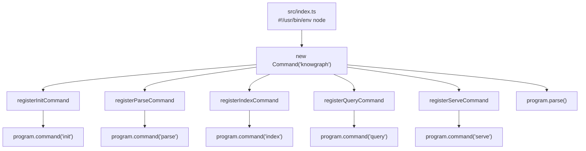
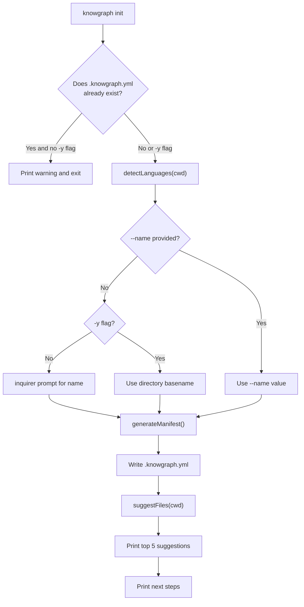
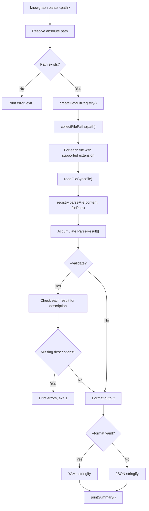
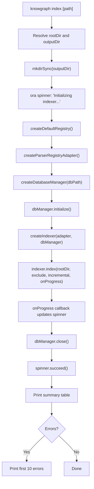
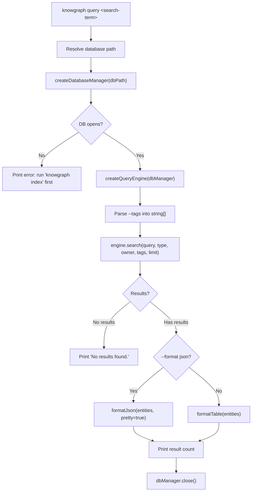
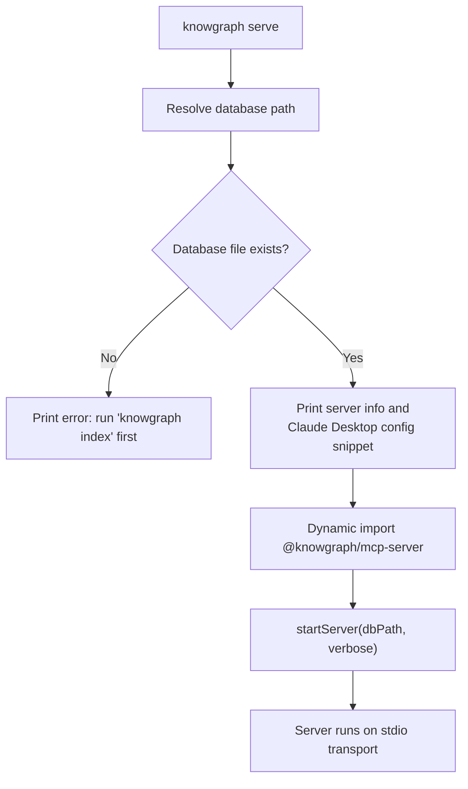
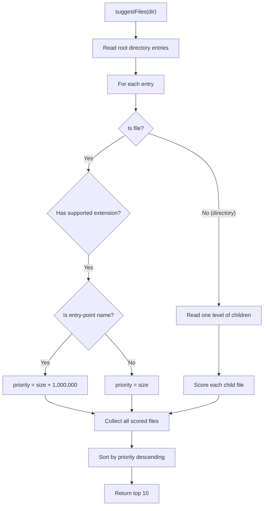

# @knowgraph/cli -- Implementation Documentation

The CLI package (`packages/cli/`) provides the `knowgraph` command-line interface built on [Commander.js](https://github.com/tj/commander.js). It exposes five subcommands -- `init`, `parse`, `index`, `query`, and `serve` -- that together form the primary developer workflow for annotating, indexing, and querying a codebase.

## Table of Contents

- [Architecture](#architecture)
- [init Command](#init-command)
- [parse Command](#parse-command)
- [index Command](#index-command)
- [query Command](#query-command)
- [serve Command](#serve-command)
- [Utilities](#utilities)

---

## Architecture

### Entrypoint

The CLI entrypoint is `src/index.ts`, which carries the `#!/usr/bin/env node` shebang so it can run as a standalone executable. The `bin` field in `package.json` maps the `knowgraph` command to the compiled `dist/index.js`.

The entrypoint creates a single `Commander.Command` instance and delegates to five `register*Command` functions, each of which adds a subcommand with its own options and action handler.

```
src/
  index.ts              # Entrypoint -- creates program, registers commands
  commands/
    index.ts            # Barrel re-export for all register* functions
    init.ts             # knowgraph init
    parse.ts            # knowgraph parse <path>
    index-cmd.ts        # knowgraph index [path]
    query.ts            # knowgraph query <search-term>
    serve.ts            # knowgraph serve
  utils/
    index.ts            # Barrel re-export for utilities
    detect.ts           # Language detection and file suggestion
    format.ts           # Table and JSON output formatters
```

### Command Registration Pattern

Every command module exports a single `register*Command(program: Command): void` function. This function calls `program.command(...)` to declare the subcommand name, description, options, and action handler. The barrel file at `commands/index.ts` re-exports all five registration functions so the entrypoint can import them in one statement.



### Dependencies

| Dependency | Purpose |
|---|---|
| `commander` | Command-line argument parsing and subcommand routing |
| `chalk` | Terminal color output |
| `ora` | Spinner for progress display during indexing |
| `inquirer` | Interactive prompts (dynamically imported in `init`) |
| `yaml` | YAML serialization for `.knowgraph.yml` generation |
| `@knowgraph/core` | Parser registry, indexer, database manager, query engine |
| `@knowgraph/mcp-server` | MCP protocol server (dynamically imported in `serve`) |

---

## init Command

**File:** `src/commands/init.ts`

Initializes a new KnowGraph project by detecting languages, generating a `.knowgraph.yml` manifest, and suggesting high-impact files to annotate first.

### Usage

```bash
# Interactive mode (prompts for project name)
knowgraph init

# Non-interactive mode (uses directory name as project name)
knowgraph init -y

# Custom project name
knowgraph init --name my-project

# Overwrite existing config
knowgraph init -y --name my-project
```

### Options

| Flag | Description |
|---|---|
| `--name <name>` | Project name (overrides prompt / directory-name default) |
| `-y, --yes` | Non-interactive mode -- uses defaults, overwrites existing config |

### Execution Flow



### Language Detection Algorithm

The `detectLanguages()` function (from `utils/detect.ts`) scans the project directory up to 4 levels deep, counting file extensions. It maps extensions to language names using a static lookup table (e.g., `.ts` and `.tsx` both map to `typescript`). Results are sorted by file count descending, so the most prevalent language appears first.

### Manifest Generation

The `generateManifest()` function produces a plain object that is serialized to YAML:

```yaml
version: "1.0"
name: my-project
languages:
  - typescript
  - python
include:
  - "**/*"
exclude:
  - node_modules
  - .git
  - dist
  - build
  - __pycache__
index:
  output_dir: .knowgraph
  incremental: true
```

### File Suggestion Algorithm

After writing the config, `suggestFiles()` scans the root directory and one level of subdirectories. It prioritizes:

1. **Entry-point files** (e.g., `index.ts`, `main.py`, `app.js`, `server.ts`) -- these receive a +1,000,000 priority bonus.
2. **Larger files** -- file size is used as a secondary sort key (larger files are more likely to contain important logic).

The top 5 results are printed to help users know where to start adding `@knowgraph` annotations.

### Sample Output

```
$ knowgraph init
Initializing KnowGraph...

Detected languages: typescript, python
? Project name: my-project

Created .knowgraph.yml

Suggested files to annotate first:
  src/index.ts
  src/commands/query.ts
  src/utils/detect.ts
  lib/main.py
  server.ts

Next steps:
  1. Add @knowgraph annotations to your code
  2. Run knowgraph index to build the graph
  3. Run knowgraph serve to start the MCP server
  4. Run knowgraph query <term> to search
```

---

## parse Command

**File:** `src/commands/parse.ts`

Parses source files for `@knowgraph` annotations and outputs the extracted metadata as JSON or YAML. This is useful for previewing annotations before indexing.

### Usage

```bash
# Parse a single file
knowgraph parse src/index.ts

# Parse an entire directory
knowgraph parse src/

# Pretty-print JSON output
knowgraph parse src/ --pretty

# YAML output
knowgraph parse src/ --format yaml

# Validate annotations have required fields
knowgraph parse src/ --validate
```

### Options

| Flag | Description | Default |
|---|---|---|
| `--format <format>` | Output format: `json` or `yaml` | `json` |
| `--validate` | Validate metadata (checks for required `description` field) | off |
| `--language <lang>` | Override language auto-detection | auto |
| `--pretty` | Pretty-print JSON output | off |

### Execution Flow



### File Collection

The `collectFilePaths()` function recursively walks directories, skipping common non-source directories (`node_modules`, `.git`, `dist`, `build`, `__pycache__`, `.venv`, `venv`, `coverage`). Hidden files (starting with `.`) are also skipped. Only files with supported extensions (`.py`, `.ts`, `.tsx`, `.js`, `.jsx`) are parsed unless `--language` is provided.

### Validation Mode

When `--validate` is passed, each `ParseResult` is checked for a `description` field in its metadata. Missing descriptions produce a validation error with the file path and line number, and the process exits with code 1.

### Sample Output

```
$ knowgraph parse src/commands/init.ts --pretty
[
  {
    "name": "src/commands/init.ts",
    "filePath": "/project/src/commands/init.ts",
    "line": 1,
    "entityType": "module",
    "metadata": {
      "type": "module",
      "description": "CLI command that initializes a new .knowgraph.yml project configuration",
      "owner": "knowgraph-cli",
      "status": "stable",
      "tags": ["cli", "command", "init", "setup"]
    }
  }
]

Found 1 entities in 1 files
```

---

## index Command

**File:** `src/commands/index-cmd.ts`

Scans a repository for annotated source files and builds a SQLite database containing the code graph. This is the core build step that must be run before `query` or `serve`.

### Usage

```bash
# Index the current directory
knowgraph index

# Index a specific directory
knowgraph index ./src

# Custom output directory
knowgraph index --output ./my-db

# Full re-index (skip incremental checks)
knowgraph index --no-incremental

# Exclude additional patterns
knowgraph index --exclude "test,fixtures,__mocks__"

# Verbose progress
knowgraph index --verbose
```

### Options

| Flag | Description | Default |
|---|---|---|
| `--output <dir>` | Directory for the SQLite database | `.knowgraph` |
| `--exclude <patterns>` | Comma-separated directories to skip | `node_modules,.git,dist,build` |
| `--incremental` | Only re-index changed files | `true` |
| `--no-incremental` | Force full re-index | -- |
| `--verbose` | Show entity counts per file | off |

### Execution Flow



### Parser Registry Adapter

The `index` command creates an adapter around the core `ParserRegistry` to match the interface expected by the indexer. The adapter exposes two methods:

- `parse(filePath, content)` -- delegates to `coreRegistry.parseFile(content, filePath)`
- `canParse(filePath)` -- checks if a parser exists for the file extension via `coreRegistry.getParser(filePath)`

### Progress Reporting

Progress is displayed using an [ora](https://github.com/sindresorhus/ora) spinner that updates in real time. The callback receives an `IndexProgress` object containing:

- `totalFiles` -- total files discovered
- `processedFiles` -- files processed so far
- `currentFile` -- file currently being parsed
- `entitiesFound` -- running count of entities

The spinner text shows a percentage, file counts, and the current file path. With `--verbose`, it also shows the entity count.

### Sample Output

```
$ knowgraph index
✔ Indexing complete!

Summary:
  Files scanned:    42
  Entities indexed: 87
  Relationships:    23
  Duration:         312ms
  Database:         .knowgraph/knowgraph.db
```

---

## query Command

**File:** `src/commands/query.ts`

Searches the code graph index using full-text search (FTS5) with optional filters. Outputs results as a formatted table or JSON.

### Usage

```bash
# Basic search
knowgraph query "database manager"

# Filter by entity type
knowgraph query "parser" --type module

# Filter by owner
knowgraph query "indexer" --owner knowgraph-core

# Filter by tags
knowgraph query "cli" --tags command,init

# JSON output
knowgraph query "serve" --format json

# Limit results
knowgraph query "test" --limit 5

# Custom database path
knowgraph query "auth" --db ./custom/knowgraph.db
```

### Options

| Flag | Description | Default |
|---|---|---|
| `--type <type>` | Filter by entity type (e.g., `module`, `function`, `class`) | all types |
| `--owner <owner>` | Filter by owner field | all owners |
| `--tags <tags>` | Comma-separated tag filter | all tags |
| `--format <format>` | Output format: `table` or `json` | `table` |
| `--limit <n>` | Maximum number of results | `20` |
| `--db <path>` | Path to the SQLite database | `.knowgraph/knowgraph.db` |

### Execution Flow



### Output Formats

**Table format** (default) produces a fixed-width columnar display:

```
$ knowgraph query "parser"
Name                   Type    Owner           File                                      Description
-----                  ------  -----------     ----------------------------------------  --------------------------------------------------
createDefaultRegistry  module  knowgraph-core  packages/core/src/parsers/registry.ts     Parser registry that maps file extensions to parsers
typescript-parser      module  knowgraph-core  packages/core/src/parsers/typescript.ts   TypeScript/JavaScript JSDoc annotation parser

Showing 2 of 2 results
```

**JSON format** outputs the full entity objects:

```
$ knowgraph query "parser" --format json
[
  {
    "name": "createDefaultRegistry",
    "entityType": "module",
    "owner": "knowgraph-core",
    ...
  }
]
```

The table formatter truncates long values: names at 30 characters, file paths at 40 characters, and descriptions at 50 characters.

### Error Handling

If the database file does not exist or cannot be opened, the command prints an error message and suggests running `knowgraph index` first. Query failures (e.g., malformed SQL from bad input) are caught and reported with exit code 1.

---

## serve Command

**File:** `src/commands/serve.ts`

Starts the MCP (Model Context Protocol) server, enabling AI assistants like Claude to query the code graph over the MCP protocol.

### Usage

```bash
# Start with default database path
knowgraph serve

# Custom database path
knowgraph serve --db ./my-db/knowgraph.db

# Verbose logging
knowgraph serve --verbose
```

### Options

| Flag | Description | Default |
|---|---|---|
| `--db <path>` | Path to the SQLite database | `.knowgraph/knowgraph.db` |
| `--verbose` | Enable verbose logging | off |

### Execution Flow



### Claude Desktop Integration

On startup, the command prints a ready-to-use JSON configuration snippet for Claude Desktop:

```
$ knowgraph serve
Starting KnowGraph MCP server...
  Database: /project/.knowgraph/knowgraph.db

Add this to your Claude Desktop config:

{
  "mcpServers": {
    "knowgraph": {
      "command": "npx",
      "args": ["knowgraph", "serve", "--db", "/project/.knowgraph/knowgraph.db"]
    }
  }
}
```

### Dynamic Import

The `@knowgraph/mcp-server` package is imported dynamically (`await import(...)`) so the CLI does not require the MCP server dependency to be loaded for non-serve commands. If the import fails, the error is caught and reported.

---

## Utilities

### detect.ts -- Language Detection and File Suggestion

**File:** `src/utils/detect.ts`

#### `detectLanguages(dir: string): readonly string[]`

Scans the project directory recursively (up to 4 levels deep) and returns detected programming languages sorted by file count.

**Algorithm:**

1. Walk the directory tree, skipping common non-source directories (`node_modules`, `.git`, `dist`, `build`, `__pycache__`, `.venv`, `venv`, `.tox`, `coverage`, `.next`).
2. For each file, look up the extension in a static map of 15 supported languages.
3. Aggregate counts by language name (e.g., `.ts` and `.tsx` both count toward `typescript`).
4. Return languages sorted by count descending.

**Supported extensions:**

| Extension | Language |
|---|---|
| `.py` | python |
| `.ts`, `.tsx` | typescript |
| `.js`, `.jsx` | javascript |
| `.java` | java |
| `.go` | go |
| `.rs` | rust |
| `.rb` | ruby |
| `.php` | php |
| `.cs` | csharp |
| `.cpp` | cpp |
| `.c` | c |
| `.swift` | swift |
| `.kt` | kotlin |

#### `suggestFiles(dir: string): readonly string[]`

Scans the root directory and one level of subdirectories to suggest high-impact files for annotation.

**Priority algorithm:**

- **Entry-point files** (`index.ts`, `main.py`, `app.js`, `server.ts`, etc.) receive a priority bonus of +1,000,000 added to their file size.
- **All other files** are ranked by file size alone (larger files tend to contain more important logic).
- Results are sorted descending by priority score, then the top 10 are returned.

**Recognized entry-point filenames:** `index.ts`, `index.js`, `main.ts`, `main.js`, `app.ts`, `app.js`, `main.py`, `app.py`, `__init__.py`, `server.ts`, `server.js`



### format.ts -- Output Formatting

**File:** `src/utils/format.ts`

#### `formatTable(entities: readonly StoredEntity[]): string`

Produces a fixed-width columnar table with five columns:

| Column | Max Width | Truncated? |
|---|---|---|
| Name | 30 chars | Yes |
| Type | -- | No |
| Owner | -- | No (shows `-` if absent) |
| File | 40 chars | Yes |
| Description | 50 chars | Yes |

Column widths are dynamically calculated to fit the longest value in each column (clamped by the truncation limits above). Columns are separated by two spaces.

#### `formatJson(data: unknown, pretty: boolean): string`

Serializes data to JSON. When `pretty` is `true`, output is indented with 2 spaces.

#### `truncate(str: string, maxLen: number): string`

Truncates a string to `maxLen` characters, appending `...` if the string exceeds the limit.
