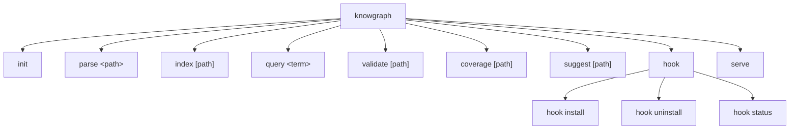

# CLI Command Reference

Complete reference for all `knowgraph` CLI commands.



## Global Options

```
knowgraph [command] [options]
```

| Option | Description |
|--------|-------------|
| `--version` | Display the CLI version |
| `--help` | Display help for any command |

---

## knowgraph init

Initialize KnowGraph in the current directory. Creates a `.knowgraph.yml` configuration file.

### Usage

```bash
knowgraph init [options]
```

### Options

| Option | Description | Default |
|--------|-------------|---------|
| `--name <name>` | Set the project name | Directory basename |
| `-y, --yes` | Non-interactive mode, use all defaults | `false` |

### Behavior

1. Detects programming languages by scanning file extensions in the current directory
2. Prompts for a project name (skipped with `--yes` or `--name`)
3. Generates `.knowgraph.yml` with detected languages, default include/exclude patterns, and index settings
4. Suggests high-impact files to annotate first (entry points like `index.ts`, `main.py`, `app.js`)
5. Prints next steps

### Examples

```bash
# Interactive initialization
knowgraph init

# Non-interactive with defaults
knowgraph init --yes

# Set project name explicitly
knowgraph init --name my-service

# Non-interactive with custom name
knowgraph init --name my-service --yes
```

### Generated Configuration

```yaml
version: "1.0"
name: my-project
languages:
  - typescript
  - python
include:
  - "**/*"
exclude:
  - node_modules
  - .git
  - dist
  - build
  - __pycache__
index:
  output_dir: .knowgraph
  incremental: true
```

### Notes

- If `.knowgraph.yml` already exists, the command exits with a warning unless `--yes` is passed (which overwrites)
- Language detection scans up to 2 levels deep, skipping `node_modules`, `.git`, and other common non-source directories
- Supported languages for detection: TypeScript, JavaScript, Python, Go, Rust, Java

---

## knowgraph parse

Parse a file or directory for `@knowgraph` annotations and display the extracted metadata.

### Usage

```bash
knowgraph parse <path> [options]
```

### Arguments

| Argument | Description | Required |
|----------|-------------|----------|
| `path` | File or directory to parse | Yes |

### Options

| Option | Description | Default |
|--------|-------------|---------|
| `--format <format>` | Output format: `json` or `yaml` | `json` |
| `--validate` | Validate metadata against schema (checks for required `description` field) | `false` |
| `--language <lang>` | Override automatic language detection | Auto-detect |
| `--pretty` | Pretty-print JSON output | `false` |

### Behavior

1. Resolves the target path to an absolute path
2. If a directory, recursively walks the tree collecting `.py`, `.ts`, `.tsx`, `.js`, `.jsx` files
3. Skips common non-source directories: `node_modules`, `.git`, `dist`, `build`, `__pycache__`, `.venv`, `venv`, `coverage`
4. Parses each file using the appropriate language parser
5. Outputs all extracted annotations in the chosen format
6. Prints a summary to stderr: `Found N entities in M files`

### Output Structure (JSON)

Each parsed entity has the following structure:

```json
[
  {
    "name": "AuthService",
    "filePath": "src/auth/service.ts",
    "line": 10,
    "column": 1,
    "language": "typescript",
    "metadata": {
      "type": "service",
      "description": "Handles user authentication",
      "owner": "platform-team",
      "status": "stable",
      "tags": ["auth", "security"],
      "context": {
        "business_goal": "User acquisition"
      }
    }
  }
]
```

### Examples

```bash
# Parse a single file
knowgraph parse src/auth/service.ts

# Parse an entire directory
knowgraph parse src/

# Pretty-printed JSON
knowgraph parse src/ --pretty

# YAML output
knowgraph parse src/ --format yaml

# Parse with validation
knowgraph parse src/ --validate
```

### Exit Codes

| Code | Meaning |
|------|---------|
| `0` | Parse completed (annotations may or may not have been found) |
| `1` | Path not found, or `--validate` found missing descriptions |

---

## knowgraph index

Scan a repository and build the SQLite knowledge graph index.

### Usage

```bash
knowgraph index [path] [options]
```

### Arguments

| Argument | Description | Default |
|----------|-------------|---------|
| `path` | Root directory to scan | `.` (current directory) |

### Options

| Option | Description | Default |
|--------|-------------|---------|
| `--output <dir>` | Output directory for the database file | `.knowgraph` |
| `--exclude <patterns>` | Comma-separated glob patterns to exclude | `node_modules,.git,dist,build` |
| `--incremental` | Only re-index files that have changed since last index | `true` |
| `--no-incremental` | Force a full re-index of all files | - |
| `--verbose` | Show detailed progress including entity counts per file | `false` |

### Behavior

1. Resolves the root directory and output directory
2. Creates the output directory if it does not exist
3. Initializes or opens the SQLite database at `<output>/knowgraph.db`
4. Scans the directory tree, applying exclude patterns
5. Parses each source file for `@knowgraph` annotations
6. Stores entities, relationships, and metadata in the database
7. Displays a progress spinner with percentage, file count, and current file
8. Prints a summary with files scanned, entities indexed, relationships found, duration, and database path
9. Reports indexing errors (up to 10, with a count of remaining)

### Output

```
Indexing complete!

Summary:
  Files scanned:    42
  Entities indexed: 87
  Relationships:    134
  Duration:         320ms
  Database:         .knowgraph/knowgraph.db
```

### Examples

```bash
# Index current directory (default)
knowgraph index

# Index a specific directory
knowgraph index packages/core

# Custom output location
knowgraph index --output build/graph

# Exclude additional patterns
knowgraph index --exclude "node_modules,dist,*.test.ts,__mocks__"

# Force full re-index
knowgraph index --no-incremental

# Verbose progress
knowgraph index --verbose
```

### Exit Codes

| Code | Meaning |
|------|---------|
| `0` | Indexing completed (possibly with non-fatal errors) |
| `1` | Indexing failed |

---

## knowgraph query

Search the knowledge graph for code entities.

### Usage

```bash
knowgraph query <search-term> [options]
```

### Arguments

| Argument | Description | Required |
|----------|-------------|----------|
| `search-term` | Text to search for (matches name, description, tags) | Yes |

### Options

| Option | Description | Default |
|--------|-------------|---------|
| `--type <type>` | Filter by entity type (e.g., `function`, `class`, `module`, `service`, `interface`) | All types |
| `--owner <owner>` | Filter by owner/team name | All owners |
| `--tags <tags>` | Comma-separated tag filter (all tags must match) | All tags |
| `--format <format>` | Output format: `table` or `json` | `table` |
| `--limit <n>` | Maximum number of results | `20` |
| `--db <path>` | Path to the SQLite database | `.knowgraph/knowgraph.db` |

### Behavior

1. Opens the SQLite database at the specified path
2. Performs a full-text search (FTS5) with the search term, falling back to LIKE-based search if FTS is unavailable
3. Applies type, owner, and tag filters
4. Returns results up to the specified limit
5. Displays results in the chosen format
6. Prints a result count summary to stderr

### Table Output

```
Name             Type       Owner          File                          Line
───────────────────────────────────────────────────────────────────────────────
AuthService      service    platform-team  src/auth/service.ts           10
validateToken    function   platform-team  src/auth/validate.ts          25

Showing 2 of 2 results
```

### JSON Output

```json
[
  {
    "name": "AuthService",
    "entityType": "service",
    "owner": "platform-team",
    "filePath": "src/auth/service.ts",
    "line": 10,
    "description": "Handles user authentication and session management",
    "tags": ["auth", "security"]
  }
]
```

### Examples

```bash
# Search by keyword
knowgraph query "authentication"

# Filter by entity type
knowgraph query "payment" --type function

# Filter by team
knowgraph query "" --owner platform-team

# Filter by tags
knowgraph query "" --tags "auth,security"

# JSON output with limit
knowgraph query "service" --format json --limit 50

# Use a custom database path
knowgraph query "auth" --db build/graph/knowgraph.db

# Combine filters
knowgraph query "process" --type function --owner payments-team --tags "billing"
```

### Exit Codes

| Code | Meaning |
|------|---------|
| `0` | Query completed (results may be empty) |
| `1` | Database not found or query error |

---

## knowgraph validate

Validate `@knowgraph` annotations for correctness and completeness.

### Usage

```bash
knowgraph validate [path] [options]
```

### Arguments

| Argument | Description | Default |
|----------|-------------|---------|
| `path` | File or directory to validate | `.` (current directory) |

### Options

| Option | Description | Default |
|--------|-------------|---------|
| `--strict` | Treat warnings as errors (exit code 1 for any issues) | `false` |
| `--format <format>` | Output format: `text` or `json` | `text` |
| `--rule <name>` | Run only a specific validation rule | All rules |

### Behavior

1. Resolves the target path
2. Creates a validator with all registered rules
3. Walks the directory tree and validates each file's annotations
4. Reports issues with file path, line number, severity, rule name, and message
5. Prints a summary: `N error(s), M warning(s) in K file(s)`

### Text Output

```
src/auth/service.ts:10 [ERROR] required-fields: missing description
src/utils/helpers.ts:5 [WARN] recommended-fields: missing owner
src/models/user.ts:1 [WARN] recommended-fields: missing tags

1 error(s), 2 warning(s) in 3 file(s)
```

### JSON Output

```json
{
  "issues": [
    {
      "filePath": "src/auth/service.ts",
      "line": 10,
      "severity": "error",
      "rule": "required-fields",
      "message": "missing description"
    }
  ],
  "fileCount": 3,
  "errorCount": 1,
  "warningCount": 2,
  "isValid": false
}
```

### Examples

```bash
# Validate current directory
knowgraph validate

# Validate a specific file
knowgraph validate src/auth/service.ts

# Validate a directory
knowgraph validate packages/core/src/

# Strict mode (warnings become errors)
knowgraph validate --strict

# JSON output for CI parsing
knowgraph validate --format json

# Run a specific rule only
knowgraph validate --rule required-fields

# Strict validation in CI
knowgraph validate --strict --format json
```

### Exit Codes

| Code | Meaning |
|------|---------|
| `0` | No errors (and no warnings in strict mode) |
| `1` | Validation errors found (or warnings in strict mode), or path not found |

---

## knowgraph coverage

Report documentation coverage for `@knowgraph` annotations across the codebase.

### Usage

```bash
knowgraph coverage [path] [options]
```

### Arguments

| Argument | Description | Default |
|----------|-------------|---------|
| `path` | Root directory to analyze | `.` (current directory) |

### Options

| Option | Description | Default |
|--------|-------------|---------|
| `--format <format>` | Output format: `table` or `json` | `table` |
| `--threshold <number>` | Exit with code 1 if coverage is below this percentage | None |
| `--by <dimension>` | Breakdown dimension: `language`, `directory`, or `owner` | All dimensions |

### Behavior

1. Scans the directory for all source files
2. Determines which files contain `@knowgraph` annotations
3. Calculates overall coverage percentage
4. Breaks down coverage by language, directory, and owner
5. Compares against threshold if specified

### Table Output

```
Documentation Coverage Report
  Total files:     42
  Annotated files: 28
  Coverage:        67%

By Language:
  Category                                  Annotated      Total   Coverage
  ──────────────────────────────────────────────────────────────────────────
  typescript                                       22         32        69%
  python                                            6         10        60%

By Directory:
  Category                                  Annotated      Total   Coverage
  ──────────────────────────────────────────────────────────────────────────
  src/auth                                          5          5       100%
  src/payments                                      3          4        75%
  src/utils                                         2          8        25%

By Owner:
  Category                                  Annotated      Total   Coverage
  ──────────────────────────────────────────────────────────────────────────
  platform-team                                    12         15        80%
  payments-team                                     8         10        80%
```

### JSON Output

```json
{
  "totalFiles": 42,
  "annotatedFiles": 28,
  "percentage": 67,
  "byLanguage": [
    { "category": "typescript", "annotatedCount": 22, "totalCount": 32, "percentage": 69 }
  ],
  "byDirectory": [
    { "category": "src/auth", "annotatedCount": 5, "totalCount": 5, "percentage": 100 }
  ],
  "byOwner": [
    { "category": "platform-team", "annotatedCount": 12, "totalCount": 15, "percentage": 80 }
  ],
  "files": [
    { "filePath": "src/auth/service.ts", "annotated": true, "language": "typescript" }
  ]
}
```

### Examples

```bash
# Full coverage report
knowgraph coverage

# Coverage for a specific directory
knowgraph coverage packages/core

# JSON output for dashboards
knowgraph coverage --format json

# Show only language breakdown
knowgraph coverage --by language

# Show only directory breakdown
knowgraph coverage --by directory

# Show only owner breakdown
knowgraph coverage --by owner

# Fail CI if below 80%
knowgraph coverage --threshold 80

# JSON with threshold for CI
knowgraph coverage --format json --threshold 80
```

### Exit Codes

| Code | Meaning |
|------|---------|
| `0` | Coverage check passed (no threshold, or coverage meets threshold) |
| `1` | Coverage below threshold, invalid threshold value, or path not found |

---

## knowgraph suggest

Suggest the most impactful unannotated files to annotate next.

### Usage

```bash
knowgraph suggest [path] [options]
```

### Arguments

| Argument | Description | Default |
|----------|-------------|---------|
| `path` | Root directory to analyze | `.` (current directory) |

### Options

| Option | Description | Default |
|--------|-------------|---------|
| `--limit <n>` | Number of suggestions to show | `10` |
| `--format <format>` | Output format: `text` or `json` | `text` |

### Behavior

1. Scans the directory for all source files
2. Identifies files without `@knowgraph` annotations
3. Scores each unannotated file by impact factors:
   - File size (larger files contain more logic)
   - Import count (heavily-imported files are more impactful)
   - Entry point detection (`index.ts`, `main.py`, `app.js`, etc.)
4. Ranks and returns the top N suggestions

### Text Output

```
12 unannotated files found, showing top 5

1. src/payments/processor.ts (score: 85) - large file, many imports, entry point
2. src/auth/middleware.ts (score: 72) - many imports
3. src/models/order.ts (score: 65) - large file
4. src/utils/validation.ts (score: 58) - many imports
5. src/routes/api.ts (score: 52) - entry point
```

### JSON Output

```json
{
  "suggestions": [
    {
      "filePath": "src/payments/processor.ts",
      "score": 85,
      "reasons": ["large file", "many imports", "entry point"],
      "language": "typescript",
      "lineCount": 250
    }
  ],
  "totalUnannotated": 12,
  "totalFiles": 42
}
```

### Examples

```bash
# Show top 10 suggestions (default)
knowgraph suggest

# Show top 5 suggestions
knowgraph suggest --limit 5

# Analyze a specific directory
knowgraph suggest packages/core

# JSON output for tooling
knowgraph suggest --format json

# Show only top 3 for a sub-package
knowgraph suggest packages/cli --limit 3
```

### Exit Codes

| Code | Meaning |
|------|---------|
| `0` | Suggestions generated (may be empty if all files are annotated) |
| `1` | Invalid limit value, or path not found |

---

## knowgraph hook

Manage KnowGraph git pre-commit hooks for automatic annotation validation.

### Usage

```bash
knowgraph hook <subcommand> [options]
```

### Subcommands

#### knowgraph hook install

Install the KnowGraph pre-commit hook into your git repository.

```bash
knowgraph hook install [options]
```

| Option | Description | Default |
|--------|-------------|---------|
| `--force` | Overwrite existing KnowGraph hook section | `false` |

**Behavior:**

- If no pre-commit hook exists, creates one with the KnowGraph validation script
- If a pre-commit hook exists without KnowGraph, **appends** the KnowGraph section (preserving existing hooks)
- If a pre-commit hook exists with KnowGraph and `--force` is passed, replaces the KnowGraph section
- If a pre-commit hook exists with KnowGraph and `--force` is not passed, prints a warning

The installed hook:
1. Gets the list of staged files matching `.ts`, `.tsx`, `.js`, `.jsx`, `.py`
2. Runs `npx knowgraph parse <file> --validate` on each staged file
3. If any validation fails, blocks the commit

**Hook Section Markers:**

The hook is delimited by markers so it can be safely installed alongside other hooks:

```bash
# >>> KnowGraph pre-commit hook >>>
# ... validation script ...
# <<< KnowGraph pre-commit hook <<<
```

#### knowgraph hook uninstall

Remove the KnowGraph pre-commit hook.

```bash
knowgraph hook uninstall
```

**Behavior:**

- If the hook file contains only KnowGraph content, deletes the entire file
- If the hook file contains other hooks alongside KnowGraph, removes only the KnowGraph section (preserving other hooks)
- If the hook is not installed, prints an error

#### knowgraph hook status

Check whether the KnowGraph pre-commit hook is installed.

```bash
knowgraph hook status
```

**Output:**

```
KnowGraph hook is installed at /path/to/repo/.git/hooks/pre-commit
```

Or:

```
KnowGraph hook is not installed.
Run `knowgraph hook install` to install it.
```

### Examples

```bash
# Install the hook
knowgraph hook install

# Force reinstall (update to latest version)
knowgraph hook install --force

# Check status
knowgraph hook status

# Remove the hook
knowgraph hook uninstall
```

### Exit Codes

| Code | Meaning |
|------|---------|
| `0` | Operation succeeded, or hook status checked |
| `1` | Not in a git repository, hook already installed (without `--force`), or hook not installed (uninstall) |

---

## knowgraph serve

Start the KnowGraph MCP (Model Context Protocol) server for AI assistant integration.

### Usage

```bash
knowgraph serve [options]
```

### Options

| Option | Description | Default |
|--------|-------------|---------|
| `--db <path>` | Path to the SQLite database | `.knowgraph/knowgraph.db` |
| `--verbose` | Enable verbose logging | `false` |

### Behavior

1. Verifies the database exists at the specified path
2. Prints Claude Desktop configuration snippet for easy setup
3. Starts the MCP server on stdio transport
4. The server exposes 7 tools for AI assistants to query the knowledge graph (see [MCP Tools Reference](../mcp-server/tools.md))

### Output

When started, the command prints:

```
Starting KnowGraph MCP server...
  Database: /path/to/.knowgraph/knowgraph.db

Add this to your Claude Desktop config:

{
  "mcpServers": {
    "knowgraph": {
      "command": "npx",
      "args": ["knowgraph", "serve", "--db", "/path/to/.knowgraph/knowgraph.db"]
    }
  }
}
```

### Examples

```bash
# Start with default database
knowgraph serve

# Use a custom database path
knowgraph serve --db build/graph/knowgraph.db

# Verbose logging for debugging
knowgraph serve --verbose
```

### Prerequisites

Run `knowgraph index` first to create the database. The server will exit with an error if the database does not exist.

### Exit Codes

| Code | Meaning |
|------|---------|
| `0` | Server shut down normally |
| `1` | Database not found, or server failed to start |
