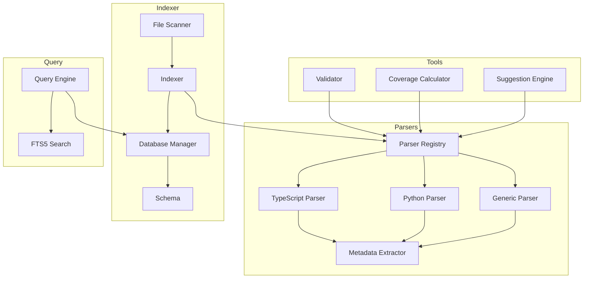

# @knowgraph/core

The core library that powers KnowGraph. It provides parsers for extracting `@knowgraph` annotations from source code, an indexer for scanning and storing code entities in SQLite, and a query engine for searching and traversing the knowledge graph.

## Architecture Overview

```
packages/core/src/
  types/          Zod schemas, TypeScript types, ParseResult interface
  parsers/        Language-specific parsers + metadata extraction pipeline
  indexer/        File scanner, SQLite database manager, schema definitions
  query/          FTS5 search engine with filtering and dependency traversal
  validation/     Annotation validation rules engine
  coverage/       Documentation coverage calculator
  suggest/        Smart file suggestion engine
```



---

## Subsystem Documentation

Each subsystem has its own detailed documentation:

| Subsystem | Description | Docs |
|-----------|-------------|------|
| **Type System** | Zod schemas as single source of truth for runtime validation and TypeScript types. Defines `CoreMetadata`, `ExtendedMetadata`, `ParseResult`, and `Manifest` schemas. | [types.md](./types.md) |
| **Parsers** | Registry-based parser system with TypeScript, Python, and generic (fallback) parsers. Shared metadata extraction pipeline with Zod validation. | [parsers.md](./parsers.md) |
| **Indexer** | File scanner with incremental indexing (MD5 hash comparison). SQLite database manager with WAL mode, FTS5 search index, and CRUD operations. | [indexer.md](./indexer.md) |
| **Query Engine** | FTS5 full-text search with type/owner/status/tag/filePath filters, pagination, and dependency graph traversal. | [query-engine.md](./query-engine.md) |
| **Validation** | Rule-based annotation validator checking required fields, valid types/statuses, description length, owner presence, and non-empty tags. | [validation.md](./validation.md) |
| **Coverage** | Calculates annotation coverage percentage with breakdowns by language, directory, and owner. | [coverage.md](./coverage.md) |
| **Suggestions** | Ranks unannotated files by annotation priority using heuristics (entry points, file size, import count, src/ location). | [suggest.md](./suggest.md) |

---

## Quick Usage

```typescript
import {
  createDefaultRegistry,
  createDatabaseManager,
  createIndexer,
  createQueryEngine,
  createValidator,
  calculateCoverage,
  createSuggestionEngine,
} from '@knowgraph/core';

// Parse a file
const registry = createDefaultRegistry();
const results = registry.parseFile(fileContent, 'src/auth.ts');

// Build an index
const db = createDatabaseManager('.knowgraph/knowgraph.db');
db.initialize();
const adapter = {
  parse: (fp: string, content: string) => registry.parseFile(content, fp),
  canParse: (fp: string) => registry.getParser(fp) !== undefined,
};
const indexer = createIndexer(adapter, db);
indexer.index({ rootDir: '.', incremental: true });

// Query the index
const engine = createQueryEngine(db);
const searchResult = engine.search({ query: 'auth', type: 'function' });

// Validate annotations
const validator = createValidator();
const validationResult = validator.validate('.');

// Check coverage
const coverage = calculateCoverage({ rootDir: '.' });

// Get suggestions
const suggester = createSuggestionEngine(registry);
const suggestions = suggester.suggest({ rootDir: '.', limit: 5 });

db.close();
```

For the complete API reference, see [API Reference](../development/api-reference.md).

---

## Source File Reference

| File | Purpose | Lines |
|------|---------|-------|
| `types/entity.ts` | Zod schemas and TS types for entities and metadata | 129 |
| `types/parse-result.ts` | ParseResult interface | 26 |
| `types/manifest.ts` | Manifest/config schemas | 81 |
| `parsers/types.ts` | Parser and ParserRegistry interfaces | 24 |
| `parsers/metadata-extractor.ts` | YAML extraction and validation pipeline | 171 |
| `parsers/typescript-parser.ts` | TypeScript/JavaScript parser | 400 |
| `parsers/python-parser.ts` | Python parser | 301 |
| `parsers/generic-parser.ts` | Language-agnostic fallback parser | 190 |
| `parsers/registry.ts` | Parser registry with extension routing | 55 |
| `indexer/schema.ts` | SQLite DDL and prepared SQL statements | 130 |
| `indexer/database.ts` | DatabaseManager with CRUD operations | 387 |
| `indexer/indexer.ts` | File scanner and indexer | 191 |
| `indexer/types.ts` | StoredEntity, IndexResult, and related types | 98 |
| `query/query-engine.ts` | Query engine with FTS5 and dependency traversal | 255 |
| `validation/rules.ts` | Validation rule implementations | ~200 |
| `validation/validator.ts` | Validator orchestration | ~150 |
| `coverage/coverage-calculator.ts` | Coverage calculation logic | ~200 |
| `suggest/suggestion-engine.ts` | File suggestion scoring | ~200 |
