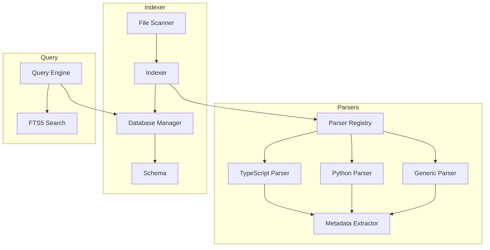
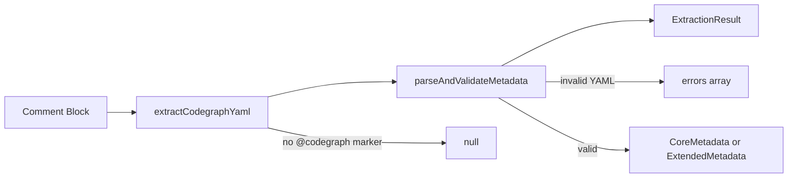
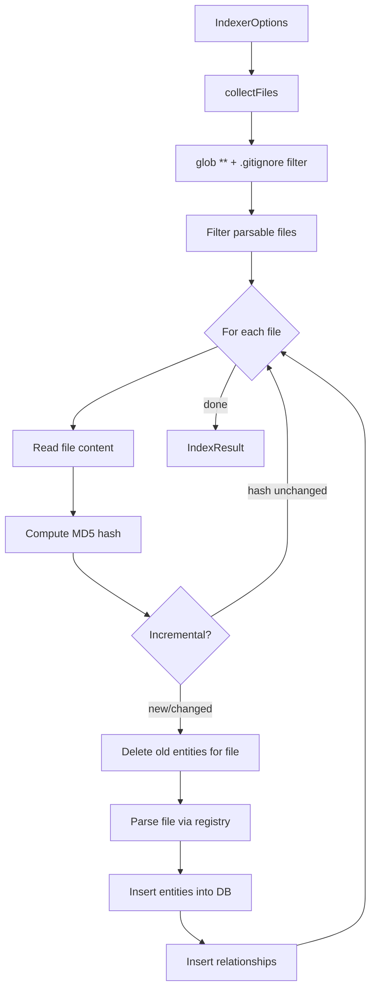
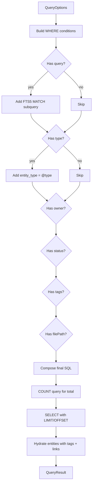
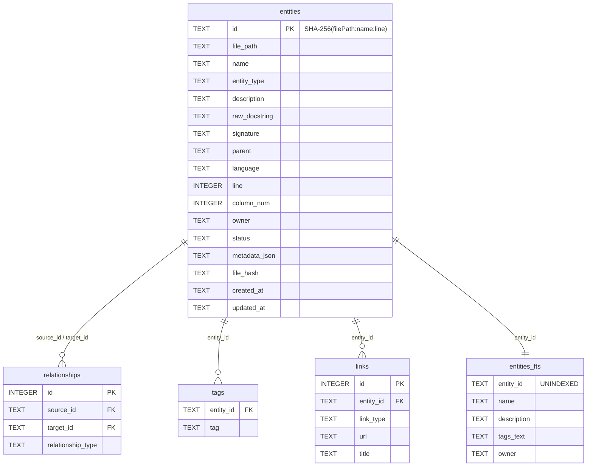
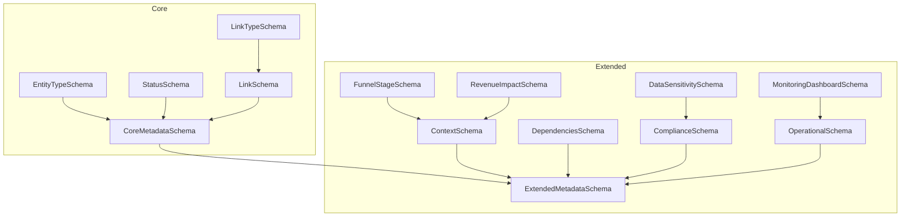

# @codegraph/core

The core library that powers CodeGraph. It provides parsers for extracting `@codegraph` annotations from source code, an indexer for scanning and storing code entities in SQLite, and a query engine for searching and traversing the knowledge graph.

## Architecture Overview

```
packages/core/src/
  types/          Zod schemas, TypeScript types, ParseResult interface
  parsers/        Language-specific parsers + metadata extraction pipeline
  indexer/        File scanner, SQLite database manager, schema definitions
  query/          FTS5 search engine with filtering and dependency traversal
```



---

## 1. Parser System

The parser system extracts `@codegraph` YAML annotations from source code comments and produces structured `ParseResult` objects. It uses a registry pattern that routes files to the appropriate language parser based on file extension.

### Parser Interface

Every parser implements the `Parser` interface defined in `parsers/types.ts`:

```typescript
interface Parser {
  readonly name: string;
  readonly supportedExtensions: readonly string[];
  parse(content: string, filePath: string): readonly ParseResult[];
}
```

### Parser Registry

The `ParserRegistry` (defined in `parsers/types.ts`) manages parser selection:

```typescript
interface ParserRegistry {
  register(parser: Parser): void;
  getParser(filePath: string): Parser | undefined;
  parseFile(content: string, filePath: string): readonly ParseResult[];
}
```

The `createDefaultRegistry()` factory in `parsers/registry.ts` creates a registry pre-loaded with the TypeScript and Python parsers. A generic fallback parser handles all other file types.

**Extension routing logic:**
1. Extract the file extension (e.g., `.ts`, `.py`).
2. Search registered parsers for one whose `supportedExtensions` includes the extension.
3. If a specific parser is found, use it. Otherwise, fall back to the generic parser.

```typescript
import { createDefaultRegistry } from '@codegraph/core';

const registry = createDefaultRegistry();

// Routes to TypeScript parser
const tsResults = registry.parseFile(tsCode, 'src/app.ts');

// Routes to Python parser
const pyResults = registry.parseFile(pyCode, 'lib/utils.py');

// Falls back to generic parser
const goResults = registry.parseFile(goCode, 'cmd/main.go');
```

### Metadata Extraction Pipeline

All three parsers share the same metadata extraction pipeline in `parsers/metadata-extractor.ts`. The pipeline has three stages:



**Stage 1: `extractCodegraphYaml(commentBlock)`**

Searches for the `@codegraph` marker in a comment block and extracts the YAML content that follows it. Strips comment syntax (leading `*` for JSDoc, `#` for Python/shell), then dedents the result to handle indented docstrings.

Returns `null` if no `@codegraph` marker is found.

**Stage 2: `parseAndValidateMetadata(yamlString, baseLineOffset)`**

Parses the extracted YAML string and validates it against Zod schemas. Tries `ExtendedMetadataSchema` first (since it is a superset of `CoreMetadataSchema`), then falls back to `CoreMetadataSchema`.

Returns an `ExtractionResult`:

```typescript
interface ExtractionResult {
  readonly metadata: CoreMetadata | ExtendedMetadata | null;
  readonly errors: readonly ExtractionError[];
  readonly rawYaml: string;
}

interface ExtractionError {
  readonly message: string;
  readonly line?: number;
}
```

**Stage 3: `extractMetadata(commentBlock, baseLineOffset)`**

Convenience function that chains stages 1 and 2.

### TypeScript Parser

**Factory:** `createTypescriptParser()`
**Extensions:** `.ts`, `.tsx`, `.js`, `.jsx`, `.mts`, `.cts`
**Language identifier:** `"typescript"`

The TypeScript parser operates in two phases:

1. **Find JSDoc blocks** -- Scans the source using a regex matching `/** ... */` patterns. Each block is stripped of JSDoc formatting (`/**`, `*/`, leading `*`).

2. **Match to code entities** -- For each JSDoc block containing a valid `@codegraph` annotation, the parser examines the next non-empty line of code after the comment. It attempts to match the line against these patterns (in order):
   - Class declaration (`class Foo {`)
   - Function declaration (`function foo()`)
   - Arrow/const function (`const foo = () =>`)
   - Interface declaration (`interface Foo {`)
   - Type alias (`type Foo =`)
   - Enum declaration (`enum Foo {`)
   - Method declaration (indented, inside a class body)
   - Module-level (if the JSDoc appears before any code, the entity represents the module itself, named after the file)

For methods, `findEnclosingClassName()` walks backwards through the source to find the parent class by indentation level. Function and method results include a `signature` field with parameter and return type information.

### Python Parser

**Factory:** `createPythonParser()`
**Extensions:** `.py`, `.pyi`
**Language identifier:** `"python"`

The Python parser operates similarly:

1. **Find docstrings** -- Scans using a regex matching `"""..."""` and `'''...'''` patterns.

2. **Match to definitions** -- For each docstring with a `@codegraph` annotation, the parser examines the line *above* the docstring (Python docstrings follow the definition they document). It matches against:
   - Function/method definition (`def foo():` or `async def foo():`)
   - Class definition (`class Foo:`)
   - Module-level (if the docstring is at the top of the file)

For methods vs. functions, the parser checks indentation. If the `def` is indented and enclosed within a `class` block, it is classified as a method and `findEnclosingClass()` identifies the parent class name. Decorators are collected by walking upward from the definition line.

### Generic Parser

**Factory:** `createGenericParser()`
**Extensions:** `[]` (empty -- serves as fallback)
**Language identifier:** inferred from extension via a built-in map (supports 20+ languages including Ruby, Go, Rust, Java, etc.)

The generic parser finds `@codegraph` annotations in two comment styles:
- Block comments: `/* ... */`, `"""..."""`, `'''...'''`
- Consecutive single-line comments: `//` or `#` groups

It only extracts module-level entities (named after the file). It does not perform code entity detection like the TypeScript and Python parsers.

---

## 2. Indexer

The indexer scans a codebase, parses annotated files, and stores the extracted entities in a SQLite database. It supports incremental indexing to avoid re-processing unchanged files.

### Indexer Pipeline



### File Scanning

The `collectFiles()` function uses `glob` to find all files under the root directory, then filters them through the `ignore` library which loads `.gitignore` patterns plus any additional exclude patterns from `IndexerOptions`.

Default exclude patterns: `node_modules`, `.git`, `dist`, `build`.

### Incremental Indexing

When `incremental: true` is set in `IndexerOptions`, the indexer:

1. Computes an MD5 hash of each file's content.
2. Compares against the stored `file_hash` in the database.
3. Skips files whose hash has not changed.
4. For changed files, deletes all existing entities for that file path before re-parsing and inserting.

### Progress Reporting

The indexer accepts an optional `onProgress` callback that receives `IndexProgress` events:

```typescript
interface IndexProgress {
  readonly totalFiles: number;
  readonly processedFiles: number;
  readonly currentFile: string;
  readonly entitiesFound: number;
}
```

### Usage

```typescript
import {
  createDefaultRegistry,
  createDatabaseManager,
  createIndexer,
} from '@codegraph/core';

const registry = createDefaultRegistry();
const db = createDatabaseManager('/path/to/.codegraph/codegraph.db');
db.initialize();

// Adapter: the indexer expects (filePath, content) -> ParseResult[]
const parserAdapter = {
  parse: (filePath: string, content: string) =>
    registry.parseFile(content, filePath),
  canParse: (filePath: string) =>
    registry.getParser(filePath) !== undefined,
};

const indexer = createIndexer(parserAdapter, db);

const result = indexer.index({
  rootDir: '/path/to/project',
  incremental: true,
  exclude: ['node_modules', '.git', 'dist'],
  onProgress: (p) => console.log(`${p.processedFiles}/${p.totalFiles}`),
});

console.log(`Indexed ${result.totalEntities} entities in ${result.duration}ms`);

db.close();
```

### IndexResult

```typescript
interface IndexResult {
  readonly totalFiles: number;
  readonly totalEntities: number;
  readonly totalRelationships: number;
  readonly errors: readonly IndexError[];
  readonly duration: number;
}

interface IndexError {
  readonly filePath: string;
  readonly message: string;
  readonly error?: unknown;
}
```

---

## 3. Query Engine

The query engine provides FTS5 full-text search, filtered queries, pagination, and dependency traversal over the indexed entities.

### QueryEngine Interface

```typescript
interface QueryEngine {
  search(options: QueryOptions): QueryResult;
  getEntity(id: string): StoredEntity | undefined;
  getDependencies(entityId: string): readonly StoredEntity[];
  getDependents(entityId: string): readonly StoredEntity[];
  getByOwner(owner: string): readonly StoredEntity[];
  getByTag(tag: string): readonly StoredEntity[];
  getStats(): IndexStats;
}
```

### QueryOptions

```typescript
interface QueryOptions {
  readonly query?: string;      // FTS5 search query
  readonly type?: EntityType;   // Filter by entity type
  readonly owner?: string;      // Filter by owner
  readonly status?: Status;     // Filter by status
  readonly tags?: readonly string[]; // Filter by tags (any match)
  readonly filePath?: string;   // Filter by file path
  readonly limit?: number;      // Pagination limit (default: 50)
  readonly offset?: number;     // Pagination offset (default: 0)
}
```

### How Search Works



The `search()` method dynamically composes SQL by building an array of WHERE conditions from the provided options:

- **FTS5 search:** Uses a subquery `e.id IN (SELECT entity_id FROM entities_fts WHERE entities_fts MATCH @query)` for full-text search across entity names, descriptions, tags, and owners.
- **Type filter:** `e.entity_type = @type`
- **Owner filter:** `e.owner = @owner`
- **Status filter:** `e.status = @status`
- **Tags filter:** `e.id IN (SELECT entity_id FROM tags WHERE tag IN (...))` -- matches entities that have *any* of the specified tags.
- **File path filter:** `e.file_path = @filePath`

Results are ordered by name ascending and paginated with `LIMIT @limit OFFSET @offset`. A separate `COUNT(*)` query determines the total matching count.

Each returned entity is "hydrated" with its tags and links from the respective tables.

### Dependency Traversal

- **`getDependencies(entityId)`** -- Returns outbound dependencies: entities that the given entity depends on. Queries the `relationships` table where `source_id` matches.
- **`getDependents(entityId)`** -- Returns inbound dependencies: entities that depend on the given entity. Queries the `relationships` table where `target_id` matches.

### Usage

```typescript
import {
  createDatabaseManager,
  createQueryEngine,
} from '@codegraph/core';

const db = createDatabaseManager('/path/to/.codegraph/codegraph.db');
db.initialize();
const engine = createQueryEngine(db);

// Full-text search with filters
const results = engine.search({
  query: 'authentication',
  type: 'function',
  owner: 'auth-team',
  limit: 20,
  offset: 0,
});
console.log(`Found ${results.total} matches`);

// Get a single entity
const entity = engine.getEntity('abc123...');

// Traverse dependencies
const deps = engine.getDependencies(entity.id);
const dependents = engine.getDependents(entity.id);

// Query by owner or tag
const teamEntities = engine.getByOwner('platform-team');
const taggedEntities = engine.getByTag('auth');

// Database statistics
const stats = engine.getStats();
console.log(`${stats.totalEntities} entities indexed`);

db.close();
```

---

## 4. Database Manager

The database layer uses `better-sqlite3` for synchronous SQLite access with WAL mode enabled for better concurrent read performance.

### Initialization

```typescript
import { createDatabaseManager } from '@codegraph/core';

// File-based database
const db = createDatabaseManager('/path/to/codegraph.db');

// In-memory database (for testing)
const memDb = createDatabaseManager();

db.initialize(); // Creates tables, indexes, FTS5
```

On creation, the database manager:
1. Opens the SQLite connection via `better-sqlite3`.
2. Enables WAL journal mode (`PRAGMA journal_mode = WAL`).
3. Enables foreign key enforcement (`PRAGMA foreign_keys = ON`).

Calling `initialize()` executes `CREATE_TABLES_SQL` to set up the schema.

### Schema



**Tables:**

| Table | Purpose |
|-------|---------|
| `entities` | Core entity storage with all metadata serialized as JSON |
| `relationships` | Directed edges between entities (e.g., `depends_on`) |
| `tags` | Normalized tag storage for efficient tag-based queries |
| `links` | External links (Notion, Jira, GitHub, etc.) |
| `entities_fts` | FTS5 virtual table for full-text search |

**Indexes:**

| Index | Column(s) |
|-------|-----------|
| `idx_entities_file_path` | `entities.file_path` |
| `idx_entities_type` | `entities.entity_type` |
| `idx_entities_owner` | `entities.owner` |
| `idx_entities_status` | `entities.status` |
| `idx_tags_tag` | `tags.tag` |
| `idx_links_entity` | `links.entity_id` |
| `idx_relationships_source` | `relationships.source_id` |
| `idx_relationships_target` | `relationships.target_id` |

### Entity ID Generation

Entity IDs are deterministic SHA-256 hashes of `filePath:name:line`:

```typescript
import { generateEntityId } from '@codegraph/core';

const id = generateEntityId('src/auth.ts', 'login', 42);
// Returns SHA-256 hex digest of "src/auth.ts:login:42"
```

This ensures the same entity always gets the same ID, enabling stable references across incremental re-indexing.

### CRUD Operations

```typescript
// Insert an entity (returns its generated ID)
const id = db.insertEntity({
  filePath: 'src/auth.ts',
  name: 'login',
  entityType: 'function',
  description: 'Authenticates a user with credentials',
  language: 'typescript',
  line: 42,
  column: 1,
  owner: 'auth-team',
  status: 'stable',
  metadata: { type: 'function', description: '...' },
  tags: ['auth', 'login'],
  links: [{ type: 'jira', url: 'https://jira.example.com/AUTH-123' }],
  fileHash: 'abc123...',
});

// Retrieve by ID
const entity = db.getEntityById(id);

// Retrieve all entities in a file
const fileEntities = db.getEntitiesByFilePath('src/auth.ts');

// Update (partial -- only specified fields change)
db.updateEntity(id, { status: 'deprecated' });

// Delete all entities for a file (used during re-indexing)
db.deleteEntitiesByFilePath('src/auth.ts');

// Insert a relationship
db.insertRelationship(sourceId, targetId, 'depends_on');

// Get database statistics
const stats = db.getStats();
```

On insert, the database manager automatically:
1. Generates the entity ID.
2. Inserts the entity row.
3. Inserts a corresponding FTS5 entry (name, description, tags text, owner).
4. Inserts normalized tag rows.
5. Inserts link rows.

On update, it deletes and re-creates the FTS5 entry to keep search in sync.

On file deletion, it first removes FTS5 entries for all entities in the file, then cascading deletes clean up tags, links, and relationships.

### DatabaseManager Interface

```typescript
interface DatabaseManager {
  readonly db: Database.Database;
  initialize(): void;
  close(): void;
  getEntityById(id: string): StoredEntity | undefined;
  getEntitiesByFilePath(filePath: string): readonly StoredEntity[];
  insertEntity(entity: EntityInsert): string;
  updateEntity(id: string, entity: Partial<EntityInsert>): void;
  deleteEntitiesByFilePath(filePath: string): void;
  insertRelationship(sourceId: string, targetId: string, type: string): void;
  insertTags(entityId: string, tags: readonly string[]): void;
  insertLinks(entityId: string, links: readonly Link[]): void;
  getStats(): IndexStats;
  getFileHash(filePath: string): string | undefined;
}
```

---

## 5. Type System

All types are defined using Zod schemas, which serve as the single source of truth for both runtime validation and TypeScript type inference.

### Schema Hierarchy



### Enums

**EntityType** -- The kind of code entity:
```
module | class | function | method | service |
api_endpoint | variable | constant | interface | enum
```

**Status** -- Lifecycle stage:
```
experimental | stable | deprecated
```

**LinkType** -- External reference types:
```
notion | jira | linear | confluence | github | custom
```

**FunnelStage** -- Business funnel position:
```
awareness | acquisition | activation | retention | revenue | referral
```

**RevenueImpact** -- Business impact level:
```
critical | high | medium | low | none
```

**DataSensitivity** -- Data classification:
```
public | internal | confidential | restricted
```

### CoreMetadata

The base metadata that every `@codegraph` annotation must provide:

```typescript
interface CoreMetadata {
  type: EntityType;         // Required
  description: string;      // Required, non-empty
  owner?: string;
  status?: Status;
  tags?: string[];
  links?: Link[];
}
```

### ExtendedMetadata

Extends `CoreMetadata` with optional business and operational context:

```typescript
interface ExtendedMetadata extends CoreMetadata {
  context?: {
    business_goal?: string;
    funnel_stage?: FunnelStage;
    revenue_impact?: RevenueImpact;
  };
  dependencies?: {
    services?: string[];
    external_apis?: string[];
    databases?: string[];
  };
  compliance?: {
    regulations?: string[];
    data_sensitivity?: DataSensitivity;
    audit_requirements?: string[];
  };
  operational?: {
    sla?: string;
    on_call_team?: string;
    monitoring_dashboards?: MonitoringDashboard[];
  };
}
```

### ParseResult

The output produced by all parsers:

```typescript
interface ParseResult {
  readonly name: string;        // Entity name (e.g., function name, class name)
  readonly filePath: string;    // Absolute path to the source file
  readonly line: number;        // Line number of the entity declaration
  readonly column: number;      // Column number (always 1 currently)
  readonly language: string;    // Language identifier
  readonly entityType: EntityType;
  readonly metadata: CoreMetadata | ExtendedMetadata;
  readonly rawDocstring: string; // Original comment text
  readonly signature?: string;  // Function/method signature
  readonly parent?: string;     // Parent class name (for methods)
}
```

### StoredEntity

The shape of entities as stored and retrieved from the database:

```typescript
interface StoredEntity {
  readonly id: string;          // SHA-256 hash
  readonly filePath: string;
  readonly name: string;
  readonly entityType: EntityType;
  readonly description: string;
  readonly rawDocstring: string | null;
  readonly signature: string | null;
  readonly parent: string | null;
  readonly language: string;
  readonly line: number;
  readonly column: number;
  readonly owner: string | null;
  readonly status: Status | null;
  readonly metadata: CoreMetadata | ExtendedMetadata;
  readonly tags: readonly string[];
  readonly links: readonly Link[];
  readonly fileHash: string | null;
  readonly createdAt: string;
  readonly updatedAt: string;
}
```

### Manifest Schema

The `.codegraph.yml` project configuration file schema:

```typescript
interface Manifest {
  version: '1.0';              // Required, must be literal "1.0"
  name?: string;
  description?: string;
  languages?: string[];
  include: string[];           // Default: ['**/*']
  exclude: string[];           // Default: ['node_modules', '.git', 'dist', 'build']
  parsers?: Record<string, ParserConfig>;
  connectors?: Connectors;
  index?: IndexConfig;
}
```

---

## Source File Reference

| File | Purpose | Lines |
|------|---------|-------|
| `types/entity.ts` | Zod schemas and TS types for entities and metadata | 129 |
| `types/parse-result.ts` | ParseResult interface | 26 |
| `types/manifest.ts` | Manifest/config schemas | 81 |
| `parsers/types.ts` | Parser and ParserRegistry interfaces | 24 |
| `parsers/metadata-extractor.ts` | YAML extraction and validation pipeline | 171 |
| `parsers/typescript-parser.ts` | TypeScript/JavaScript parser | 400 |
| `parsers/python-parser.ts` | Python parser | 301 |
| `parsers/generic-parser.ts` | Language-agnostic fallback parser | 190 |
| `parsers/registry.ts` | Parser registry with extension routing | 55 |
| `indexer/schema.ts` | SQLite DDL and prepared SQL statements | 130 |
| `indexer/database.ts` | DatabaseManager with CRUD operations | 387 |
| `indexer/indexer.ts` | File scanner and indexer | 191 |
| `indexer/types.ts` | StoredEntity, IndexResult, and related types | 98 |
| `query/query-engine.ts` | Query engine with FTS5 and dependency traversal | 255 |
