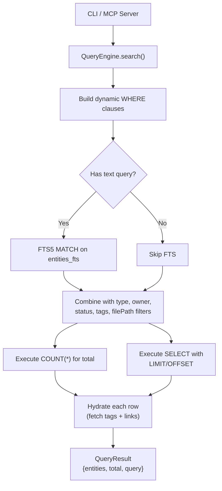

# Query Engine

The query engine provides search, filtering, pagination, and dependency traversal over the indexed code knowledge graph. It operates on the SQLite database populated by the indexer and leverages FTS5 full-text search for text queries.

## Architecture

```
query/
  query-engine.ts  # QueryEngine factory and implementation
  index.ts         # Re-exports
```

The query engine sits between the database and consumers (CLI, MCP server):



## QueryEngine Interface

Created via `createQueryEngine(dbManager)`.

```typescript
export interface QueryEngine {
  search(options: QueryOptions): QueryResult;
  getEntity(id: string): StoredEntity | undefined;
  getDependencies(entityId: string): readonly StoredEntity[];
  getDependents(entityId: string): readonly StoredEntity[];
  getByOwner(owner: string): readonly StoredEntity[];
  getByTag(tag: string): readonly StoredEntity[];
  getStats(): IndexStats;
}
```

| Method | Description |
|--------|-------------|
| `search` | Full-featured search with filtering, FTS, and pagination |
| `getEntity` | Retrieve a single entity by ID |
| `getDependencies` | Get entities that the given entity depends on (outgoing edges) |
| `getDependents` | Get entities that depend on the given entity (incoming edges) |
| `getByOwner` | Get all entities owned by a specific team/person |
| `getByTag` | Get all entities with a specific tag |
| `getStats` | Return aggregate statistics (counts by type, language, etc.) |

## QueryOptions

```typescript
export interface QueryOptions {
  readonly query?: string;         // FTS5 full-text search query
  readonly type?: EntityType;      // Filter by entity type
  readonly owner?: string;         // Filter by owner
  readonly status?: Status;        // Filter by status
  readonly tags?: readonly string[];  // Filter by tags (OR match)
  readonly filePath?: string;      // Filter by file path
  readonly limit?: number;         // Page size (default: 50)
  readonly offset?: number;        // Page offset (default: 0)
}
```

All filters are optional. When multiple filters are provided, they are combined with `AND`.

## QueryResult

```typescript
export interface QueryResult {
  readonly entities: readonly StoredEntity[];  // Hydrated entities for the current page
  readonly total: number;                      // Total matching count (before pagination)
  readonly query: QueryOptions;                // Echo of the original query options
}
```

## SQL Generation

The `search()` method dynamically builds SQL queries by accumulating WHERE conditions based on which options are provided.

### Filter Conditions

| Option | SQL Condition |
|--------|--------------|
| `query` | `e.id IN (SELECT entity_id FROM entities_fts WHERE entities_fts MATCH @query)` |
| `type` | `e.entity_type = @type` |
| `owner` | `e.owner = @owner` |
| `status` | `e.status = @status` |
| `filePath` | `e.file_path = @filePath` |
| `tags` | `e.id IN (SELECT entity_id FROM tags WHERE tag IN (@tag0, @tag1, ...))` |

All conditions are joined with `AND`.

### Query Structure

The engine executes two queries per search:

1. **Count query**: `SELECT COUNT(*) as count FROM entities e {WHERE}` -- returns the total matching count for pagination metadata.

2. **Data query**: `SELECT e.* FROM entities e {WHERE} ORDER BY e.name ASC LIMIT @limit OFFSET @offset` -- returns the actual page of entities.

Results are ordered alphabetically by entity name.

### Full-Text Search

When a `query` string is provided, the engine uses the FTS5 virtual table:

```sql
SELECT entity_id FROM entities_fts WHERE entities_fts MATCH @query
```

FTS5 searches across four columns: `name`, `description`, `tags_text` (space-separated tag values), and `owner`.

FTS5 supports advanced query syntax:
- Simple terms: `authenticate`
- Phrase matching: `"user login"`
- Boolean operators: `auth AND security`
- Column filters: `name:authenticate`
- Prefix queries: `auth*`

### Tag Filtering

Tags use an `IN` subquery, which means any entity that has **at least one** of the specified tags will match:

```sql
e.id IN (SELECT entity_id FROM tags WHERE tag IN (@tag0, @tag1))
```

## Entity Hydration

Each entity row returned from SQL is "hydrated" by fetching its associated tags and links:

```typescript
function hydrateEntity(db, row: EntityRow): StoredEntity {
  const tags = db.prepare('SELECT tag FROM tags WHERE entity_id = ?').all(row.id);
  const links = db.prepare('SELECT link_type, url, title FROM links WHERE entity_id = ?').all(row.id);
  return rowToStoredEntity(row, tags, links);
}
```

The `metadata_json` column is parsed back into a JavaScript object via `JSON.parse()`.

## Dependency Traversal

### getDependencies(entityId)

Returns entities that the given entity **depends on** (outgoing `depends_on` edges).

```sql
SELECT e.* FROM entities e
JOIN relationships r ON e.id = r.target_id
WHERE r.source_id = ?
```

### getDependents(entityId)

Returns entities that **depend on** the given entity (incoming edges).

```sql
SELECT e.* FROM entities e
JOIN relationships r ON e.id = r.source_id
WHERE r.target_id = ?
```

## Convenience Methods

### getByOwner(owner)

```sql
SELECT * FROM entities WHERE owner = ?
```

Returns all entities owned by a specific team or person. Results are hydrated with tags and links.

### getByTag(tag)

```sql
SELECT e.* FROM entities e
JOIN tags t ON e.id = t.entity_id
WHERE t.tag = ?
```

Returns all entities that have the specified tag. Results are hydrated.

### getStats()

Delegates to `dbManager.getStats()`, which runs aggregate queries:

```sql
SELECT COUNT(*) as count FROM entities
SELECT COUNT(*) as count FROM relationships
SELECT COUNT(*) as count FROM tags
SELECT COUNT(*) as count FROM links
SELECT entity_type, COUNT(*) as count FROM entities GROUP BY entity_type
SELECT language, COUNT(*) as count FROM entities GROUP BY language
```

Returns an `IndexStats` object.

## Integration with MCP Server

The MCP server creates a `QueryEngine` instance and exposes its methods as MCP tools, allowing AI assistants to search the knowledge graph:

```
MCP Tool: knowgraph_search  -->  queryEngine.search()
MCP Tool: knowgraph_entity  -->  queryEngine.getEntity()
MCP Tool: knowgraph_stats   -->  queryEngine.getStats()
```

## Exports

```typescript
import {
  createQueryEngine,
  type QueryEngine,
  type QueryOptions,
  type QueryResult,
} from '@knowgraph/core';
```

Source files:
- `packages/core/src/query/query-engine.ts`
