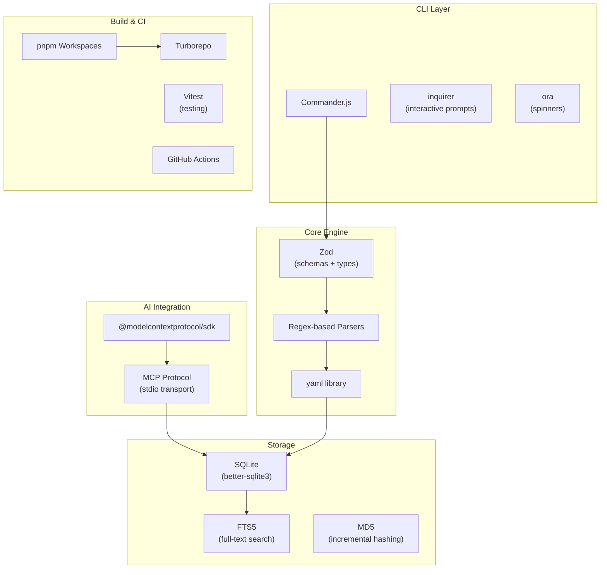

# KnowGraph Design Decisions

> Architecture Decision Records (ADRs) for the KnowGraph project. Each decision documents the context, rationale, consequences, and alternatives considered.

---

## Table of Contents

- [ADR-001: Monorepo with pnpm Workspaces + Turborepo](#adr-001-monorepo-with-pnpm-workspaces--turborepo)
- [ADR-002: SQLite with FTS5 for Knowledge Graph Storage](#adr-002-sqlite-with-fts5-for-knowledge-graph-storage)
- [ADR-003: MCP Protocol for AI Integration](#adr-003-mcp-protocol-for-ai-integration)
- [ADR-004: Zod Schemas as Single Source of Truth](#adr-004-zod-schemas-as-single-source-of-truth)
- [ADR-005: Regex-Based Parsing Over AST for Initial Release](#adr-005-regex-based-parsing-over-ast-for-initial-release)
- [ADR-006: Incremental Indexing via MD5 File Hashing](#adr-006-incremental-indexing-via-md5-file-hashing)
- [ADR-007: YAML Metadata Inside Code Comments](#adr-007-yaml-metadata-inside-code-comments)
- [ADR-008: Commander.js for CLI Framework](#adr-008-commanderjs-for-cli-framework)
- [ADR-009: Factory Functions Over Classes](#adr-009-factory-functions-over-classes)
- [ADR-010: Immutable Data Structures Throughout](#adr-010-immutable-data-structures-throughout)
- [ADR-011: Separate MCP Database Layer](#adr-011-separate-mcp-database-layer)
- [ADR-012: Deterministic Entity IDs via SHA-256](#adr-012-deterministic-entity-ids-via-sha-256)
- [ADR-013: Parser Registry Pattern for Extensibility](#adr-013-parser-registry-pattern-for-extensibility)
- [ADR-014: Vector Embeddings Deferred to Phase 2b](#adr-014-vector-embeddings-deferred-to-phase-2b)
- [ADR-015: Connector Plugin Architecture for External Tools](#adr-015-connector-plugin-architecture-for-external-tools)

---

## ADR-001: Monorepo with pnpm Workspaces + Turborepo

**Date**: 2026-02-14
**Status**: Accepted

### Context

KnowGraph consists of three distinct packages (`core`, `cli`, `mcp-server`) that share types, utilities, and common dependencies. We needed a project structure that supports:

- Shared code between packages without duplication
- Independent versioning and npm publishing
- Fast, parallelizable builds
- Single CI pipeline

### Decision

Use **pnpm workspaces** for dependency management and **Turborepo** for build orchestration. The three packages are:

- `@knowgraph/core` -- parsers, indexer, query engine, types
- `@knowgraph/cli` -- Commander.js command-line interface
- `@knowgraph/mcp-server` -- MCP protocol server

### Implementation

```
know-know/
  package.json          # "workspaces" not needed (pnpm uses pnpm-workspace.yaml)
  pnpm-workspace.yaml   # packages: ["packages/*"]
  turbo.json            # Pipeline: build -> test, lint parallel
  packages/
    core/               # No internal deps
    cli/                # depends on: core, mcp-server (workspace:*)
    mcp-server/         # depends on: core (workspace:*)
```

Turborepo pipeline ensures correct build order via `dependsOn: ["^build"]`:

```json
{
  "tasks": {
    "build": { "dependsOn": ["^build"], "outputs": ["dist/**"] },
    "test":  { "dependsOn": ["build"] }
  }
}
```

### Consequences

**Positive**:
- Shared types via `@knowgraph/core` workspace dependency (`workspace:*`)
- Parallel builds with Turborepo caching (only rebuilds changed packages)
- Single CI pipeline -- one `ci.yml` handles all packages
- Lockfile integrity -- `pnpm install --frozen-lockfile` prevents dependency drift
- Publishing in dependency order is straightforward (core -> mcp-server -> cli)

**Negative**:
- Contributors must use pnpm (not npm or yarn)
- Turborepo adds a dev dependency, though it is lightweight

### Alternatives Considered

| Alternative | Why Rejected |
|-------------|-------------|
| Single package | Poor separation of concerns; harder to publish CLI and MCP server independently; users would install unnecessary dependencies |
| Nx monorepo | Heavier tooling with more configuration overhead; Turborepo is simpler and sufficient for 3 packages |
| Polyrepo (3 separate repos) | Shared types would require publishing core before making changes to cli/mcp-server; friction for atomic cross-package changes |

---

## ADR-002: SQLite with FTS5 for Knowledge Graph Storage

**Date**: 2026-02-14
**Status**: Accepted

### Context

The knowledge graph stores code entities, their relationships (dependencies), tags, and external links. The storage solution needs to:

- Support full-text search across entity names, descriptions, and tags
- Work without external services (zero-config for developers)
- Handle graph-like queries (dependencies, dependents)
- Be portable (copyable, committable)

### Decision

Use **SQLite** via `better-sqlite3` with **FTS5 virtual tables** for full-text search. Each project gets a single database file at `.knowgraph/knowgraph.db`.

### Implementation

The database schema uses 5 tables:

```sql
entities          -- Main entity storage (id, file_path, name, type, metadata_json, ...)
entities_fts      -- FTS5 virtual table (name, description, tags_text, owner)
relationships     -- Dependency graph edges (source_id, target_id, relationship_type)
tags              -- Normalized tag storage (entity_id, tag)
links             -- External links (entity_id, url, link_type, title)
```

Key configuration:
- **WAL mode** (`PRAGMA journal_mode = WAL`) for concurrent read access
- **Foreign keys** enabled with CASCADE deletes
- **7 indexes** on frequently queried columns (file_path, entity_type, owner, etc.)

Full metadata is stored as JSON in `metadata_json` column, enabling schema evolution without migrations.

### Consequences

**Positive**:
- Zero-config storage -- no database server to install or run
- Fast full-text search via FTS5 (sub-millisecond on typical codebases)
- Portable -- `.knowgraph/knowgraph.db` is a single file that can be copied, backed up, or committed
- Synchronous API via `better-sqlite3` (no async overhead for local operations)
- WAL mode allows concurrent reads (MCP server reads while CLI writes)

**Negative**:
- No concurrent write support (acceptable: only the CLI writes during indexing)
- SQL-based graph queries are less elegant than dedicated graph databases
- `metadata_json` column requires JSON parsing at read time (minor performance cost)

### Alternatives Considered

| Alternative | Why Rejected |
|-------------|-------------|
| PostgreSQL | Requires running a database server; overkill for a local CLI tool |
| JSON files | No query capabilities; poor performance at scale; no full-text search |
| LevelDB | No SQL queries; no built-in full-text search; limited query flexibility |
| Neo4j | Excellent for graph queries, but requires a running server; heavy dependency |
| DuckDB | Good analytical engine, but FTS5 in SQLite is more mature and better-sqlite3 has broader ecosystem |

---

## ADR-003: MCP Protocol for AI Integration

**Date**: 2026-02-14
**Status**: Accepted

### Context

KnowGraph's primary value is making code knowledge available to AI assistants. The integration mechanism needs to:

- Work with Claude Desktop and Claude Code
- Be standardized (not a custom protocol)
- Support local execution without network configuration
- Be extensible with new tools

### Decision

Implement an **MCP (Model Context Protocol) server** with **stdio transport** as the primary AI interface. The server exposes 7 tools for searching, browsing, and understanding the code knowledge graph.

### Implementation

The MCP server uses `@modelcontextprotocol/sdk`:

```typescript
import { McpServer } from '@modelcontextprotocol/sdk/server/mcp.js';
import { StdioServerTransport } from '@modelcontextprotocol/sdk/server/stdio.js';

const server = new McpServer({ name: 'knowgraph', version: '0.1.0' });
// Register tools...
const transport = new StdioServerTransport();
await server.connect(transport);
```

7 registered tools:

| Tool | Purpose |
|------|---------|
| `search_code` | Full-text search with filters |
| `find_by_owner` | Find entities by owner/team |
| `find_by_business_goal` | Find entities by business context |
| `get_dependencies` | Dependency graph traversal |
| `get_entity_details` | Detailed entity information |
| `get_external_knowledge` | External links (Notion, Jira, etc.) |
| `get_graph_overview` | Codebase statistics |

Each tool uses Zod schemas for parameter validation and returns markdown-formatted text.

### Consequences

**Positive**:
- Native integration with Claude Desktop and Claude Code (stdio transport)
- Standard protocol -- other AI tools adopting MCP get integration for free
- stdio transport works locally with no network config needed
- Tool-based API is naturally discoverable by AI assistants
- Graceful degradation -- if database is unavailable, the server returns an error tool

**Negative**:
- MCP is still relatively new; ecosystem is growing but not yet universal
- stdio transport is one-to-one (one server per client process)
- No real-time updates; the server reads a static database snapshot

### Alternatives Considered

| Alternative | Why Rejected |
|-------------|-------------|
| REST API only | No native AI assistant integration; would require custom tool definitions and network setup |
| Language Server Protocol (LSP) | Designed for IDE features (autocomplete, go-to-definition), not for AI-style queries |
| Custom JSON-RPC | Reinventing the wheel; MCP already provides the standard |
| GraphQL API | More complex setup; MCP tools are simpler and map better to AI tool-calling patterns |

---

## ADR-004: Zod Schemas as Single Source of Truth

**Date**: 2026-02-14
**Status**: Accepted

### Context

KnowGraph needs to validate `@knowgraph` metadata extracted from code comments at runtime (the YAML could contain anything), while also having TypeScript type safety throughout the codebase. Having separate type definitions and validation schemas leads to drift.

### Decision

Use **Zod schemas** as the single source of truth for both runtime validation and TypeScript types, leveraging `z.infer<>` for type inference.

### Implementation

```typescript
// Schema is the source of truth
export const CoreMetadataSchema = z.object({
  type: EntityTypeSchema,
  description: z.string().min(1),
  owner: z.string().optional(),
  status: StatusSchema.optional(),
  tags: z.array(z.string()).optional(),
  links: z.array(LinkSchema).optional(),
});

// TypeScript type is derived (never manually defined)
export type CoreMetadata = z.infer<typeof CoreMetadataSchema>;
```

Validation uses `.safeParse()` for non-throwing validation:

```typescript
const result = ExtendedMetadataSchema.safeParse(parsed);
if (result.success) {
  return { metadata: result.data, errors: [] };
}
// Fall back to CoreMetadataSchema...
```

### Consequences

**Positive**:
- Single source of truth -- types and validation can never drift apart
- Runtime safety -- user-authored YAML is validated before entering the system
- Clear error messages -- Zod provides structured validation errors with paths
- Composable -- `ExtendedMetadataSchema` extends `CoreMetadataSchema` via `.extend()`
- IntelliSense -- TypeScript types are available throughout the IDE

**Negative**:
- Zod is a runtime dependency in the core package (though small at ~50KB)
- Schema definitions are slightly more verbose than plain TypeScript interfaces
- Developers must learn Zod's API (though it maps closely to TypeScript)

### Alternatives Considered

| Alternative | Why Rejected |
|-------------|-------------|
| JSON Schema + ajv | Requires separate TypeScript type definitions; more boilerplate; types and validation can drift |
| io-ts | Less ergonomic API; smaller ecosystem; functional style can be harder to read |
| TypeScript interfaces + manual validation | Validation logic duplicates type information; easy to miss fields; no structured error messages |
| Yup | Less TypeScript-native than Zod; `.infer` support is less mature |

---

## ADR-005: Regex-Based Parsing Over AST for Initial Release

**Date**: 2026-02-14
**Status**: Accepted

### Context

KnowGraph needs to extract `@knowgraph` metadata from code comments across multiple languages. Two approaches were considered:

1. **Regex-based**: Use regular expressions to find comment blocks and pattern-match declarations
2. **AST-based**: Use language parsers (Tree-sitter, ts-morph) to build abstract syntax trees

### Decision

Use **regex-based parsing** for the initial release with language-specific comment extraction patterns. Plan Tree-sitter integration for Phase 1b.

### Implementation

Each parser uses regexes tailored to the language's comment syntax:

**TypeScript parser** (`typescript-parser.ts`):
```typescript
const JSDOC_REGEX = /\/\*\*[\s\S]*?\*\//g;                // Find JSDoc blocks
const CLASS_DECL_REGEX = /^(?:export\s+)?(?:abstract\s+)?class\s+(\w+)/;  // Match class
const FUNC_DECL_REGEX = /^(?:export\s+)?(?:async\s+)?function\s+(\w+)/;   // Match function
// ... 4 more patterns for arrow functions, interfaces, types, methods
```

**Python parser** (`python-parser.ts`):
```typescript
const DOCSTRING_REGEX = /("""[\s\S]*?"""|'''[\s\S]*?''')/g;  // Find docstrings
const CLASS_DEF_REGEX = /^(\s*)class\s+(\w+)/;                // Match class
const FUNC_DEF_REGEX = /^(\s*)(?:async\s+)?def\s+(\w+)/;     // Match function
```

**Generic parser** (`generic-parser.ts`):
```typescript
const BLOCK_COMMENT_REGEX = /\/\*[\s\S]*?\*\/|"""[\s\S]*?"""|'''[\s\S]*?'''/g;
const SINGLE_LINE_COMMENT_GROUP_REGEX = /(?:^[ \t]*(?:\/\/|#).*\n?)+/gm;
```

The generic parser serves as a fallback for any language with standard comment syntax.

### Consequences

**Positive**:
- Fast to implement for multiple languages (Python, TypeScript, generic fallback done in one sprint)
- Handles well-formatted comments correctly (covers ~95% of real-world cases)
- No external WASM dependencies (Tree-sitter requires WASM runtime)
- Small bundle size
- Easy to understand and debug

**Negative**:
- May miss edge cases that AST parsing would catch (e.g., template literals containing `/**`, multiline strings)
- Entity name inference from surrounding code is heuristic-based (regex matching against next non-empty line)
- Cannot determine if a comment is inside a string literal vs. actual code
- Each new language needs its own regex patterns

### Upgrade Path

Tree-sitter integration is planned for Phase 1b. The `Parser` interface is already designed for this:

```typescript
interface Parser {
  readonly name: string;
  readonly supportedExtensions: readonly string[];
  parse(content: string, filePath: string): readonly ParseResult[];
}
```

A Tree-sitter parser would implement the same interface, meaning no changes to the registry or downstream code.

### Alternatives Considered

| Alternative | Why Rejected |
|-------------|-------------|
| Tree-sitter from day one | Significant implementation effort; WASM dependency adds complexity; delays initial release by weeks |
| Language-specific AST parsers (ts-morph, etc.) | Different parser library per language; no unified approach; heavy dependencies |
| Babel parser for JS/TS + ast module for Python | Two separate systems; still need generic fallback for other languages |

---

## ADR-006: Incremental Indexing via MD5 File Hashing

**Date**: 2026-02-14
**Status**: Accepted

### Context

Re-indexing an entire codebase on every run is wasteful. Large codebases with thousands of files would take seconds to minutes, but typically only a few files change between runs.

### Decision

Store the MD5 hash of each indexed file's content. On re-index, compare the current hash to the stored hash and skip unchanged files.

### Implementation

```typescript
function computeFileHash(content: string): string {
  return createHash('md5').update(content).digest('hex');
}

// During indexing:
if (incremental) {
  const existingHash = dbManager.getFileHash(relPath);
  if (existingHash === fileHash) {
    continue;  // Skip unchanged file
  }
}

// When file has changed:
dbManager.deleteEntitiesByFilePath(relPath);  // Remove old entities
// ... re-parse and insert new entities with updated hash
```

The hash is stored in the `file_hash` column of the `entities` table.

### Consequences

**Positive**:
- Fast re-indexing -- only changed files are processed
- Simple implementation (MD5 is fast and sufficient for change detection)
- Works regardless of version control system

**Negative**:
- MD5 is not cryptographically secure (irrelevant here -- used only for change detection)
- Slight overhead for hash computation on first run (negligible for typical file sizes)
- Entire file must be re-parsed even if only non-annotation code changed

### Alternatives Considered

| Alternative | Why Rejected |
|-------------|-------------|
| File modification timestamps | Unreliable across git operations (clone, checkout, rebase all reset mtime) |
| Git diff-based detection | Only works in git repos; misses untracked files; more complex implementation |
| inotify/fswatch file watchers | Requires a running daemon; doesn't help for CLI re-runs |

---

## ADR-007: YAML Metadata Inside Code Comments

**Date**: 2026-02-14
**Status**: Accepted

### Context

Developers need to annotate their code with structured metadata. The format must be:

- Human-readable and writable
- Parseable by tools
- Co-located with the code it describes
- Compatible with existing IDE syntax highlighting

### Decision

Use **YAML blocks inside language-native comments**, triggered by the `@knowgraph` marker.

### Implementation

**TypeScript (JSDoc)**:
```typescript
/**
 * @knowgraph
 * type: module
 * description: Parser registry that routes files to appropriate language parsers
 * owner: knowgraph-core
 * status: stable
 * tags: [parser, registry, factory]
 * context:
 *   business_goal: Enable automatic parser selection based on file type
 */
```

**Python (docstring)**:
```python
"""
@knowgraph
type: service
description: Authentication service for user login and token management
owner: auth-team
status: stable
tags: [auth, security, jwt]
context:
  business_goal: Secure user authentication
  funnel_stage: acquisition
"""
```

**Any language (line comments)**:
```go
// @knowgraph
// type: module
// description: HTTP router with middleware support
// owner: platform-team
// status: stable
```

The metadata extractor handles comment stripping (removing `*`, `#`, `//` prefixes) and YAML dedenting automatically.

### Consequences

**Positive**:
- Familiar YAML syntax -- no new language for developers to learn
- Co-located with code -- annotations stay in sync with the code they describe
- Language-native comment styles -- IDEs already syntax-highlight JSDoc and docstrings
- Structured data -- YAML supports nested objects (context, dependencies, compliance)
- The `@knowgraph` marker makes annotations explicitly opt-in and easy to grep for

**Negative**:
- Comments can get long for entities with rich metadata
- YAML indentation sensitivity inside comments can be tricky
- Some languages have limited comment block support
- No schema validation in the editor (until a VSCode extension is built)

### Alternatives Considered

| Alternative | Why Rejected |
|-------------|-------------|
| JSON in comments | Verbose; hard to write by hand; no inline comments; closing braces are error-prone |
| Separate YAML/TOML files per module | Disconnected from code; easy to get out of sync; extra files clutter the project |
| Custom DSL | Learning curve; no existing tooling support; harder to parse |
| TypeScript decorators | Language-specific; not applicable to Python, Go, etc.; runtime overhead |
| JSDoc tags (e.g., `@owner`, `@status`) | Limited to key-value pairs; no support for nested objects (context, dependencies); would need many custom tags |

---

## ADR-008: Commander.js for CLI Framework

**Date**: 2026-02-14
**Status**: Accepted

### Context

KnowGraph needs a CLI with 9 subcommands (`parse`, `index`, `query`, `serve`, `init`, `validate`, `coverage`, `suggest`, `hook`). The CLI framework should provide argument parsing, help generation, and subcommand routing.

### Decision

Use **Commander.js** for CLI argument parsing and command routing.

### Implementation

```typescript
import { Command } from 'commander';

const program = new Command();
program.name('knowgraph').description('AI-navigable code documentation tool');

// Each command is a separate module
registerParseCommand(program);    // knowgraph parse <path>
registerIndexCommand(program);    // knowgraph index [path]
registerQueryCommand(program);    // knowgraph query <term>
// ... 6 more commands
```

Each command module exports a single function:

```typescript
export function registerIndexCommand(program: Command): void {
  program
    .command('index [path]')
    .description('Scan repository and build the SQLite index')
    .option('--output <dir>', 'Output directory', '.knowgraph')
    .option('--incremental', 'Only re-index changed files', true)
    .action((path, options) => { /* implementation */ });
}
```

### Consequences

**Positive**:
- Well-maintained, widely used (60k+ GitHub stars)
- Built-in help generation (`--help` works for all commands and subcommands)
- Clean API for options, arguments, and subcommands
- Small dependency footprint

**Negative**:
- Less opinionated than oclif (no plugin system, no auto-update)
- No built-in support for interactive prompts (we use `inquirer` separately for `init`)

### Alternatives Considered

| Alternative | Why Rejected |
|-------------|-------------|
| yargs | More complex API for similar functionality; Builder pattern is less readable |
| oclif | Heavy framework better suited for large, plugin-based CLIs; overkill for 9 commands |
| Custom argument parsing | Reinventing the wheel; would need to build help generation, option parsing, etc. |
| clipanion (used by yarn) | Smaller ecosystem; decorator-based API requires classes |

---

## ADR-009: Factory Functions Over Classes

**Date**: 2026-02-14
**Status**: Accepted

### Context

The codebase needs constructors for parsers, database managers, query engines, validators, and other components. JavaScript/TypeScript offers both class-based and factory function approaches.

### Decision

Use **factory functions** that return interface objects, rather than class constructors.

### Implementation

```typescript
// Factory function pattern used throughout
export function createDatabaseManager(dbPath?: string): DatabaseManager {
  const db = new Database(dbPath ?? ':memory:');

  function insertEntity(entity: EntityInsert): string {
    // Private implementation using closure over `db`
  }

  return {
    insertEntity,
    getEntityById,
    // ... other methods
  };
}
```

This pattern is consistent across the codebase:

| Factory | Creates |
|---------|---------|
| `createDefaultRegistry()` | `ParserRegistry` |
| `createTypescriptParser()` | `Parser` |
| `createPythonParser()` | `Parser` |
| `createGenericParser()` | `Parser` |
| `createDatabaseManager()` | `DatabaseManager` |
| `createIndexer()` | Indexer |
| `createQueryEngine()` | `QueryEngine` |
| `createValidator()` | `Validator` |
| `createSuggestionEngine()` | `SuggestionEngine` |
| `createServer()` | `McpServer` |

### Consequences

**Positive**:
- No `this` binding issues (closures capture state naturally)
- Private state via closures (no need for `#private` or `_private` conventions)
- Simpler to compose and test (functions, not class hierarchies)
- Return type is always an interface, making it easy to mock in tests
- Aligns with functional programming patterns used elsewhere in the codebase

**Negative**:
- No `instanceof` checks (if needed, would require brand checking)
- Cannot extend with inheritance (but composition is preferred anyway)

---

## ADR-010: Immutable Data Structures Throughout

**Date**: 2026-02-14
**Status**: Accepted

### Context

Mutation-related bugs are common in JavaScript, especially when objects are passed between functions and modules. KnowGraph processes data through multiple pipeline stages (parse -> validate -> index -> query), and mutations at any stage could corrupt data.

### Decision

All interfaces and data structures use `readonly` properties. Functions return new objects rather than mutating inputs.

### Implementation

```typescript
// All interface properties are readonly
interface StoredEntity {
  readonly id: string;
  readonly filePath: string;
  readonly name: string;
  readonly entityType: EntityType;
  readonly tags: readonly string[];       // readonly array
  readonly links: readonly Link[];        // readonly array
  // ...
}

// Functions return new arrays, not mutations
function parse(content: string, filePath: string): readonly ParseResult[] {
  const results: ParseResult[] = [];
  // ... build results
  return results;  // Return new array
}
```

`readonly` is applied to:
- All interface properties
- Array return types (`readonly T[]`)
- Const assertions for static data (`as const`)
- ReadonlySet and ReadonlyMap for collection constants

### Consequences

**Positive**:
- Prevents accidental mutations across module boundaries
- Makes data flow explicit -- you can trace where values are created
- Enables safe sharing of objects between components
- TypeScript compiler catches mutation attempts at compile time

**Negative**:
- Slightly more verbose interface definitions
- Occasional need for mutable intermediate arrays during construction (e.g., `const results: T[] = []` then `return results` as readonly)

---

## ADR-011: Separate MCP Database Layer

**Date**: 2026-02-14
**Status**: Accepted

### Context

The MCP server and the core indexer both access the SQLite database, but with different access patterns:

- The **indexer** (core) needs read-write access for CRUD operations
- The **MCP server** needs read-only access optimized for search queries

### Decision

The MCP server has its own database layer (`packages/mcp-server/src/db.ts`) separate from the core `DatabaseManager`.

### Implementation

```typescript
// MCP database layer opens in read-only mode
export function openDatabase(dbPath: string): McpDatabase {
  const db = new Database(dbPath, { readonly: true, fileMustExist: true });
  db.pragma('journal_mode = WAL');
  return createDatabaseApi(db, hasFtsTable(db));
}
```

The MCP `McpDatabase` interface is query-focused:

```typescript
interface McpDatabase {
  search(query: string, filters?: SearchFilters): readonly EntityRow[];
  getById(id: string): EntityRow | undefined;
  getByOwner(owner: string): readonly EntityRow[];
  getDependencies(entityId: string, depth?: number): readonly DependencyRow[];
  getLinks(entityId?: string): readonly LinkRow[];
  getByBusinessGoal(goal: string): readonly EntityRow[];
  getStats(): GraphStats;
  close(): void;
}
```

Notable differences from core `DatabaseManager`:
- No write methods (insert, update, delete)
- BFS-based dependency traversal with configurable depth
- Business goal search (LIKE query on metadata)
- FTS fallback to LIKE queries when FTS table is missing
- Flatter return types (rows, not hydrated entities)

### Consequences

**Positive**:
- Safety: read-only mode prevents accidental writes from MCP tool handlers
- Performance: database opened with `fileMustExist: true` -- fails fast if not indexed
- Separation: MCP query patterns are optimized independently from indexer patterns
- Graceful degradation: FTS availability is checked at startup, falls back to LIKE

**Negative**:
- Some code duplication between core `DatabaseManager` and MCP `McpDatabase`
- Schema assumptions are duplicated (column names, table structures)

---

## ADR-012: Deterministic Entity IDs via SHA-256

**Date**: 2026-02-14
**Status**: Accepted

### Context

Entities need stable identifiers that persist across re-indexes. If IDs were random UUIDs, relationships and references would break on every re-index.

### Decision

Entity IDs are **SHA-256 hashes** of `filePath:name:line`:

```typescript
function generateEntityId(filePath: string, name: string, line: number): string {
  return createHash('sha256').update(`${filePath}:${name}:${line}`).digest('hex');
}
```

### Consequences

**Positive**:
- Same entity always gets the same ID (deterministic)
- IDs are stable across re-indexes if the entity hasn't moved
- No ID generation service needed
- Collision-resistant (SHA-256 has 256-bit output)

**Negative**:
- Renaming a file or moving an entity changes its ID (breaking relationships)
- Two entities with the same name on the same line in the same file would collide (extremely unlikely in practice)
- IDs are long hex strings (64 characters), not human-friendly

---

## ADR-013: Parser Registry Pattern for Extensibility

**Date**: 2026-02-14
**Status**: Accepted

### Context

KnowGraph needs to support multiple programming languages, each with different comment syntax. New languages should be addable without modifying existing code.

### Decision

Use a **registry pattern** where parsers are registered by the file extensions they handle. The registry routes files to the appropriate parser and falls back to the generic parser.

### Implementation

```typescript
interface Parser {
  readonly name: string;
  readonly supportedExtensions: readonly string[];
  parse(content: string, filePath: string): readonly ParseResult[];
}

interface ParserRegistry {
  register(parser: Parser): void;
  getParser(filePath: string): Parser | undefined;
  parseFile(content: string, filePath: string): readonly ParseResult[];
}

// Default registry with built-in parsers
function createDefaultRegistry(): ParserRegistry {
  const registry = createRegistry();
  registry.register(createPythonParser());
  registry.register(createTypescriptParser());
  return registry;  // Generic parser is always the fallback
}
```

**Extension routing**:
```
.ts, .tsx, .js, .jsx, .mts, .cts  -->  TypeScript Parser
.py, .pyi                          -->  Python Parser
(everything else)                   -->  Generic Parser (fallback)
```

### Consequences

**Positive**:
- Open/closed principle -- add new parsers without modifying registry code
- Generic fallback ensures any language with standard comments works out of the box
- `Parser` interface is simple (3 members) -- easy to implement new parsers
- Extension-based routing is fast (string comparison)

**Negative**:
- Only one parser per extension (no composite parsing)
- The generic parser cannot infer entity names from language-specific constructs

### Extension Points

Adding a new language parser:
1. Implement the `Parser` interface
2. Call `registry.register(createGoParser())` in `createDefaultRegistry`
3. The registry handles all routing automatically

---

## ADR-014: Vector Embeddings Deferred to Phase 2b

**Date**: 2026-02-15
**Status**: Proposed

### Context

Semantic search via vector embeddings would improve query quality (finding conceptually similar entities even with different terminology). However, it adds complexity:

- Requires an embedding model (local or API-based)
- Needs a vector store (LanceDB, ChromaDB, etc.)
- Increases dependencies and setup complexity

### Decision

Defer vector embeddings to Phase 2b. FTS5 full-text search covers most use cases for the initial release.

### Consequences

**Positive**:
- Simpler initial release with no ML dependencies
- FTS5 handles keyword-based queries well for most developer workflows
- Clear upgrade path when semantic search demand materializes

**Negative**:
- Queries must use exact or near-exact terms (no semantic matching)
- Cannot find conceptually related entities unless they share keywords

### Open Questions

- Local vs. API-based embeddings?
- Which embedding model? (OpenAI, Cohere, local ONNX)
- LanceDB vs. ChromaDB vs. pgvector?

---

## ADR-015: Connector Plugin Architecture for External Tools

**Date**: 2026-02-15
**Status**: Proposed

### Context

Phase 4 requires integrating with external tools (Notion, Jira, Linear) to enrich the knowledge graph with external context. The integration system needs to be extensible for third-party connectors.

### Decision

Define a `Connector` interface with standard lifecycle methods. Each connector is a separate npm package (`@knowgraph/connector-*`).

### Planned Implementation

```typescript
interface Connector {
  readonly name: string;
  authenticate(config: ConnectorConfig): Promise<void>;
  sync(entities: readonly StoredEntity[]): Promise<SyncResult>;
  validate(config: ConnectorConfig): Promise<ValidationResult>;
}
```

Planned connector packages:
- `@knowgraph/connector-notion`
- `@knowgraph/connector-jira`
- `@knowgraph/connector-linear`
- `@knowgraph/connector-webhook`

### Consequences

**Positive**:
- Clean separation of concerns (one package per connector)
- Users install only the connectors they need
- Third-party connectors are possible via the same interface

### Open Questions

- OAuth flow for browser-based authentication?
- Token storage location and encryption?
- Webhook vs. polling for change detection?

---

## Technology Stack Overview



## Summary of Key Decisions

| Decision | Core Choice | Primary Rationale |
|----------|-------------|-------------------|
| Monorepo | pnpm + Turborepo | Shared types, parallel builds, single CI |
| Storage | SQLite + FTS5 | Zero-config, portable, fast full-text search |
| AI Integration | MCP protocol | Native Claude integration, standard protocol |
| Type System | Zod schemas | Single source of truth for types + validation |
| Parsing | Regex-based | Fast multi-language support, simple implementation |
| Change Detection | MD5 hashing | Reliable incremental indexing |
| Metadata Format | YAML in comments | Human-readable, co-located with code |
| CLI Framework | Commander.js | Simple, well-maintained, good help generation |
| Code Pattern | Factory functions | No `this` issues, closure-based encapsulation |
| Data Pattern | Immutable everywhere | Prevents mutation bugs, explicit data flow |
