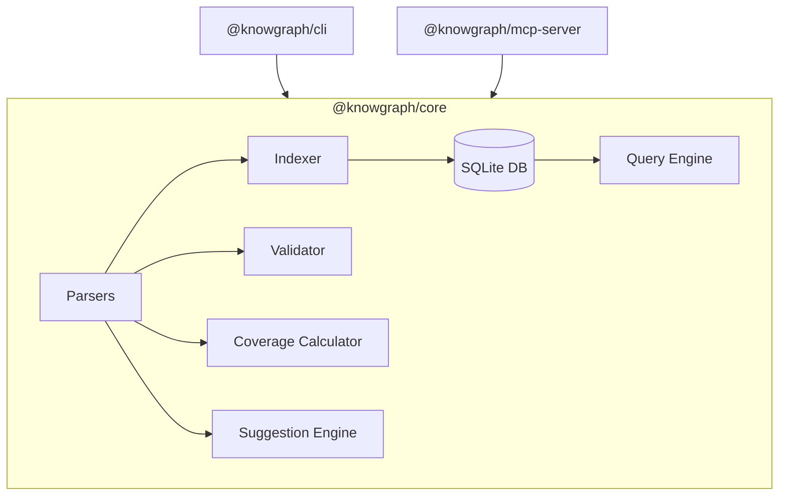

# @knowgraph/core API Reference

`@knowgraph/core` is the core library that provides parsing, indexing, querying, validation, coverage analysis, and suggestion capabilities.

```bash
npm install @knowgraph/core
```

```typescript
import { createDefaultRegistry, createDatabaseManager, createIndexer } from '@knowgraph/core';
```



---

## Parsers

### `extractKnowgraphYaml(commentBlock: string): string | null`

Extracts the raw YAML content following a `@knowgraph` marker from a comment block. Returns `null` if no marker is found.

Automatically strips JSDoc-style leading asterisks (`* `) and Python-style hash prefixes (`# `).

```typescript
import { extractKnowgraphYaml } from '@knowgraph/core';

const yaml = extractKnowgraphYaml(`
 * @knowgraph
 * type: function
 * description: My function
`);
// yaml === "type: function\ndescription: My function"
```

### `parseAndValidateMetadata(yamlString: string, baseLineOffset?: number): ExtractionResult`

Parses a YAML string and validates it against the KnowGraph metadata schemas. Tries `ExtendedMetadataSchema` first, then falls back to `CoreMetadataSchema`.

**Parameters:**
- `yamlString` -- Raw YAML string to parse
- `baseLineOffset` -- Line number offset for error reporting (default: `0`)

**Returns:** `ExtractionResult`

```typescript
import { parseAndValidateMetadata } from '@knowgraph/core';

const result = parseAndValidateMetadata('type: function\ndescription: Authenticates a user');
if (result.metadata) {
  console.log(result.metadata.type);        // "function"
  console.log(result.metadata.description); // "Authenticates a user"
}
```

### `extractMetadata(commentBlock: string, baseLineOffset?: number): ExtractionResult`

Combines `extractKnowgraphYaml` and `parseAndValidateMetadata` into a single call. Extracts the YAML from a comment block and validates it.

**Parameters:**
- `commentBlock` -- Full comment block text
- `baseLineOffset` -- Line number offset for error reporting (default: `0`)

**Returns:** `ExtractionResult`

```typescript
import { extractMetadata } from '@knowgraph/core';

const result = extractMetadata(`
@knowgraph
type: module
description: User authentication service
owner: auth-team
`);
// result.metadata?.type === "module"
```

### `ExtractionResult`

```typescript
interface ExtractionResult {
  readonly metadata: CoreMetadata | ExtendedMetadata | null;
  readonly errors: readonly ExtractionError[];
  readonly rawYaml: string;
}

interface ExtractionError {
  readonly message: string;
  readonly line?: number;
}
```

### `createTypescriptParser(): Parser`

Creates a parser for TypeScript and JavaScript files (`.ts`, `.tsx`, `.js`, `.jsx`, `.mts`, `.cts`). Extracts `@knowgraph` annotations from JSDoc comment blocks.

```typescript
import { createTypescriptParser } from '@knowgraph/core';

const parser = createTypescriptParser();
const results = parser.parse(fileContent, 'src/auth.ts');
```

### `createPythonParser(): Parser`

Creates a parser for Python files (`.py`, `.pyi`). Extracts `@knowgraph` annotations from triple-quoted docstrings.

```typescript
import { createPythonParser } from '@knowgraph/core';

const parser = createPythonParser();
const results = parser.parse(fileContent, 'src/auth.py');
```

### `createGenericParser(): Parser`

Creates a language-agnostic fallback parser. Extracts `@knowgraph` annotations from block comments (`/* ... */`, `""" ... """`) and consecutive single-line comments (`//`, `#`).

```typescript
import { createGenericParser } from '@knowgraph/core';

const parser = createGenericParser();
const results = parser.parse(fileContent, 'src/middleware.go');
```

### `createDefaultRegistry(): ParserRegistry`

Creates a parser registry pre-loaded with the TypeScript and Python parsers. The generic parser is used as a fallback for unrecognized extensions.

```typescript
import { createDefaultRegistry } from '@knowgraph/core';

const registry = createDefaultRegistry();
const results = registry.parseFile(fileContent, 'src/module.ts');
const parser = registry.getParser('file.py'); // PythonParser
```

### `Parser` Interface

```typescript
interface Parser {
  readonly name: string;
  readonly supportedExtensions: readonly string[];
  parse(content: string, filePath: string): readonly ParseResult[];
}
```

### `ParserRegistry` Interface (from parsers)

```typescript
interface ParserRegistry {
  register(parser: Parser): void;
  getParser(filePath: string): Parser | undefined;
  parseFile(content: string, filePath: string): readonly ParseResult[];
}
```

### `ParseResult`

```typescript
interface ParseResult {
  readonly name: string;         // Entity name (function name, class name, module name)
  readonly filePath: string;     // File path
  readonly line: number;         // Line number
  readonly column: number;       // Column number
  readonly language: string;     // Language identifier
  readonly entityType: EntityType;
  readonly metadata: CoreMetadata | ExtendedMetadata;
  readonly rawDocstring: string;
  readonly signature?: string;   // Function/method signature
  readonly parent?: string;      // Enclosing class name (for methods)
}
```

---

## Indexer

### `createDatabaseManager(dbPath?: string): DatabaseManager`

Creates a SQLite database manager for storing and querying indexed entities. Uses WAL mode and foreign keys.

**Parameters:**
- `dbPath` -- Path to the SQLite database file. Defaults to `:memory:` for an in-memory database.

```typescript
import { createDatabaseManager } from '@knowgraph/core';

// File-based database
const dbManager = createDatabaseManager('.knowgraph/knowgraph.db');
dbManager.initialize(); // Creates tables if they don't exist

// In-memory database (for testing)
const memDb = createDatabaseManager();
memDb.initialize();
```

### `DatabaseManager` Interface

```typescript
interface DatabaseManager {
  readonly db: Database.Database;       // Underlying better-sqlite3 instance
  initialize(): void;                   // Create tables
  close(): void;                        // Close the database
  getEntityById(id: string): StoredEntity | undefined;
  getEntitiesByFilePath(filePath: string): readonly StoredEntity[];
  insertEntity(entity: EntityInsert): string;   // Returns entity ID
  updateEntity(id: string, entity: Partial<EntityInsert>): void;
  deleteEntitiesByFilePath(filePath: string): void;
  insertRelationship(sourceId: string, targetId: string, type: string): void;
  insertTags(entityId: string, tags: readonly string[]): void;
  insertLinks(entityId: string, links: readonly Link[]): void;
  getStats(): IndexStats;
  getFileHash(filePath: string): string | undefined;
}
```

### `generateEntityId(filePath: string, name: string, line: number): string`

Generates a deterministic SHA-256 entity ID from the file path, entity name, and line number.

```typescript
import { generateEntityId } from '@knowgraph/core';

const id = generateEntityId('src/auth.ts', 'hashPassword', 42);
// Returns a hex SHA-256 hash
```

### `createIndexer(parserRegistry, dbManager): { index(options) }`

Creates an indexer that scans files, parses annotations, and stores them in the database.

**Parameters:**
- `parserRegistry` -- Object with `parse(filePath, content)` and `canParse(filePath)` methods
- `dbManager` -- A `DatabaseManager` instance

```typescript
import {
  createDefaultRegistry,
  createDatabaseManager,
  createIndexer,
} from '@knowgraph/core';

const coreRegistry = createDefaultRegistry();
const adapter = {
  parse(filePath: string, content: string) {
    return coreRegistry.parseFile(content, filePath);
  },
  canParse(filePath: string) {
    return coreRegistry.getParser(filePath) !== undefined;
  },
};

const dbManager = createDatabaseManager('.knowgraph/knowgraph.db');
dbManager.initialize();

const indexer = createIndexer(adapter, dbManager);
const result = indexer.index({
  rootDir: '/path/to/project',
  exclude: ['node_modules', '.git', 'dist'],
  incremental: true,
  onProgress: (progress) => {
    console.log(`${progress.processedFiles}/${progress.totalFiles}`);
  },
});

console.log(`Indexed ${result.totalEntities} entities in ${result.duration}ms`);
dbManager.close();
```

### `IndexerOptions`

```typescript
interface IndexerOptions {
  readonly rootDir: string;
  readonly outputDir?: string;
  readonly exclude?: readonly string[];
  readonly incremental?: boolean;               // Skip unchanged files
  readonly onProgress?: (progress: IndexProgress) => void;
}
```

### `IndexResult`

```typescript
interface IndexResult {
  readonly totalFiles: number;
  readonly totalEntities: number;
  readonly totalRelationships: number;
  readonly errors: readonly IndexError[];
  readonly duration: number;                    // Milliseconds
}
```

### `IndexProgress`

```typescript
interface IndexProgress {
  readonly totalFiles: number;
  readonly processedFiles: number;
  readonly currentFile: string;
  readonly entitiesFound: number;
}
```

### `StoredEntity`

The full entity as stored in the database:

```typescript
interface StoredEntity {
  readonly id: string;
  readonly filePath: string;
  readonly name: string;
  readonly entityType: EntityType;
  readonly description: string;
  readonly rawDocstring: string | null;
  readonly signature: string | null;
  readonly parent: string | null;
  readonly language: string;
  readonly line: number;
  readonly column: number;
  readonly owner: string | null;
  readonly status: Status | null;
  readonly metadata: CoreMetadata | ExtendedMetadata;
  readonly tags: readonly string[];
  readonly links: readonly Link[];
  readonly fileHash: string | null;
  readonly createdAt: string;
  readonly updatedAt: string;
}
```

### `IndexStats`

```typescript
interface IndexStats {
  readonly totalEntities: number;
  readonly totalRelationships: number;
  readonly totalTags: number;
  readonly totalLinks: number;
  readonly entitiesByType: Readonly<Record<string, number>>;
  readonly entitiesByLanguage: Readonly<Record<string, number>>;
}
```

### `CREATE_TABLES_SQL`

The raw SQL string for creating the SQLite schema. Exported for advanced use cases where you want to set up the database manually.

---

## Query Engine

### `createQueryEngine(dbManager: DatabaseManager): QueryEngine`

Creates a query engine for searching and traversing the indexed code graph. Supports full-text search via SQLite FTS5.

```typescript
import { createDatabaseManager, createQueryEngine } from '@knowgraph/core';

const dbManager = createDatabaseManager('.knowgraph/knowgraph.db');
const engine = createQueryEngine(dbManager);

// Full-text search
const result = engine.search({ query: 'authentication' });
console.log(`Found ${result.total} entities`);

// Filter by type
const functions = engine.search({ type: 'function', limit: 10 });

// Filter by owner
const authEntities = engine.search({ owner: 'auth-team' });

// Filter by tags
const securityEntities = engine.search({ tags: ['security'] });

// Get a specific entity
const entity = engine.getEntity('sha256-hash-id');

// Traverse dependencies
const deps = engine.getDependencies('entity-id');
const dependents = engine.getDependents('entity-id');

// Query by owner or tag directly
const ownerEntities = engine.getByOwner('platform-team');
const tagEntities = engine.getByTag('auth');

// Get index statistics
const stats = engine.getStats();
```

### `QueryEngine` Interface

```typescript
interface QueryEngine {
  search(options: QueryOptions): QueryResult;
  getEntity(id: string): StoredEntity | undefined;
  getDependencies(entityId: string): readonly StoredEntity[];
  getDependents(entityId: string): readonly StoredEntity[];
  getByOwner(owner: string): readonly StoredEntity[];
  getByTag(tag: string): readonly StoredEntity[];
  getStats(): IndexStats;
}
```

### `QueryOptions`

```typescript
interface QueryOptions {
  readonly query?: string;       // FTS5 search query
  readonly type?: EntityType;    // Filter by entity type
  readonly owner?: string;       // Filter by owner
  readonly status?: Status;      // Filter by status
  readonly tags?: readonly string[];  // Filter by tags (ANY match)
  readonly filePath?: string;    // Filter by file path
  readonly limit?: number;       // Max results (default: 50)
  readonly offset?: number;      // Pagination offset (default: 0)
}
```

### `QueryResult`

```typescript
interface QueryResult {
  readonly entities: readonly StoredEntity[];
  readonly total: number;        // Total matching count (before pagination)
  readonly query: QueryOptions;  // Echo of the query options
}
```

---

## Validation

### `createValidator(customRules?: readonly ValidationRule[]): Validator`

Creates a validator that scans files for `@knowgraph` annotations and checks them against validation rules.

If no custom rules are provided, all default rules are used.

```typescript
import { createValidator } from '@knowgraph/core';

const validator = createValidator();
const result = validator.validate('/path/to/project');

console.log(`Valid: ${result.isValid}`);
console.log(`Errors: ${result.errorCount}, Warnings: ${result.warningCount}`);

for (const issue of result.issues) {
  console.log(`${issue.filePath}:${issue.line} [${issue.severity}] ${issue.message}`);
}
```

### `Validator` Interface

```typescript
interface Validator {
  validate(rootDir: string, options?: ValidateOptions): ValidationResult;
}

interface ValidateOptions {
  readonly strict?: boolean;     // Treat warnings as errors
  readonly ruleName?: string;    // Run only a specific rule
}
```

### `ValidationResult`

```typescript
interface ValidationResult {
  readonly issues: readonly ValidationIssue[];
  readonly fileCount: number;
  readonly errorCount: number;
  readonly warningCount: number;
  readonly isValid: boolean;     // true if errorCount === 0
}
```

### `ValidationIssue`

```typescript
interface ValidationIssue {
  readonly filePath: string;
  readonly line: number;
  readonly rule: string;         // Rule name that triggered the issue
  readonly message: string;
  readonly severity: ValidationSeverity;
}

type ValidationSeverity = 'error' | 'warning';
```

### `ValidationRule` Interface

For creating custom validation rules:

```typescript
interface ValidationRule {
  readonly name: string;
  readonly description: string;
  readonly severity: ValidationSeverity;
  check(parseResult: ParseResult): readonly ValidationIssue[];
}
```

### Built-in Rule Factories

Each factory returns a `ValidationRule`:

| Function | Rule Name | Severity | Checks |
|----------|-----------|----------|--------|
| `createRequiredFieldsRule()` | `required-fields` | error | `description` is present |
| `createValidStatusRule()` | `valid-status` | error | `status` is `experimental`, `stable`, or `deprecated` |
| `createValidTypeRule()` | `valid-type` | error | `type` is a valid `EntityType` |
| `createNonEmptyTagsRule()` | `non-empty-tags` | warning | `tags` array is not empty when present |
| `createOwnerPresentRule()` | `owner-present` | warning | `owner` field is present |
| `createDescriptionLengthRule()` | `description-length` | warning | Description is at least 10 characters |
| `createAllDefaultRules()` | (all) | mixed | Returns array of all default rules |

```typescript
import { createValidator, createRequiredFieldsRule, createValidTypeRule } from '@knowgraph/core';

// Custom validator with only specific rules
const validator = createValidator([
  createRequiredFieldsRule(),
  createValidTypeRule(),
]);
```

---

## Coverage

### `calculateCoverage(options: CoverageOptions): CoverageResult`

Calculates annotation coverage by scanning all parseable files and checking which ones have `@knowgraph` annotations.

```typescript
import { calculateCoverage } from '@knowgraph/core';

const result = calculateCoverage({ rootDir: '/path/to/project' });

console.log(`${result.annotatedFiles}/${result.totalFiles} files annotated (${result.percentage}%)`);

// Breakdown by language
for (const lang of result.byLanguage) {
  console.log(`${lang.category}: ${lang.percentage}%`);
}

// Breakdown by directory
for (const dir of result.byDirectory) {
  console.log(`${dir.category}: ${dir.annotatedCount}/${dir.totalCount}`);
}

// Breakdown by owner
for (const owner of result.byOwner) {
  console.log(`${owner.category}: ${owner.percentage}%`);
}
```

### `CoverageOptions`

```typescript
interface CoverageOptions {
  readonly rootDir: string;
  readonly exclude?: readonly string[];
  readonly byDimension?: 'language' | 'directory' | 'owner' | 'type';
}
```

### `CoverageResult`

```typescript
interface CoverageResult {
  readonly totalFiles: number;
  readonly annotatedFiles: number;
  readonly percentage: number;
  readonly byLanguage: readonly CoverageBreakdown[];
  readonly byDirectory: readonly CoverageBreakdown[];
  readonly byOwner: readonly CoverageBreakdown[];
  readonly files: readonly FileCoverageInfo[];
}
```

### `CoverageBreakdown`

```typescript
interface CoverageBreakdown {
  readonly category: string;       // Language name, directory path, or owner
  readonly annotatedCount: number;
  readonly totalCount: number;
  readonly percentage: number;
}
```

### `FileCoverageInfo`

```typescript
interface FileCoverageInfo {
  readonly filePath: string;
  readonly language: string;
  readonly hasAnnotation: boolean;
  readonly entityCount: number;
}
```

---

## Suggestion Engine

### `createSuggestionEngine(registry: ParserRegistry): SuggestionEngine`

Creates an engine that scores and ranks unannotated files by annotation priority. Helps developers decide which files to annotate next.

```typescript
import { createDefaultRegistry, createSuggestionEngine } from '@knowgraph/core';

const registry = createDefaultRegistry();
const engine = createSuggestionEngine(registry);

const result = engine.suggest({
  rootDir: '/path/to/project',
  limit: 10,
});

for (const suggestion of result.suggestions) {
  console.log(`${suggestion.filePath} (score: ${suggestion.score}) - ${suggestion.reasons.join(', ')}`);
}
```

### `SuggestionEngine` Interface

```typescript
interface SuggestionEngine {
  readonly suggest: (options: SuggestionOptions) => SuggestionResult;
}
```

### `SuggestionOptions`

```typescript
interface SuggestionOptions {
  readonly rootDir: string;
  readonly limit?: number;    // Max suggestions (default: 10)
}
```

### `SuggestionResult`

```typescript
interface SuggestionResult {
  readonly suggestions: readonly FileSuggestion[];
  readonly totalUnannotated: number;
  readonly totalFiles: number;
}
```

### `FileSuggestion`

```typescript
interface FileSuggestion {
  readonly filePath: string;
  readonly score: number;
  readonly reasons: readonly SuggestionReason[];
  readonly language: string;
  readonly lineCount: number;
}

type SuggestionReason =
  | 'entry-point'       // index.ts, main.py, app.js, etc.
  | 'large-file'        // More than 100 lines
  | 'many-imports'      // More than 5 imports
  | 'exported-module'   // Located in src/ directory
  | 'uncovered';        // Default reason
```

---

## Type Schemas

All type schemas are defined with Zod and exported from `@knowgraph/core`. Both the schema (for runtime validation) and the inferred TypeScript type are exported.

### Entity Schemas

```typescript
import {
  EntityTypeSchema,     // z.enum(['module', 'class', 'function', ...])
  StatusSchema,         // z.enum(['experimental', 'stable', 'deprecated'])
  LinkTypeSchema,       // z.enum(['notion', 'jira', 'linear', ...])
  LinkSchema,           // z.object({ type?, url, title? })
  CoreMetadataSchema,   // z.object({ type, description, owner?, status?, tags?, links? })
  ExtendedMetadataSchema, // CoreMetadata + context?, dependencies?, compliance?, operational?
  ContextSchema,
  DependenciesSchema,
  ComplianceSchema,
  OperationalSchema,
  DataSensitivitySchema,
  FunnelStageSchema,
  RevenueImpactSchema,
  MonitoringDashboardSchema,
} from '@knowgraph/core';

// Validate at runtime
const result = CoreMetadataSchema.safeParse(unknownData);
if (result.success) {
  const metadata = result.data; // typed as CoreMetadata
}
```

### Manifest Schemas

For `.knowgraph.yml` configuration files:

```typescript
import {
  ManifestSchema,
  IndexConfigSchema,
  ParserConfigSchema,
  ConnectorConfigSchema,
  ConnectorsSchema,
  WebhookConfigSchema,
  AnnotationStyleSchema,
} from '@knowgraph/core';

const manifest = ManifestSchema.parse({
  version: '1.0',
  name: 'my-project',
  languages: ['typescript', 'python'],
  include: ['**/*'],
  exclude: ['node_modules', '.git'],
  index: { output_dir: '.knowgraph', incremental: true },
});
```

### TypeScript Types

All types are inferred from their Zod schemas:

```typescript
import type {
  EntityType,
  Status,
  LinkType,
  Link,
  CoreMetadata,
  ExtendedMetadata,
  Context,
  Dependencies,
  Compliance,
  Operational,
  FunnelStage,
  RevenueImpact,
  DataSensitivity,
  MonitoringDashboard,
  ParseResult,
  Manifest,
  AnnotationStyle,
  ParserConfig,
  ConnectorConfig,
  WebhookEvent,
  WebhookConfig,
  Connectors,
  IndexConfig,
} from '@knowgraph/core';
```

---

## Using Core as a Library

You can use `@knowgraph/core` programmatically in your own tools:

```typescript
import {
  createDefaultRegistry,
  createDatabaseManager,
  createIndexer,
  createQueryEngine,
  createValidator,
  calculateCoverage,
  createSuggestionEngine,
} from '@knowgraph/core';

// 1. Parse a single file
const registry = createDefaultRegistry();
const results = registry.parseFile(fileContent, 'src/auth.ts');

// 2. Build a full index
const dbManager = createDatabaseManager('./my-index.db');
dbManager.initialize();
const adapter = {
  parse: (fp: string, content: string) => registry.parseFile(content, fp),
  canParse: (fp: string) => registry.getParser(fp) !== undefined,
};
const indexer = createIndexer(adapter, dbManager);
indexer.index({ rootDir: '.' });

// 3. Query the index
const engine = createQueryEngine(dbManager);
const searchResult = engine.search({ query: 'auth', type: 'function' });

// 4. Validate annotations
const validator = createValidator();
const validationResult = validator.validate('.');

// 5. Check coverage
const coverage = calculateCoverage({ rootDir: '.' });

// 6. Get suggestions
const suggester = createSuggestionEngine(registry);
const suggestions = suggester.suggest({ rootDir: '.', limit: 5 });

// 7. Clean up
dbManager.close();
```
