# Testing Guide

KnowGraph uses [Vitest](https://vitest.dev/) as its testing framework with V8 for code coverage.

## Quick Start

```mermaid
flowchart LR
    A[pnpm turbo test] --> B[Build Core]
    B --> C[Test Core\nvitest]
    B --> D[Test CLI\nvitest]
    C & D --> E[Coverage\nReport]
    E --> F{Coverage\n≥ 80%?}
    F -->|Yes| G[Pass]
    F -->|No| H[Fail]
```



```bash
# Run all tests across the monorepo
pnpm turbo test

# Run tests with coverage
pnpm turbo test -- --coverage

# Run tests for a specific package
pnpm --filter @knowgraph/core test
pnpm --filter @knowgraph/cli test

# Run a specific test file
pnpm --filter @knowgraph/core vitest run src/parsers/__tests__/metadata-extractor.test.ts

# Run tests in watch mode (during development)
pnpm --filter @knowgraph/core vitest
```

## Test Organization

Tests live in `__tests__/` directories adjacent to the source code they test:

```
packages/core/src/
  parsers/
    metadata-extractor.ts
    python-parser.ts
    typescript-parser.ts
    registry.ts
    __tests__/
      metadata-extractor.test.ts
      python-parser.test.ts
      typescript-parser.test.ts
      registry.test.ts
  indexer/
    database.ts
    indexer.ts
    __tests__/
      database.test.ts
      indexer.test.ts
  query/
    query-engine.ts
    __tests__/
      query-engine.test.ts
  validation/
    rules.ts
    validator.ts
    __tests__/
      rules.test.ts
      validator.test.ts
  coverage/
    coverage-calculator.ts
    __tests__/
      coverage-calculator.test.ts
  suggest/
    suggestion-engine.ts
    __tests__/
      suggestion-engine.test.ts
  types/
    __tests__/
      entity.test.ts
      manifest.test.ts

packages/cli/src/
  __tests__/
    init.test.ts
    index-cmd.test.ts
    parse.test.ts
    query.test.ts
    coverage.test.ts
    suggest.test.ts
    validate.test.ts
    hook.test.ts
    detect.test.ts
```

### Naming Conventions

- Test files: `<module-name>.test.ts`
- Test directories: `__tests__/`
- Fixture directories: `__tests__/fixtures/`
- Temp directories in tests: `.tmp-<test-name>` (cleaned up in `afterEach`)

## Vitest Configuration

### Core Package

The core package does not have a custom `vitest.config.ts` -- it uses the default Vitest settings. Coverage thresholds are enforced at the CI level.

### CLI Package

The CLI package has a custom config at `packages/cli/vitest.config.ts`:

```typescript
import { defineConfig } from 'vitest/config';

export default defineConfig({
  test: {
    globals: true,
    coverage: {
      provider: 'v8',
      reporter: ['text', 'lcov'],
      include: ['src/utils/**/*.ts'],
      exclude: [
        'src/utils/index.ts',
        '**/__tests__/**',
        '**/*.test.ts',
      ],
      thresholds: {
        statements: 80,
        branches: 60,
        functions: 80,
        lines: 80,
      },
    },
  },
});
```

Key points:
- Coverage targets `src/utils/` (where testable logic lives)
- Excludes test files and barrel exports from coverage
- Threshold: 80% statements/functions/lines, 60% branches

## Coverage Requirements

| Metric | Minimum |
|--------|---------|
| Statements | 80% |
| Branches | 60-80% (varies by package) |
| Functions | 80% |
| Lines | 80% |

To check coverage locally:

```bash
pnpm --filter @knowgraph/core vitest run --coverage
pnpm --filter @knowgraph/cli vitest run --coverage
```

## Writing Tests

### Basic Test Structure

```typescript
import { describe, it, expect } from 'vitest';
import { extractMetadata } from '../metadata-extractor.js';

describe('extractMetadata', () => {
  it('extracts and validates metadata from a comment block', () => {
    const block = `
@knowgraph
type: function
description: Authenticates a user
owner: auth-team
    `;
    const result = extractMetadata(block);
    expect(result.metadata).not.toBeNull();
    expect(result.metadata?.type).toBe('function');
    expect(result.metadata?.owner).toBe('auth-team');
    expect(result.errors).toHaveLength(0);
  });

  it('returns empty result when no @knowgraph marker', () => {
    const block = 'Just a regular comment.';
    const result = extractMetadata(block);
    expect(result.metadata).toBeNull();
    expect(result.errors).toHaveLength(0);
    expect(result.rawYaml).toBe('');
  });
});
```

### Testing Pure Functions

Most core modules export pure functions or factory functions that return objects with methods. Test the public API:

```typescript
import { describe, it, expect } from 'vitest';
import { createDefaultRegistry } from '../registry.js';

describe('createDefaultRegistry', () => {
  it('returns a registry with Python and TypeScript parsers', () => {
    const registry = createDefaultRegistry();
    expect(registry.getParser('file.py')).toBeDefined();
    expect(registry.getParser('file.ts')).toBeDefined();
  });

  it('falls back to generic parser for unknown extensions', () => {
    const registry = createDefaultRegistry();
    const parser = registry.getParser('file.go');
    expect(parser).toBeDefined();
    expect(parser?.name).toBe('generic');
  });
});
```

### Testing with Temporary Files

When tests need file system access, create temporary directories and clean up after:

```typescript
import { describe, it, expect, afterEach } from 'vitest';
import { resolve, join } from 'node:path';
import { mkdirSync, rmSync, existsSync, writeFileSync } from 'node:fs';

const TEMP_DIR = resolve(__dirname, '.tmp-my-test');

afterEach(() => {
  if (existsSync(TEMP_DIR)) {
    rmSync(TEMP_DIR, { recursive: true, force: true });
  }
});

describe('my feature', () => {
  it('should process files from a directory', () => {
    mkdirSync(TEMP_DIR, { recursive: true });
    writeFileSync(join(TEMP_DIR, 'main.py'), '# python file\n');

    // Test logic here
  });
});
```

### Testing the Indexer

The indexer requires a database. Use an in-memory database or a temp file:

```typescript
import { describe, it, expect, afterEach } from 'vitest';
import { resolve, join } from 'node:path';
import { mkdirSync, rmSync, existsSync } from 'node:fs';
import {
  createDefaultRegistry,
  createDatabaseManager,
  createIndexer,
} from '@knowgraph/core';

const FIXTURES_DIR = resolve(__dirname, 'fixtures');
const TEMP_DIR = resolve(__dirname, '.tmp-test-output');

function createAdapter(registry: ReturnType<typeof createDefaultRegistry>) {
  return {
    parse(filePath: string, content: string) {
      return registry.parseFile(content, filePath);
    },
    canParse(filePath: string) {
      return registry.getParser(filePath) !== undefined;
    },
  };
}

afterEach(() => {
  if (existsSync(TEMP_DIR)) {
    rmSync(TEMP_DIR, { recursive: true, force: true });
  }
});

describe('index command logic', () => {
  it('should index a sample directory', () => {
    mkdirSync(TEMP_DIR, { recursive: true });
    const dbPath = join(TEMP_DIR, 'knowgraph.db');

    const registry = createDefaultRegistry();
    const adapter = createAdapter(registry);
    const dbManager = createDatabaseManager(dbPath);
    dbManager.initialize();

    const indexer = createIndexer(adapter, dbManager);
    const result = indexer.index({
      rootDir: FIXTURES_DIR,
      exclude: [],
    });

    expect(result.totalFiles).toBeGreaterThan(0);
    expect(result.totalEntities).toBeGreaterThan(0);
    expect(result.errors.length).toBe(0);

    dbManager.close();
  });
});
```

### Testing CLI Commands

CLI command tests focus on the underlying logic rather than the Commander.js wiring. The pattern is:

1. Extract the core logic into testable functions
2. Test those functions directly
3. Use temporary directories for file system operations

For commands that interact with `@knowgraph/core`, import and test the core functions:

```typescript
import { describe, it, expect, afterEach } from 'vitest';
import { resolve, join } from 'node:path';
import { mkdirSync, rmSync, existsSync, writeFileSync, readFileSync } from 'node:fs';
import { parse, stringify } from 'yaml';

const TEMP_DIR = resolve(__dirname, '.tmp-init-test');

afterEach(() => {
  if (existsSync(TEMP_DIR)) {
    rmSync(TEMP_DIR, { recursive: true, force: true });
  }
});

describe('init command logic', () => {
  it('should generate valid .knowgraph.yml content', () => {
    const manifest = {
      version: '1.0',
      name: 'test-project',
      languages: ['python', 'typescript'],
      include: ['**/*'],
      exclude: ['node_modules', '.git', 'dist', 'build', '__pycache__'],
      index: { output_dir: '.knowgraph', incremental: true },
    };

    mkdirSync(TEMP_DIR, { recursive: true });
    const yamlContent = stringify(manifest);
    const configPath = join(TEMP_DIR, '.knowgraph.yml');
    writeFileSync(configPath, yamlContent, 'utf-8');

    const content = readFileSync(configPath, 'utf-8');
    const parsed = parse(content);
    expect(parsed.version).toBe('1.0');
    expect(parsed.name).toBe('test-project');
  });
});
```

### Testing Zod Schemas

Test schemas by validating both valid and invalid inputs:

```typescript
import { describe, it, expect } from 'vitest';
import { CoreMetadataSchema, StatusSchema } from '../entity.js';

describe('CoreMetadataSchema', () => {
  it('accepts valid core metadata', () => {
    const result = CoreMetadataSchema.safeParse({
      type: 'function',
      description: 'My function',
    });
    expect(result.success).toBe(true);
  });

  it('rejects missing required fields', () => {
    const result = CoreMetadataSchema.safeParse({
      owner: 'some-team',
    });
    expect(result.success).toBe(false);
  });
});

describe('StatusSchema', () => {
  it('accepts valid status values', () => {
    expect(StatusSchema.safeParse('experimental').success).toBe(true);
    expect(StatusSchema.safeParse('stable').success).toBe(true);
    expect(StatusSchema.safeParse('deprecated').success).toBe(true);
  });

  it('rejects invalid status values', () => {
    expect(StatusSchema.safeParse('active').success).toBe(false);
  });
});
```

## Test Fixtures

Place test fixture files in `__tests__/fixtures/`:

```
packages/cli/src/__tests__/fixtures/
  sample.ts          # TypeScript file with @knowgraph annotations
  sample.py          # Python file with @knowgraph annotations
```

These are real files that parsers and indexers run against during tests.

## Troubleshooting

### Tests Fail After Changing Core

The CLI package depends on core. If you change core, rebuild before testing:

```bash
pnpm turbo build && pnpm turbo test
```

### Coverage Below Threshold

If coverage drops below the threshold:

1. Check the coverage report: `pnpm --filter @knowgraph/core vitest run --coverage`
2. Look at uncovered lines in the `text` reporter output
3. Add tests for uncovered branches and functions
4. Re-run to verify

### Database Tests Leave Artifacts

Always clean up temp directories in `afterEach`:

```typescript
afterEach(() => {
  if (existsSync(TEMP_DIR)) {
    rmSync(TEMP_DIR, { recursive: true, force: true });
  }
});
```

### Import Path Issues

All internal imports use the `.js` extension (even for `.ts` files), because the project uses ESM:

```typescript
// Correct
import { extractMetadata } from './metadata-extractor.js';

// Wrong
import { extractMetadata } from './metadata-extractor';
```
