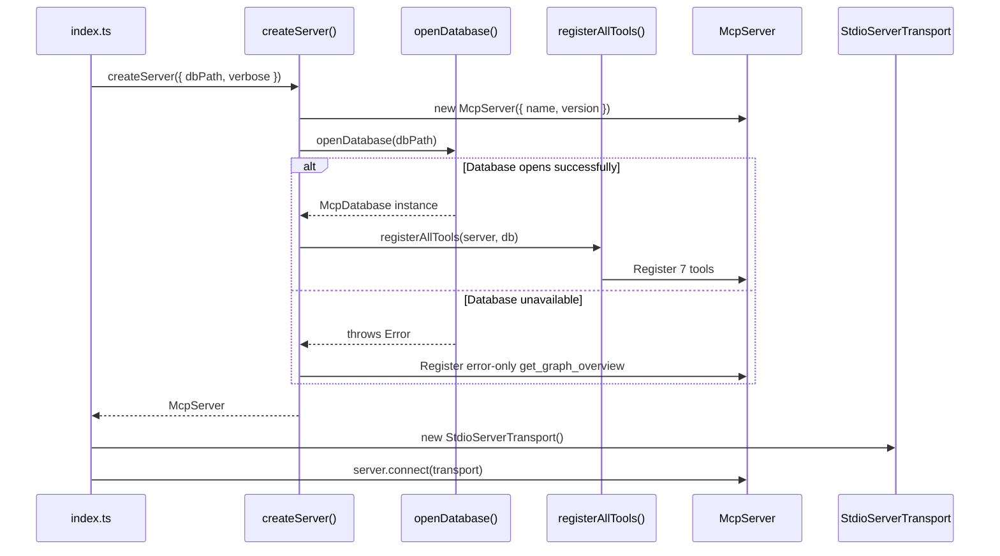
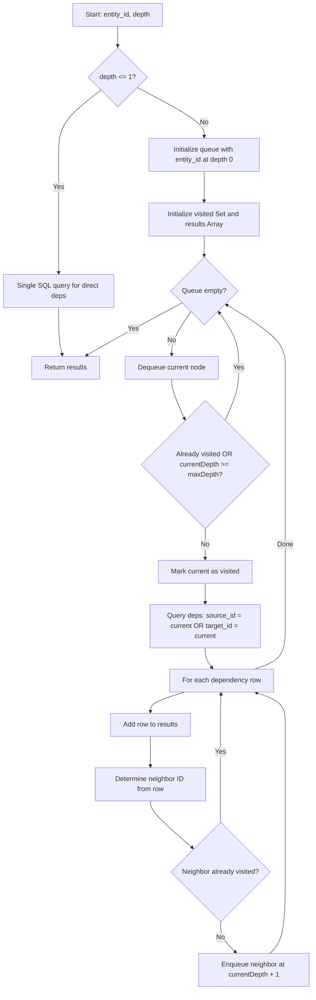

# MCP Server (`@knowgraph/mcp-server`)

The MCP (Model Context Protocol) server exposes the KnowGraph knowledge graph to AI assistants such as Claude Desktop and Claude Code. It provides 7 read-only tools that allow AI assistants to search, navigate, and understand an indexed codebase.

**Package:** `@knowgraph/mcp-server` (v0.2.0)
**Transport:** stdio
**Database:** Read-only SQLite via `better-sqlite3`
**Source:** [`packages/mcp-server/src/`](../../packages/mcp-server/src/)

---

## Table of Contents

- [Server Architecture](#server-architecture)
- [Tool Registration](#tool-registration)
- [Tools Reference](#tools-reference)
  - [search_code](#search_code)
  - [find_code_by_owner](#find_code_by_owner)
  - [find_code_by_business_goal](#find_code_by_business_goal)
  - [get_code_dependencies](#get_code_dependencies)
  - [get_entity_details](#get_entity_details)
  - [get_external_knowledge](#get_external_knowledge)
  - [get_graph_overview](#get_graph_overview)
- [Database Layer](#database-layer)
- [Integration Guide](#integration-guide)

---

## Server Architecture

The server follows a two-phase factory pattern: `createServer` builds the MCP server and registers tools, then `startServer` connects it to a stdio transport.

### Initialization Sequence



### Key Files

| File | Purpose |
|------|---------|
| `src/index.ts` | Package entrypoint, exports, and direct-run CLI handler |
| `src/server.ts` | `createServer` / `startServer` factory functions |
| `src/db.ts` | SQLite database layer (`McpDatabase` interface) |
| `src/config.ts` | Claude Desktop configuration generator |
| `src/tools/index.ts` | Tool registry (`registerAllTools`) |
| `src/tools/format.ts` | Markdown formatting utilities for tool responses |
| `src/tools/*.ts` | Individual tool implementations (one per file) |

### Error Handling: Database Unavailable

When the database file does not exist or cannot be opened, `createServer` does **not** throw. Instead, it catches the error and registers a single fallback tool (`get_graph_overview`) that returns an error message directing the user to run `knowgraph index`:

```
Database not available at .knowgraph/knowgraph.db. Run 'knowgraph index' to create it.
```

This ensures the MCP server always starts successfully, even without a database.

### ServerOptions

```typescript
interface ServerOptions {
  readonly dbPath: string;     // Path to the SQLite database file
  readonly verbose?: boolean;  // Log database errors to stderr
}
```

---

## Tool Registration

Tools are registered through a centralized `registerAllTools` function in `src/tools/index.ts`. This function takes the `McpServer` instance and an `McpDatabase` instance, then calls each individual tool registration function in sequence.

### Tool Dispatch Flow

```mermaid
flowchart TD
    A[AI Assistant sends tool call] --> B[McpServer receives request]
    B --> C{Match tool name}
    C -->|search_code| D[registerSearchCode handler]
    C -->|find_code_by_owner| E[registerFindByOwner handler]
    C -->|find_code_by_business_goal| F[registerFindByBusinessGoal handler]
    C -->|get_code_dependencies| G[registerGetDependencies handler]
    C -->|get_entity_details| H[registerGetEntityDetails handler]
    C -->|get_external_knowledge| I[registerGetExternalKnowledge handler]
    C -->|get_graph_overview| J[registerGraphOverview handler]
    D --> K[McpDatabase query]
    E --> K
    F --> K
    G --> K
    H --> K
    I --> K
    J --> K
    K --> L[Format response as Markdown]
    L --> M[Return { content, isError? }]
```

### Registration Pattern

Each tool follows a consistent pattern:

1. **Zod parameter schema** -- defines and validates input parameters inline
2. **Handler function** -- calls the appropriate `McpDatabase` method
3. **Formatter** -- converts raw data into Markdown via `format.ts`
4. **Error wrapper** -- catches exceptions and returns `{ isError: true }` with a message

```typescript
// Simplified pattern used by every tool
server.tool(
  'tool_name',                          // MCP tool identifier
  'Human-readable description',         // Shown to the AI assistant
  { param: z.string().describe('...') }, // Zod schema for parameters
  async (params) => {
    try {
      const results = db.someMethod(params.param);
      return { content: [{ type: 'text', text: formatResults(results) }] };
    } catch (error) {
      return {
        content: [{ type: 'text', text: `Error: ${String(error)}` }],
        isError: true,
      };
    }
  },
);
```

---

## Tools Reference

### `search_code`

Full-text search across code entities by description, name, or tags.

**Source:** `src/tools/search-code.ts`

| Parameter | Type | Required | Description |
|-----------|------|----------|-------------|
| `query` | `string` | Yes | Search query text |
| `type` | `string` | No | Entity type filter (e.g., `function`, `class`, `module`) |
| `owner` | `string` | No | Owner/team filter |
| `tags` | `string[]` | No | Tag filters (AND logic -- all tags must match) |
| `limit` | `number` | No | Max results (default 20) |

**Search Strategy:**

1. If FTS5 is available **and** the query is non-empty, attempts a `MATCH` query against the `entities_fts` virtual table
2. If FTS5 query syntax is invalid (e.g., special characters), falls through to step 3
3. Falls back to `LIKE` search on `name` and `description` columns
4. All filter parameters (`type`, `owner`, `tags`) are composed into additional `AND` clauses via `buildFilterClause`

**Example call:**
```json
{
  "tool": "search_code",
  "arguments": {
    "query": "authentication",
    "type": "service",
    "limit": 5
  }
}
```

**Example response:**
```markdown
## AuthService (service)
**File:** src/auth/service.ts:10
**Description:** Handles user authentication and session management
**Owner:** platform-team
**Status:** stable
**Tags:** auth,security
**Business Goal:** User acquisition and retention
```

---

### `find_code_by_owner`

Find all code entities owned by a specific team or person.

**Source:** `src/tools/find-by-owner.ts`

| Parameter | Type | Required | Description |
|-----------|------|----------|-------------|
| `owner` | `string` | Yes | Owner name or team to search for |

**Implementation:** Direct `WHERE owner = ?` column lookup. Returns all entities with an exact match on the `owner` column.

**Example call:**
```json
{
  "tool": "find_code_by_owner",
  "arguments": { "owner": "platform-team" }
}
```

---

### `find_code_by_business_goal`

Find code entities related to a specific business goal or context.

**Source:** `src/tools/find-by-business-goal.ts`

| Parameter | Type | Required | Description |
|-----------|------|----------|-------------|
| `goal` | `string` | Yes | Business goal or context to search for |

**Implementation:** Uses `LIKE` pattern matching (`%goal%`) on both the `business_goal` and `description` columns. This intentionally searches `description` as well, since business context is sometimes embedded in entity descriptions.

**Example call:**
```json
{
  "tool": "find_code_by_business_goal",
  "arguments": { "goal": "revenue" }
}
```

---

### `get_code_dependencies`

Get the dependency tree for a specific code entity.

**Source:** `src/tools/get-dependencies.ts`

| Parameter | Type | Required | Description |
|-----------|------|----------|-------------|
| `entity_id` | `string` | Yes | The entity ID to get dependencies for |
| `depth` | `number` | No | How many levels deep to traverse (default 1) |

**Implementation:**

- **depth=1** (default): Single SQL query for direct dependencies (`source_id = ? OR target_id = ?`)
- **depth>1**: BFS traversal with a visited set to prevent cycles

**BFS Dependency Traversal Algorithm:**



The output is formatted into two sections: **Depends On** (outgoing) and **Depended On By** (incoming).

**Example call:**
```json
{
  "tool": "get_code_dependencies",
  "arguments": { "entity_id": "payment-processor", "depth": 2 }
}
```

**Example response:**
```markdown
## Dependencies for payment-processor

### Depends On
- auth-service (calls)
- logger-util (imports)

### Depended On By
(none at depth 1 from payment-processor)
```

---

### `get_entity_details`

Get full metadata for a specific code entity including links and dependencies.

**Source:** `src/tools/get-entity-details.ts`

| Parameter | Type | Required | Description |
|-----------|------|----------|-------------|
| `entity_id` | `string` | Yes | The entity ID to look up |

**Implementation:** Performs three database lookups and combines the results:

1. `db.getById(entity_id)` -- retrieves the entity row
2. `db.getLinks(entity_id)` -- retrieves associated external links
3. `db.getDependencies(entity_id)` -- retrieves direct dependencies

Returns `isError: true` with `"Entity not found"` if the ID does not exist.

**Example response:**
```markdown
## AuthService (service)
**File:** src/auth/service.ts:10
**Description:** Handles user authentication and session management
**Owner:** platform-team
**Status:** stable
**Language:** typescript
**Signature:** `class AuthService`
**Tags:** auth,security
**Business Goal:** User acquisition and retention
**Funnel Stage:** acquisition
**Revenue Impact:** critical

### External Links
- Auth Design Doc [notion]: https://notion.so/auth-design (entity: auth-service)
- Auth Epic [jira]: https://jira.example.com/AUTH-123 (entity: auth-service)

## Dependencies for auth-service

### Depends On
- user-model (imports)

### Depended On By
- payment-processor (calls)
```

---

### `get_external_knowledge`

Get external links (Notion, Jira, Linear, etc.) for an entity or all entities.

**Source:** `src/tools/get-external-knowledge.ts`

| Parameter | Type | Required | Description |
|-----------|------|----------|-------------|
| `entity_id` | `string` | No | Entity ID to get links for (omit for all) |
| `type` | `string` | No | Link type filter (`notion`, `jira`, `linear`, `confluence`, etc.) |

**Implementation:** Queries the `links` table. If `entity_id` is provided, filters by `WHERE entity_id = ?`. If `type` is provided, applies an in-memory filter on the result set (`link.type === params.type`).

**Example call:**
```json
{
  "tool": "get_external_knowledge",
  "arguments": { "type": "notion" }
}
```

**Example response:**
```markdown
- Auth Design Doc [notion]: https://notion.so/auth-design (entity: auth-service)
```

---

### `get_graph_overview`

Get statistics and overview of the indexed codebase.

**Source:** `src/tools/graph-overview.ts`

| Parameter | Type | Required | Description |
|-----------|------|----------|-------------|
| *(none)* | -- | -- | This tool takes no parameters |

**Implementation:** Executes aggregate SQL queries:

- `COUNT(*)` on `entities`, `links`, and `dependencies` tables
- `GROUP BY entity_type` for type breakdown
- `SELECT DISTINCT owner` for owner list
- `SELECT DISTINCT language` for language list

**Example response:**
```markdown
## KnowGraph Overview

**Total Entities:** 4
**Total Links:** 3
**Total Dependencies:** 3

### Entity Types
- service: 1
- function: 1
- interface: 1
- class: 1

### Owners
platform-team, payments-team, infra-team

### Languages
typescript, python
```

---

## Database Layer

The database layer (`src/db.ts`) provides read-only access to the KnowGraph SQLite database. It exports the `McpDatabase` interface and two factory functions.

### McpDatabase Interface

```typescript
interface McpDatabase {
  search(query: string, filters?: SearchFilters): readonly EntityRow[];
  getById(id: string): EntityRow | undefined;
  getByOwner(owner: string): readonly EntityRow[];
  getDependencies(entityId: string, depth?: number): readonly DependencyRow[];
  getLinks(entityId?: string): readonly LinkRow[];
  getByBusinessGoal(goal: string): readonly EntityRow[];
  getStats(): GraphStats;
  close(): void;
}
```

### Factory Functions

| Function | Purpose |
|----------|---------|
| `openDatabase(dbPath)` | Opens a read-only SQLite file with WAL journal mode. Detects FTS5 support automatically. |
| `createInMemoryDatabase()` | Creates an in-memory database with full schema and FTS5. Used for testing. Returns `{ db, rawDb }`. |

### Schema

The database contains three tables:

**`entities`** -- Code entities extracted from `@knowgraph` annotations.

| Column | Type | Notes |
|--------|------|-------|
| `id` | `TEXT PRIMARY KEY` | Unique entity identifier |
| `name` | `TEXT NOT NULL` | Entity name |
| `file_path` | `TEXT NOT NULL` | Source file path |
| `line` | `INTEGER NOT NULL` | Line number |
| `column` | `INTEGER NOT NULL` | Column number |
| `language` | `TEXT NOT NULL` | Programming language |
| `entity_type` | `TEXT NOT NULL` | Type (function, class, module, service, interface) |
| `description` | `TEXT NOT NULL` | Human-readable description |
| `owner` | `TEXT` | Team or person owning this entity |
| `status` | `TEXT` | `experimental`, `stable`, or `deprecated` |
| `tags` | `TEXT` | Comma-separated tags |
| `signature` | `TEXT` | Code signature |
| `parent` | `TEXT` | Parent entity ID |
| `business_goal` | `TEXT` | Business objective this code serves |
| `funnel_stage` | `TEXT` | Business funnel stage |
| `revenue_impact` | `TEXT` | Revenue impact level |
| ... | `TEXT` | Additional context fields |

**`links`** -- External documentation links.

| Column | Type | Notes |
|--------|------|-------|
| `entity_id` | `TEXT NOT NULL` | FK to `entities.id` |
| `type` | `TEXT` | Link type (notion, jira, linear, confluence) |
| `url` | `TEXT NOT NULL` | URL |
| `title` | `TEXT` | Human-readable title |

**`dependencies`** -- Relationships between entities.

| Column | Type | Notes |
|--------|------|-------|
| `source_id` | `TEXT NOT NULL` | FK to `entities.id` |
| `target_id` | `TEXT NOT NULL` | FK to `entities.id` |
| `dependency_type` | `TEXT NOT NULL` | Relationship type (imports, calls, extends) |

**`entities_fts`** -- FTS5 virtual table for full-text search.

| Column | Source |
|--------|--------|
| `name` | `entities.name` |
| `description` | `entities.description` |
| `tags` | `entities.tags` |
| `business_goal` | `entities.business_goal` |

### FTS5 Detection

The `hasFtsTable` function checks `sqlite_master` for the `entities_fts` table. If FTS5 is not available (e.g., the database was built without it), all searches fall back to `LIKE` queries automatically.

### Filter Composition (`buildFilterClause`)

The `buildFilterClause` helper builds `AND` clauses from `SearchFilters`:

- `type` filter: `e.entity_type = ?`
- `owner` filter: `e.owner = ?`
- `tags` filter: Multiple `e.tags LIKE ?` conditions joined with `AND` (all tags must match)

The returned `{ where, params }` object is appended to the base query. If no filters are set, `where` is an empty string.

---

## Integration Guide

### Claude Desktop

Add the following to your Claude Desktop MCP configuration file (`~/Library/Application Support/Claude/claude_desktop_config.json` on macOS):

```json
{
  "mcpServers": {
    "knowgraph": {
      "command": "node",
      "args": [
        "/absolute/path/to/project/node_modules/@knowgraph/mcp-server/dist/index.js",
        "/absolute/path/to/project/.knowgraph/knowgraph.db"
      ]
    }
  }
}
```

You can also generate this configuration programmatically:

```typescript
import { generateClaudeDesktopConfig } from '@knowgraph/mcp-server';

const config = generateClaudeDesktopConfig('/path/to/your/project');
// Returns the JSON object shown above
```

### Claude Code

Add to your project's `.mcp.json` or use the Claude Code MCP settings:

```json
{
  "mcpServers": {
    "knowgraph": {
      "command": "node",
      "args": [
        "./node_modules/@knowgraph/mcp-server/dist/index.js",
        ".knowgraph/knowgraph.db"
      ]
    }
  }
}
```

### Direct Execution

The package can also be run directly from the command line:

```bash
# After building the package
node packages/mcp-server/dist/index.js .knowgraph/knowgraph.db

# With verbose logging
node packages/mcp-server/dist/index.js .knowgraph/knowgraph.db --verbose
```

Or via the `knowgraph-mcp` binary (if installed globally or via npx):

```bash
knowgraph-mcp .knowgraph/knowgraph.db
```

### Programmatic Usage

```typescript
import { createServer, startServer, openDatabase } from '@knowgraph/mcp-server';

// Option 1: Full server with stdio transport
await startServer({ dbPath: '.knowgraph/knowgraph.db', verbose: true });

// Option 2: Create server without starting transport (for testing/embedding)
const server = createServer({ dbPath: '.knowgraph/knowgraph.db' });

// Option 3: Use the database layer directly
const db = openDatabase('.knowgraph/knowgraph.db');
const results = db.search('authentication', { type: 'service' });
db.close();
```

### Testing with In-Memory Database

```typescript
import { createInMemoryDatabase } from '@knowgraph/mcp-server';

const { db, rawDb } = createInMemoryDatabase();

// Insert test data via rawDb (raw better-sqlite3 instance)
rawDb.prepare('INSERT INTO entities ...').run(...);

// Query via the McpDatabase interface
const results = db.search('test query');

db.close();
```

### Prerequisites

Before the MCP server can serve data, you must index your project:

```bash
# Install dependencies and build
pnpm install
pnpm turbo build

# Index the codebase (creates .knowgraph/knowgraph.db)
knowgraph index .
```
