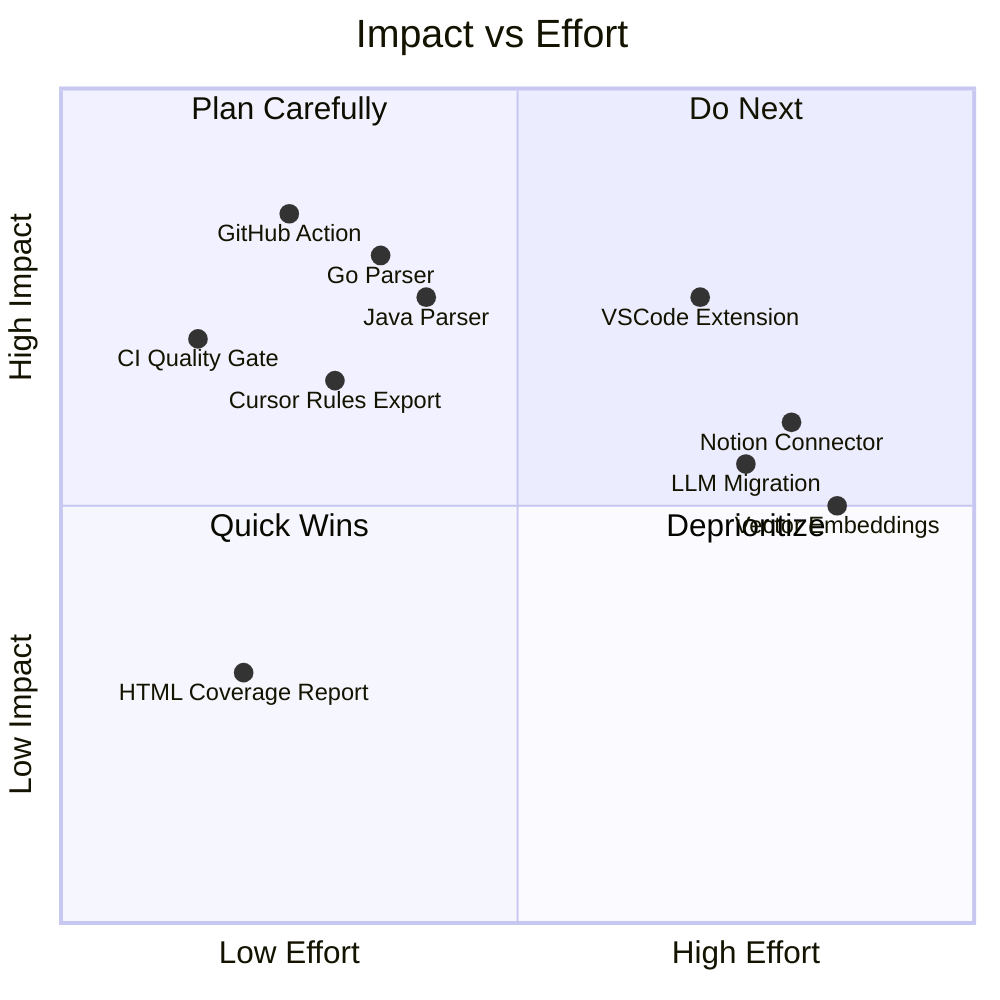
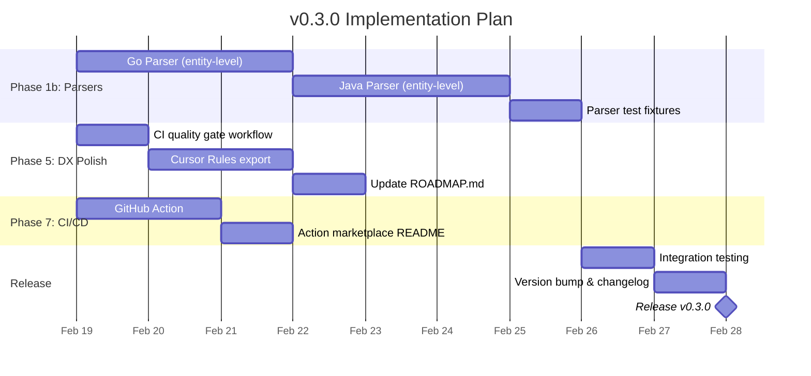
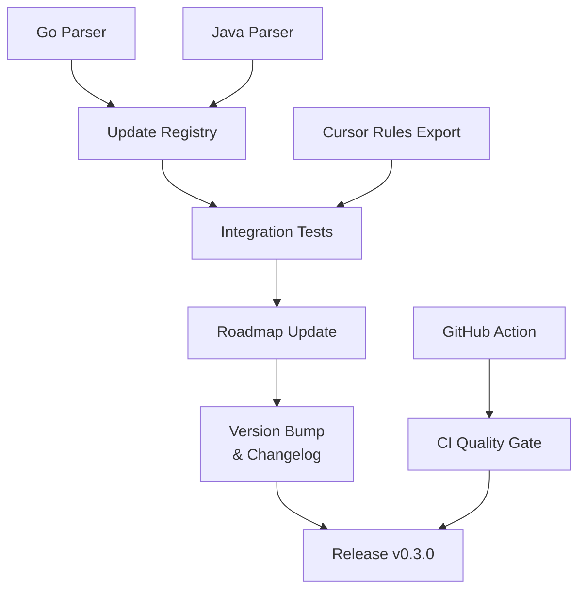

# Next Phase Plan: v0.3.0 — Language Expansion & CI Integration

> Status: DRAFT
> Author: Claude
> Date: 2026-02-18

---

## Table of Contents

- [1. Current State Assessment](#1-current-state-assessment)
- [2. Strategic Priority](#2-strategic-priority)
- [3. Phase Breakdown](#3-phase-breakdown)
- [4. Detailed Implementation Plan](#4-detailed-implementation-plan)
- [5. Architecture Decisions](#5-architecture-decisions)
- [6. Risks & Mitigations](#6-risks--mitigations)
- [7. Success Criteria](#7-success-criteria)
- [8. Estimated Effort](#8-estimated-effort)

---

## 1. Current State Assessment

### Roadmap Accuracy Update

The ROADMAP.md is **out of date**. Phase 5 is listed at 30% but is actually ~75% complete:

| Roadmap Item | Listed Status | Actual Status |
|-------------|---------------|---------------|
| `knowgraph init` wizard | done | done |
| Auto-detect project languages | done | done |
| Suggest high-impact files | done | done |
| Self-documentation | done | done |
| Coverage reporting | **todo** | **done** (PR #12) |
| Coverage breakdown by module/team/type | **todo** | **done** (built into coverage-calculator.ts) |
| Pre-commit hook for validation | **todo** | **done** (PR #10) |
| `knowgraph validate` | **todo** | **done** (PR #11) |
| `knowgraph suggest` | **todo** | **done** (PR #13) |
| `knowgraph coverage` | **todo** | **done** (PR #12) |
| HTML coverage report | todo | todo |
| CI quality gate | todo | todo |
| LLM-assisted migration | todo | todo |
| `knowgraph migrate` | todo | todo |

### Codebase Health

| Metric | Value |
|--------|-------|
| Total tests | 329 (100% pass) |
| Core coverage | 90.03% statements |
| MCP server coverage | 80.58% statements |
| CLI coverage | 95.88% statements |
| All packages above 80% threshold | Yes |
| MCP tools | 7 registered |
| CLI commands | 10 (init, parse, index, query, serve, validate, coverage, suggest, hook) |
| Supported languages | TypeScript/JavaScript (full), Python (full), Generic fallback |

### What's Missing for v0.3.0

The biggest gaps for a compelling next release are:

1. **Language support** — Go and Java are the most-requested enterprise languages. The generic parser works but produces only module-level entities, losing function/class/method granularity.
2. **CI integration** — No GitHub Action exists. Users must manually set up `knowgraph` in CI.
3. **CI quality gate** — `knowgraph coverage --threshold` works in CLI but there's no official CI workflow or GitHub Action for it.
4. **Broader AI reach** — Only MCP/Claude is supported. Cursor is the second most popular AI coding tool and has `.cursorrules` integration.

---

## 2. Strategic Priority

### Why Languages + CI First



**Selected for v0.3.0:**

| Item | Impact | Effort | Rationale |
|------|--------|--------|-----------|
| Go parser | HIGH | MEDIUM | Enterprise Go codebases are a key audience |
| Java parser | HIGH | MEDIUM | Enterprise Java is ubiquitous |
| GitHub Action | VERY HIGH | LOW | Makes CI adoption trivial |
| CI quality gate | HIGH | LOW | `knowgraph coverage --threshold` in CI |
| Cursor Rules export | MEDIUM | LOW | Doubles the AI assistant reach |
| Finish Phase 5 | LOW-MEDIUM | LOW | Polish for completeness |

**Deferred to v0.4.0+:**

| Item | Reason for Deferral |
|------|---------------------|
| VSCode extension | High effort, needs separate repo/marketplace publishing |
| Notion/Jira connectors | Phase 4 is a major initiative on its own |
| Vector embeddings | Needs architectural decisions (embedding model, store) |
| LLM migration assistant | Depends on choosing an LLM provider strategy |
| REST/GraphQL API | Phase 6, lower priority than MCP |

---

## 3. Phase Breakdown

### v0.3.0 Release Plan



### Work Streams (Parallelizable)

**Stream A: Language Parsers** (Phase 1b partial)
1. Go parser with function/struct/method/interface detection
2. Java parser with class/method/interface/enum detection
3. Test fixtures for both languages

**Stream B: CI & DX** (Phase 5 + Phase 7)
1. GitHub Action for `knowgraph index` + `knowgraph coverage`
2. CI quality gate workflow (`knowgraph-gate.yml`)
3. `knowgraph export --format cursorrules` command

**Stream C: Release Polish**
1. Update ROADMAP.md with accurate Phase 5 status
2. Update tracker.yml
3. Integration tests
4. Changelog and version bump

---

## 4. Detailed Implementation Plan

### 4.1 Go Parser

**Goal:** Parse Go source files and extract `@knowgraph` annotations from doc comments with full entity detection (functions, structs, methods, interfaces).

**Source file:** `packages/core/src/parsers/go-parser.ts`

#### Go Comment Conventions

Go uses `//` doc comments placed immediately before declarations:

```go
// @knowgraph
// type: function
// description: Handles user registration
// owner: auth-team
// status: stable
func RegisterUser(w http.ResponseWriter, r *http.Request) {
```

Go also supports block comments:

```go
/*
@knowgraph
type: module
description: HTTP middleware package
owner: platform-team
status: stable
*/
package middleware
```

#### Entity Detection Patterns

After extracting a `@knowgraph` comment block, the parser examines the next code line to classify the entity:

| Pattern | Entity Type | Example |
|---------|-------------|---------|
| `func (receiver) Name(` | `method` | `func (s *Server) Start(port int) error` |
| `func Name(` | `function` | `func RegisterUser(w http.ResponseWriter, r *http.Request)` |
| `type Name struct` | `class` | `type UserService struct {` |
| `type Name interface` | `interface` | `type Repository interface {` |
| `const (` or `const Name` | `constant` | `const MaxRetries = 3` |
| `var (` or `var Name` | `variable` | `var DefaultConfig = Config{}` |
| `package Name` | `module` | `package handlers` |
| `type Name int` (with iota) | `enum` | `type Status int` + `const ( ... iota )` |

#### Method Receiver Detection

Go methods have receivers. The parser must extract:
- **Receiver type** as `parent` field (e.g., `UserService` from `func (s *UserService) Create(...)`)
- **Signature** including receiver, params, and return type

```typescript
// Regex for Go function/method declarations
const GO_FUNC_REGEX = /^func\s+(?:\((\w+)\s+\*?(\w+)\)\s+)?(\w+)\s*\((.*?)\)(?:\s+(.+?))?(?:\s*\{|$)/;
//                              receiver var  receiver type  func name   params      return type
```

#### Implementation Approach

1. **Extend parser registry** — Register Go parser for `.go` extensions
2. **Comment extraction** — Find `//` comment groups and `/* */` blocks containing `@knowgraph`
3. **Entity matching** — Match next non-blank code line after comment to entity patterns
4. **Method detection** — Extract receiver type for `parent` field
5. **Signature extraction** — Capture full function signature
6. **Package detection** — Module-level annotations use `package` statement as name

#### Test Plan

Create `packages/core/src/parsers/__tests__/go-parser.test.ts` with fixtures:

```
packages/core/src/parsers/__tests__/fixtures/
  sample.go               # Functions, structs, methods, interfaces
  sample_module.go         # Module-level package annotation
  sample_enum.go           # Const block with iota pattern
```

Test cases (minimum):
- Module-level annotation on package declaration
- Function annotation with full signature
- Method annotation with receiver and parent detection
- Struct (class) annotation
- Interface annotation
- Const/var annotations
- Multiple annotations in one file
- Nested method within struct
- No annotation (should return empty)
- Malformed annotation (should report errors)

**Target: 90%+ coverage**

---

### 4.2 Java Parser

**Goal:** Parse Java source files and extract `@knowgraph` annotations from JavaDoc comments with full entity detection.

**Source file:** `packages/core/src/parsers/java-parser.ts`

#### Java Comment Conventions

Java uses JavaDoc `/** ... */` blocks (identical syntax to TypeScript JSDoc):

```java
/**
 * @knowgraph
 * type: class
 * description: REST controller for user management
 * owner: platform-team
 * status: stable
 * tags: [users, api, rest]
 */
@RestController
@RequestMapping("/api/v1/users")
public class UserController {
```

#### Entity Detection Patterns

| Pattern | Entity Type | Example |
|---------|-------------|---------|
| `class Name` | `class` | `public class UserService {` |
| `interface Name` | `interface` | `public interface UserRepository extends JpaRepository<User, Long> {` |
| `enum Name` | `enum` | `public enum OrderStatus {` |
| `record Name` | `class` | `public record UserDTO(String name, String email) {` |
| Method (in class body) | `method` | `public ResponseEntity<User> getUser(@PathVariable Long id) {` |
| Static method (top level) | `function` | `public static void main(String[] args) {` |
| `package Name` | `module` | `package com.example.users;` |

#### Annotation (Java @Annotation) Handling

The parser should skip Java annotations (`@RestController`, `@Override`, etc.) that appear between the JavaDoc comment and the declaration. These are NOT `@knowgraph` annotations — they are Java language annotations.

```java
/**
 * @knowgraph
 * type: method
 * description: Creates a new user
 */
@PostMapping           // <-- skip these
@ResponseStatus(201)   // <-- skip these
public User create(@RequestBody CreateUserRequest request) {
```

**Implementation:** After the JavaDoc block, skip lines matching `^\s*@\w+` until reaching a non-annotation line.

#### Access Modifier Extraction

Extract visibility from Java modifiers for the `signature` field:

```typescript
const JAVA_MODIFIERS = /^(public|private|protected|static|final|abstract|synchronized|native|default)\s+/;
```

#### Enclosing Class Detection

For methods, walk backward from the method to find the enclosing `class` or `interface` declaration, similar to the TypeScript parser's `findEnclosingClassName()`.

#### Implementation Approach

1. **Reuse JSDoc extraction** — Java and TypeScript both use `/** ... */` blocks. The comment extraction logic can be shared from the existing TypeScript parser or metadata extractor.
2. **Entity matching** — Different regex patterns for Java declarations (class, interface, enum, record, method)
3. **Skip Java annotations** — Filter `@Annotation` lines between comment and declaration
4. **Package detection** — Use `package` statement for module-level entity name
5. **Register for extensions** — `.java`

#### Test Plan

Create `packages/core/src/parsers/__tests__/java-parser.test.ts` with fixtures:

```
packages/core/src/parsers/__tests__/fixtures/
  Sample.java              # Class, methods, interface
  SampleEnum.java          # Enum with values
  SampleRecord.java        # Record (Java 16+)
  SampleModule.java        # Package-level annotation
```

Test cases (minimum):
- Class annotation with modifiers
- Method annotation with return type and parameters
- Interface annotation
- Enum annotation
- Record annotation (Java 16+)
- Module-level annotation (package declaration)
- Method with Java annotations (@PostMapping, @Override) between doc and declaration
- Private/protected/static method detection
- Enclosing class detection for methods
- Multiple entities in one file
- No annotation (should return empty)
- Abstract class and abstract method

**Target: 90%+ coverage**

---

### 4.3 GitHub Action

**Goal:** Publish a reusable GitHub Action that runs `knowgraph index` and optionally `knowgraph coverage --threshold` in CI.

**Location:** `.github/actions/knowgraph/` or separate repo `idosams/knowgraph-action`

#### Action Design

```yaml
# action.yml
name: 'KnowGraph Index & Validate'
description: 'Index your codebase with KnowGraph and enforce annotation coverage'
inputs:
  command:
    description: 'Command to run: index, validate, coverage, suggest'
    required: false
    default: 'index'
  path:
    description: 'Path to index/validate'
    required: false
    default: '.'
  coverage-threshold:
    description: 'Minimum annotation coverage percentage (0-100)'
    required: false
    default: '0'
  validate-strict:
    description: 'Treat validation warnings as errors'
    required: false
    default: 'false'
  knowgraph-version:
    description: 'Version of @knowgraph/cli to install'
    required: false
    default: 'latest'
runs:
  using: 'composite'
  steps:
    - name: Install KnowGraph CLI
      shell: bash
      run: npm install -g @knowgraph/cli@${{ inputs.knowgraph-version }}

    - name: Run KnowGraph
      shell: bash
      run: |
        knowgraph ${{ inputs.command }} ${{ inputs.path }}

    - name: Check Coverage Threshold
      if: inputs.coverage-threshold != '0'
      shell: bash
      run: |
        knowgraph coverage ${{ inputs.path }} --threshold ${{ inputs.coverage-threshold }}

    - name: Validate Annotations
      if: inputs.validate-strict == 'true'
      shell: bash
      run: |
        knowgraph validate ${{ inputs.path }} --strict
```

#### Usage Examples

```yaml
# Basic indexing
- uses: idosams/knowgraph-action@v1
  with:
    command: index

# With coverage enforcement
- uses: idosams/knowgraph-action@v1
  with:
    command: index
    coverage-threshold: 80
    validate-strict: true
```

#### CI Quality Gate Workflow

Add `knowgraph-gate.yml` to the KnowGraph repo itself:

```yaml
# .github/workflows/knowgraph-gate.yml
name: KnowGraph Quality Gate
on: [push, pull_request]
jobs:
  knowgraph-gate:
    runs-on: ubuntu-latest
    steps:
      - uses: actions/checkout@v4
      - uses: pnpm/action-setup@v4
      - uses: actions/setup-node@v4
        with:
          node-version: 20
          cache: pnpm
      - run: pnpm install --frozen-lockfile
      - run: pnpm turbo build
      - name: Validate annotations
        run: node packages/cli/dist/index.js validate . --strict
      - name: Check coverage
        run: node packages/cli/dist/index.js coverage . --threshold 50
```

---

### 4.4 Cursor Rules Export

**Goal:** Add `knowgraph export --format cursorrules` command that generates a `.cursorrules` file from the knowledge graph.

**Source file:** `packages/cli/src/commands/export.ts`

#### .cursorrules Format

Cursor reads a `.cursorrules` file from the project root. It's a plain text file with instructions:

```markdown
# Project Knowledge Graph

## Architecture Overview
This project uses the following modules and services...

## Code Ownership
- auth-team: AuthService (src/auth/service.ts), LoginHandler (src/auth/login.ts)
- payments-team: PaymentProcessor (src/payments/processor.ts)

## Key Services
### AuthService (service) - stable
File: src/auth/service.ts:10
Owner: auth-team
Description: Handles user authentication and session management
Business Goal: User acquisition and retention
Dependencies: user-model, session-store

## Compliance Notes
- PCI-DSS applies to: PaymentProcessor, ChargeHandler
- GDPR applies to: UserService, DataExporter
```

#### Implementation

1. Query the index for all entities
2. Group by owner, then by entity type
3. Generate a structured markdown document
4. Write to `.cursorrules` in the project root (or custom path via `--output`)

```typescript
interface ExportOptions {
  readonly format: 'cursorrules' | 'markdown';  // extensible later
  readonly output?: string;
  readonly dbPath?: string;
}
```

#### CLI Interface

```bash
# Generate .cursorrules from the index
knowgraph export --format cursorrules

# Custom output path
knowgraph export --format cursorrules --output .cursorrules

# Markdown export (for other AI tools)
knowgraph export --format markdown --output CODEBASE.md
```

---

### 4.5 Roadmap & Tracker Update

Update `ROADMAP.md` and `roadmap/tracker.yml` to reflect:

1. Phase 5 actual progress (75%, not 30%)
2. Mark completed items: validate, coverage, suggest, hook commands
3. Add Phase 1b partial completion (Go + Java parsers)
4. Add new items: GitHub Action, Cursor Rules export
5. Update overall progress percentage

---

## 5. Architecture Decisions

### ADR-011: Dedicated Go & Java Parsers vs Enhanced Generic Parser

**Context:** The generic parser already handles Go and Java via block/line comment extraction, but only produces module-level entities. Two approaches:

**Option A: Dedicated parsers (RECOMMENDED)**
- Separate `go-parser.ts` and `java-parser.ts` files
- Full entity detection (functions, structs/classes, methods, interfaces)
- Can handle language-specific patterns (Go receivers, Java annotations)
- Follows existing pattern (TypeScript and Python have dedicated parsers)

**Option B: Enhanced generic parser**
- Add entity detection patterns to the generic parser
- Less code duplication for comment extraction
- But makes generic-parser.ts too complex and violates single responsibility

**Decision:** Option A — Dedicated parsers.

**Rationale:**
- Consistent with existing architecture (each language has its own parser)
- Clean separation of concerns
- Easier to test language-specific edge cases
- Files stay under 400 lines

### ADR-012: GitHub Action as Composite vs JavaScript Action

**Context:** GitHub Actions can be composite (shell scripts) or JavaScript (Node.js).

**Option A: Composite action (RECOMMENDED)**
- Simple shell commands wrapping `knowgraph` CLI
- No build step needed
- Easy to maintain

**Option B: JavaScript action**
- Can directly import `@knowgraph/core`
- More complex setup (needs bundling)
- Better error reporting possible

**Decision:** Option A — Composite action.

**Rationale:** The CLI already handles all the logic. The action just needs to install and run it.

### ADR-013: Cursor Rules Export vs Generic AI Context Export

**Context:** Should we build Cursor-specific export or a generic AI context format?

**Decision:** Start with Cursor-specific `.cursorrules` format, but design the export command to be extensible (`--format cursorrules|markdown`). Markdown format serves as generic AI context for any tool.

---

## 6. Risks & Mitigations

| Risk | Likelihood | Impact | Mitigation |
|------|-----------|--------|------------|
| Go comment patterns have edge cases (cgo directives, build tags) | Medium | Low | Focus on standard `//` doc comments; ignore cgo/build tags |
| Java generics in method signatures confuse regex | Medium | Medium | Use non-greedy matching; test with complex generic types like `Map<String, List<User>>` |
| GitHub Action version pinning issues | Low | Medium | Use semantic versioning; document upgrade path |
| Generic parser tests break when adding Go/Java specific parsers | Low | Low | Go/Java parsers take priority over generic for their extensions; generic remains as fallback |
| `.cursorrules` format changes (Cursor is fast-moving) | Medium | Low | Keep export simple (plain markdown); easy to adapt |

---

## 7. Success Criteria

### v0.3.0 Release Checklist

**Must Have (P0):**
- [ ] Go parser extracts functions, structs, methods, interfaces with parent detection
- [ ] Java parser extracts classes, methods, interfaces, enums with annotation skipping
- [ ] Both parsers have 90%+ test coverage
- [ ] Both parsers registered in default registry
- [ ] GitHub Action published and documented
- [ ] CI quality gate workflow added to KnowGraph repo
- [ ] All existing tests still pass (329+ tests)
- [ ] Overall coverage stays above 80%

**Should Have (P1):**
- [ ] `knowgraph export --format cursorrules` command
- [ ] `knowgraph export --format markdown` command
- [ ] ROADMAP.md updated with accurate Phase 5 status
- [ ] CHANGELOG.md updated for v0.3.0

**Nice to Have (P2):**
- [ ] Go parser handles `type ... int` + iota enum pattern
- [ ] Java parser handles record types (Java 16+)
- [ ] HTML coverage report generation

---

## 8. Estimated Effort

| Work Item | Complexity | Files to Create/Modify |
|-----------|-----------|------------------------|
| Go parser | Medium | `go-parser.ts`, `go-parser.test.ts`, fixtures, `registry.ts` |
| Java parser | Medium | `java-parser.ts`, `java-parser.test.ts`, fixtures, `registry.ts` |
| GitHub Action | Low | `action.yml`, `README.md`, `knowgraph-gate.yml` |
| CI quality gate | Low | `.github/workflows/knowgraph-gate.yml` |
| Cursor Rules export | Low-Medium | `export.ts`, `export.test.ts`, `commands/index.ts`, `index.ts` |
| Roadmap update | Low | `ROADMAP.md`, `roadmap/tracker.yml` |
| Release | Low | `CHANGELOG.md`, `package.json` (x3) |

### Dependency Graph



### Parallelization

Three work streams can run in parallel:
1. **Stream A:** Go parser + Java parser + registry update + integration tests
2. **Stream B:** GitHub Action + CI quality gate workflow
3. **Stream C:** Cursor Rules export command

All streams converge at the release step.
